<br>

[:contents]

<br>

# 01. はじめに

前世の俺が徳を積まなかったせいで、Mitchell Hashimoto として現世に生まれることができませんした😭

さて最近の業務で、全プロダクトの技術基盤開発チームに携わっており、チームが使っているTerraform🧑🏻‍🚀のリポジトリをリプレイスする作業を担当しました。

このリポジトリでは単一の`tfstate`ファイルが状態を持ち過ぎている課題を抱えていたため、課題に合った適切な分割手法でリプレイスしました。

今回は、この時に整理した分割手法を記事で紹介しました。

なお、プロバイダーの中でもAWS向けの説明となってしまうことをご容赦ください。

それでは、もりもり布教していきます😗

<br>

# 02. なぜ`tfstate`ファイルを分割するのか

そもそも、なぜ`tfstate`ファイルを分割する必要なのでしょうか。

様々なインフラコンポーネントを単一の`tfstate`ファイルで状態を持つと、1回の`terraform`コマンド全ての状態を操作できて楽です。

その一方で、自身の作業ブランチ以外でインフラコンポーネントの状態を変更しかけていると、`terraform`コマンドで`target`オプションが必要になります。


<br>

この時に`tfstate`ファイルをいい感じに分割すると、まるで暗黙的に`target`オプションがついたように、他の作業ブランチの影響を受けずに`terraform`コマンドを実行できます。

各`tfstate`ファイルの管理者は互いに影響を受けずに、Terraformのソースコードを変更できるようになります。


> ↪️：
>
> - [isbn:1492046906:title]
> - [https://cloudcasts.io/course/terraform/organizing-with-multiple-states:title]

<br>

# 03. `tfstate`ファイルの分割

## `tfstate`ファイルの分割

それでは、`tfstate`ファイルの分割の境目はどのようにして見つければよいのでしょうか。

これを見つけるコツは、『他の状態にできるだけ依存しないリソースの関係』に注目することだと考えています。

もう少し簡単に説明すると、ここでいう依存関係とは『設定値の参照』のことです。

本記事では、`tfstate`ファイルが他の`tfstate`ファイルの状態を使用する場合、それを『依存』と表現することとします。

これは、オブジェクト指向でいうところの『依存』と同じような考え方と思っていただいてよいです

(例)

AWSリソースからなるプロダクトをいくつかの`tfstate`ファイル (`foo-tfstate`、`bar-tfstate`、`baz-tfstate`) に分割したと仮定します。


<div hidden>

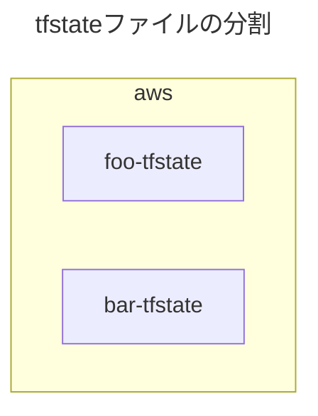

</div>

<br>

## リポジトリのディレクトリ構成

リポジトリのディレクトリは、`tfstate`ファイルの分割に基づいて設計しましょう。

率直に言うと、Terraformのディレクトリ構成のパターンは無数にあり、**<font color="#FF0000">ディレクトリ構成自体の設計が本質的ではないと考えています。</font>**

一方で、このディレクトリ構成を`tfstate`ファイルに基づいて設計することにより、意義のあるパターンとして抽象化できるようになります。

```yaml
repository/
├── foo/
│   ├── backend.tf # リモートバックエンド内の/foo/terraform.tfstate
│   ...
│
└── bar/
    ├── backend.tf # リモートバックエンド内の/bar/terraform.tfstate
    ...
```

<br>

## リモートバックエンドの構成

### リモートバックエンド自体の分割

`tfstate`ファイルの分割に基づいて、リモートバックエンド自体も分割するとよい場合があります。

これについては、[08. 中間レイヤーの構成](# 08. 中間レイヤーの構成 (任意))で紹介しています。

### ディレクトリ構成

リモートバックエンド内のディレクトリ構成も、`tfstate`ファイルの分割に基づいて設計しましょう。

```sh
bucket/
├── foo/
│   └── terraform.tfstate
│
└── bar/
    └── terraform.tfstate
```

<br>

# 04. `tfstate`ファイル間の状態依存関係について

## 状態の依存関係図

`tfstate`ファイル間で状態の依存関係図を考える必要があります。

`tfstate`ファイル間で状態の依存関係 (設定値の参照数) が少ないほどよいです。

(例)

AWSリソースからなるプロダクトをいくつかの`tfstate`ファイル (`foo-tfstate`、`bar-tfstate`) に分割したと仮定します。

ここで仮定した状況では、`foo-tfstate` ➡︎ `bar-tfstate` の方向に依存しています。

そのため、想定される状態の依存関係図は以下の通りです。


<div hidden>

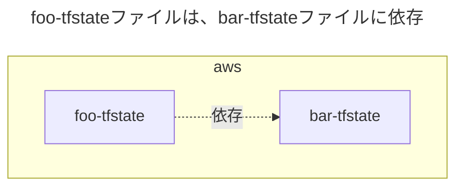

</div>

<br>

## `terraform_remote_state`ブロックを使用する場合

### `terraform_remote_state`ブロックによる依存

**以降は、こちらを使用して状態依存関係を実装します。**

`tfstate`ファイルが他の`tfstate`ファイルに依存する方法として、`terraform_remote_state`ブロックがあります。

`terraform_remote_state`ブロックを使用する場合、以下のメリットがあります。

- 依存先のAWSリソースに関わらず、同じ`terraform_remote_state`ブロックを使い回すことができる

一方で、以下のデメリットがあります。

- 別途`output`ブロックの定義が必要になり、可読性が低くなる。
- 依存先と依存元の間でTerraformのバージョンに差がありすぎると、`tfstate`ファイル間で互換性がなくなり、`terraform_remote_state`ブロックで状態に依存できない場合があります。

### 状態の依存関係図

(例)

AWSリソースからなるプロダクトをいくつかの`tfstate`ファイル (`foo-tfstate`、`bar-tfstate`) に分割したと仮定します。

ここで仮定した状況では、`bar-tfstate`ファイルはVPCの状態を持っており、`foo-tfstate`ファイルは`bar-tfstate`ファイルに依存しています。

そのため、想定される状態の依存関係図は以下の通りです。


<div hidden>

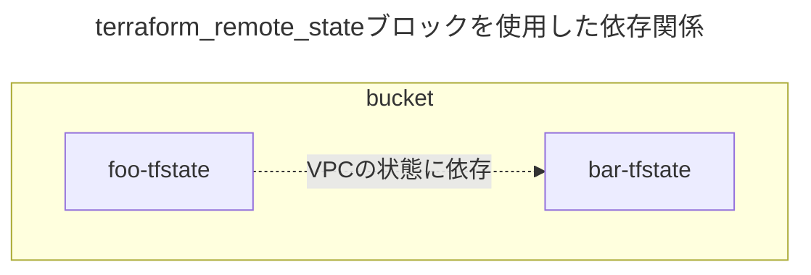

</div>

### リポジトリのディレクトリ構成

`tfstate`ファイルの分割に基づいて、リポジトリのディレクトリ構成例は以下の通りです。

```sh
repository/
├── foo/
│   ├── backend.tf # リモートバックエンド内の/foo/terraform.tfstate
│   ├── remote_state.tf # terraform_remote_stateブロックを使用し、bar-tfstateファイルに依存する
│   ├── provider.tf
│   ...
│
└── bar/
    ├── backend.tf # リモートバックエンド内の/bar/terraform.tfstate
    ├── output.tf # 他のtfstateファイルから依存される
    ├── provider.tf
    ...
```

`foo-tfstate`ファイルが`bar-tfstate`ファイルに依存するために必要な実装は、以下の通りです。

```terraform
# fooリソースの状態は、bar-tfstateファイルで持つ
resource "example" "foo" {

  # fooリソースは、bar-tfstateファイルのVPCに依存する
  vpc_id = data.terraform_remote_state.bar.outputs.bar_vpc_id

  ...
}

# VPCの状態は、bar-tfstateファイルで持つ
data "terraform_remote_state" "bar" {

  backend = "s3"

  config = {
    bucket = "bar-tfstate"
    key    = "bar/terraform.tfstate"
    region = "ap-northeast-1"
  }
}
```

```terraform
# VPCの状態は、bar-tfstateファイルで持つ
output "bar_vpc_id" {
  value = aws_vpc.bar.id
}

resource "aws_vpc" "bar" {
  ...
}
```

### リモートバックエンドのディレクトリ構成

`tfstate`ファイルの分割に基づいて、リモートバックエンド内のディレクトリ構成例は以下の通りです。

```sh
bucket/
├── foo
│   └── terraform.tfstate
│
└── bar
    └── terraform.tfstate
```

<br>

## `data`ブロックを使用する場合

### `data`ブロックによる依存とは

他の方法として、`data`ブロックがあります。

`data`ブロックは、`tfstate`ファイルが自身以外 (例：コンソール画面、他の`tfstate`ファイル) で作成されたAWSリソースの状態に依存するために使用できます。

`data`ブロックを使用する場合は、以下のメリットがあります。

- `output`ブロックが不要で可読性が高い。

一方で以下のデメリットがあります。

- 依存先のAWSリソースごとに`data`ブロックを定義する必要がある。

`terraform_remote_state`ブロックとは異なり、直接的には`tfstate`ファイルに依存しません。

`data`ブロックの場合は、実際のAWSリソースの状態に依存することにより、間接的にAWSリソースの`tfstate`ファイルに依存することになります。

### 状態の依存関係図

(例)

`data`ブロックも同様にして、AWSリソースからなるプロダクトをいくつかの`tfstate`ファイル (`foo-tfstate`、`bar-tfstate`) に分割したと仮定します。

ここで仮定した状況では、`bar-tfstate`ファイルはVPCの状態を持っており、`foo-tfstate`ファイルは`bar-tfstate`ファイルに依存しています。

想定される状態の依存関係図は以下の通りです。


<div hidden>

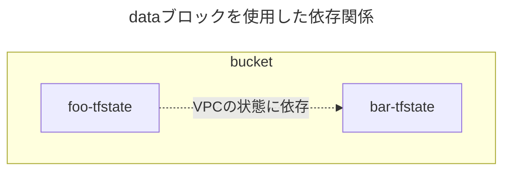

</div>

### リポジトリのディレクトリ構成

ディレクトリ構成は、`tfstate`ファイルの分割に基づいて、以下の通りです。

```sh
repository/
├── foo/
│   ├── backend.tf # リモートバックエンド内の/foo/terraform.tfstate
│   ├── data.tf # dataブロックを使用し、bar-tfstateファイルに依存する
│   ├── provider.tf
│   ...
│
└── bar/
    ├── backend.tf # リモートバックエンド内の/bar/terraform.tfstate
    ├── provider.tf
    ...
```

`foo-tfstate`ファイルが`bar-tfstate`ファイルに依存するために必要な実装は、以下の通りです。

```terraform
# fooリソースの状態は、foo-tfstateファイルで持つ
resource "example" "foo" {

  # fooリソースは、bar-tfstateファイルのVPCに依存する
  vpc_id     = data.aws_vpc.bar.id
}

# VPCの状態は、bar-tfstateファイルで持つ
data "aws_vpc" "bar" {

  filter {
    name   = "tag:Name"
    values = ["<bar-tfstateが持つVPCの名前>"]
  }
}
```

### リモートバックエンドのディレクトリ構成

`tfstate`ファイルの分割に基づいて、リモートバックエンド内のディレクトリ構成例は以下の通りです。

```sh
bucket/
├── foo
│   └── terraform.tfstate
│
└── bar
    └── terraform.tfstate
```

<br>

# 05. 分割手法パターンの概要

`tfstate`ファイルの分割パターンは、以下の 上/中/下 に大別できると考えています。

<table>
<thead>
  <tr>
    <th>必須<br>または<br>任意</th><th>分割レイヤー</th><th>パターン</th><th>おすすめ</th>
  </tr>
</thead>
<tbody>
  <tr>
    <td rowspan="3">必須</td>
  </tr>
  <tr>
    <td>高レイヤー</td><td>プロバイダーのアカウント別</td><td align=center><code>⭕️</code></td>
  </tr>
  <tr>
    <td>低レイヤー</td><td>実行環境別</td><td align=center><code>⭕️</code></td>
  </tr>
  <tr>
    <td rowspan="6">任意</td><td rowspan="7">中間レイヤー</td><td>同じテナント内のプロダクト別</td><td></td>
  </tr>
  <tr>
    <td>運用チーム責務範囲別</td><td align=center><code>⭕️</code></td>
  </tr>
  <tr>
    <td>プロダクトのサブコンポーネント別</td><td align=center><code>⭕️</code></td>
  </tr>
  <tr>
    <td>AWSリソースの種類グループ別</td><td></td>
  </tr>
  <tr>
    <td>AWSリソースの状態の変更頻度グループ別</td><td></td>
  </tr>
  <tr>
    <td>運用チーム責務範囲別とプロダクトのサブコンポーネント別の組み合わせ</td><td align=center><code>⭕️</code></td>
  </tr>
</tbody>
</table>

<br>

# 06. 高レイヤーの構成 (必須)

## 高レイヤーの構成について

これは必須の構成です。

`tfstate`ファイル

## プロバイダーのアカウント別

### この分割方法について

基本的な分割方法の1つです。

プロバイダー (AWS、GoogleCloud、Azure) のアカウント別に`tfstate`ファイルを分割し、高レイヤーもこれに基づいて設計します。

この分割方法により、各プロバイダーの管理者が互いに影響を受けずに、Terraformのソースコードを変更できるようになります。

### 状態の依存関係図

(例)

以下のプロバイダーを使用したい状況と仮定します。

- 主要プロバイダー (AWS)
- アプリ/インフラ監視プロバイダー (NewRelic、Datadog、など)
- ジョブ監視プロバイダー (Healthchecks)
- インシデント管理プロバイダー (PagerDuty)

ここで仮定した状況では、各プロバイダーの`tfstate`ファイル間で状態の相互依存関係があるとします。

そのため、想定される状態の依存関係図は以下の通りです。


<div hidden>

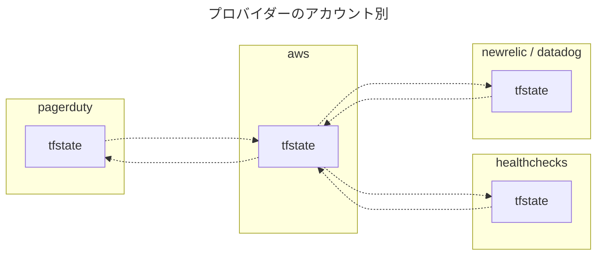

</div>

### リポジトリのディレクトリ構成

#### 異なるリポジトリの場合

プロバイダー別に分割した`tfstate`ファイルを異なるリポジトリで管理する場合です。

(例)

`tfstate`ファイルの分割に基づいて、リポジトリのディレクトリ構成例は以下の通りです。

状態の依存関係図の項目に記載する状況と同じです。

```sh
aws-repository/
├── backend.tf # バックエンド内のaws用terraform.tfstate
├── output.tf # 他のtfstateファイルから依存される
├── remote_state.tf # 他のtfstateファイルに依存する
├── provider.tf
...
```

```sh
<newrelic、datadog>-repository/
├── backend.tf # バックエンド内のnewrelic、datadog用terraform.tfstate
├── output.tf # 他のtfstateファイルから依存される
├── remote_state.tf # 他のtfstateファイルに依存する
├── provider.tf
...
```

```sh
<healthchecks>-repository/
├── backend.tf # healthchecks用バックエンド内のterraform.tfstate
├── output.tf # 他のtfstateファイルから依存される
├── remote_state.tf # 他のtfstateファイルに依存する
├── provider.tf
...
```

```sh
<pagerDuty>-repository/
├── backend.tf # pagerduty用バックエンド内のterraform.tfstate
├── output.tf # 他のtfstateファイルから依存される
├── remote_state.tf # 他のtfstateファイルに依存する
├── provider.tf
...
```

#### 同じリポジトリの場合

プロバイダー別に分割した`tfstate`ファイルを同じリポジトリで管理する場合です。

(例)

`tfstate`ファイルの分割に基づいて、リポジトリのディレクトリ構成例は以下の通りです。

状態の依存関係図の項目に記載する状況と同じです。

```sh
repository/
├── aws/
│   ├── backend.tf # バックエンド内のaws用terraform.tfstate
│   ├── output.tf # 他のtfstateファイルから依存される
│   ├── remote_state.tf # 他のtfstateファイルに依存する
│   ├── provider.tf
│   ...
│
├── <newrelic、datadog>/
│   ├── backend.tf # バックエンド内のdatadog用terraform.tfstate
│   ├── output.tf # 他のtfstateファイルから依存される
│   ├── remote_state.tf # 他のtfstateファイルに依存する
│   ├── provider.tf
│   ...
│
├── <healthchecks>/
│   ├── backend.tf # バックエンド内のhealthchecks用terraform.tfstate
│   ├── output.tf # 他のtfstateファイルから依存される
│   ├── remote_state.tf # 他のtfstateファイルに依存する
│   ├── provider.tf
│   ...
│
└── <pagerduty>/
     ├── backend.tf # バックエンド内のpagerduty用terraform.tfstate
     ├── output.tf # 他のtfstateファイルから依存される
     ├── remote_state.tf # 他のtfstateファイルに依存する****
     ├── provider.tf
     ...
```

<br>

### リモートバックエンドのディレクトリ構成

#### 異なるリモートバックエンドの場合

プロバイダー別に分割した`tfstate`ファイルを、異なるリモートバックエンドで管理します。

(例)

`tfstate`ファイルの分割に基づいて、リモートバックエンド内のディレクトリ構成例は以下の通りです。

状態の依存関係図の項目に記載する状況と同じです。

```sh
aws-bucket/
└── terraform.tfstate # AWSの状態を持つ
```

```sh
<newrelic、datadog>-bucket/
└── terraform.tfstate # NewRelic、Datadog、の状態を持つ
```

```sh
<healthchecks>-bucket/
└── terraform.tfstate # Healthchecksの状態を持つ
```

```sh
<pagerduty>-bucket/
└── terraform.tfstate # PagerDutyの状態を持つ
```

#### 同じリモートバックエンドの場合

プロバイダー別に分割した`tfstate`ファイルを、同じリモートバックエンドで管理します。

(例)

`tfstate`ファイルの分割に基づいて、リモートバックエンド内のディレクトリ構成例は以下の通りです。

状態の依存関係図の項目に記載する状況と同じです。

```sh
bucket/
├── aws
│   └── terraform.tfstate # AWSの状態を持つ
│
├── <newrelic、datadog>
│   └── terraform.tfstate # NewRelic、Datadog、の状態を持つ
│
├── <healthchecks>
│   └── terraform.tfstate # Healthchecksの状態を持つ
│
└── <pagerduty>
    └── terraform.tfstate # PagerDutyの状態を持つ
```

<br>

# 07. 低レイヤーの構成 (必須)

## 実行環境別

### この分割方法について

基本的な分割方法の1つです。

実行環境別 (`tes`、`stg`、`prd`環境など) に`tfstate`ファイルを分割し、低レイヤーもこれに基づいて設計します。

この分割方法により、各実行環境の管理者が互いに影響を受けずに、Terraformのソースコードを変更できるようになります。

> ↪️：
>
> - [isbn:1098116747:title]
> - [https://blog.gruntwork.io/how-to-manage-terraform-state-28f5697e68fa:title]

### 状態の依存関係図

(例)

以下の実行環境を構築したい状況と仮定します。

- `tes` (検証環境)
- `stg` (ユーザー受け入れ環境)
- `prd` (本番環境)

かつ、以下のプロバイダーを使用したい状況と仮定します。

- 主要プロバイダー (AWS)
- アプリ/インフラ監視プロバイダー (NewRelic、Datadog、など)
- ジョブ監視プロバイダー (Healthchecks)
- インシデント管理プロバイダー (PagerDuty)

ここで仮定した状況では、各実行環境の`tfstate`ファイルは他の実行環境には依存していないとします。

そのため、想定される状態の依存関係図は以下の通りです。


<div hidden>

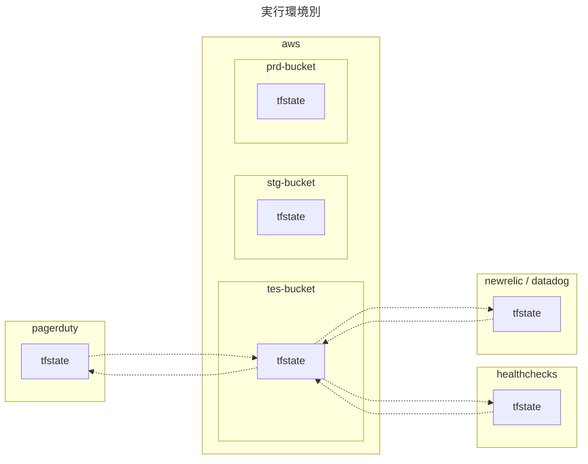

</div>

### リポジトリのディレクトリ構成

#### 異なるリポジトリの場合

**以降は、こちらを使用して状態依存関係を実装します。**

プロバイダー別に`tfstate`ファイルを分割することは必須としているため、その上でディレクトリ構成を考えます。

(例)

`tfstate`ファイルの分割に基づいて、リポジトリのディレクトリ構成例は以下の通りです。

状態の依存関係図の項目に記載する状況と同じです。

```sh
aws-repository/
├── provider.tf
├── tes/ # 検証環境
│   ├── backend.tfvars # aws用バックエンド内のterraform.tfstate
│   ...
│
├── stg/ # ユーザー受け入れ環境
└── prd/ # 本番環境
```

```sh
<newrelic、datadog>-repository/
├── provider.tf
├── tes/
├── stg/
└── prd/
```

```sh
<healthchecks>-repository/
├── provider.tf
├── tes/
├── stg/
└── prd/
```

```sh
<pagerduty>-repository/
├── provider.tf
├── tes/
├── stg/
└── prd/
```

#### 同じリポジトリの場合

プロバイダー別に`tfstate`ファイルを分割することは必須としているため、その上でディレクトリ構成を考えます。

(例)

`tfstate`ファイルの分割に基づいて、リポジトリのディレクトリ構成例は以下の通りです。

状態の依存関係図の項目に記載する状況と同じです。

```sh
repository/
├── aws/
│   ├── tes/ # 検証環境
│   │   ├── backend.tfvars # aws用バックエンド内のterraform.tfstate
│   │   ...
│   │
│   ├── stg/ # ユーザー受け入れ環境
│   └── prd/ # 本番環境
│
├── <newrelic、datadog>/
│   ├── tes/
│   ├── stg/
│   └── prd/
│
├── <healthchecks>/
│   ├── tes/
│   ├── stg/
│   └── prd/
│
└── <pagerduty>/
    ├── tes/
    ├── stg/
    └── prd/

```

### リモートバックエンドのディレクトリ構成

#### 異なるリモートバックエンドの場合

実行環境別に分割した`tfstate`ファイルを、異なるリモートバックエンドで管理します。

`tfstate`ファイルの分割に基づいて、リモートバックエンド内のディレクトリ構成例は以下の通りです。

(例)

状態の依存関係図の項目に記載する状況と同じです。

```sh
tes-aws-bucket/
└── terraform.tfstate # AWSの状態を持つ
```

```sh
tes-<newrelic、datadog>-bucket/
└── terraform.tfstate # NewRelic、Datadog、の状態を持つ
```

```sh
tes-<healthchecks>-bucket/
└── terraform.tfstate # Healthchecksの状態を持つ
```

```sh
tes-<pagerduty>-bucket/
└── terraform.tfstate # PagerDutyの状態を持つ
```

#### 同じリモートバックエンド x AWSアカウントごと異なる実行環境 の場合

**以降は、こちらを使用してディレクトリを構成します。**

プロバイダー別に分割した`tfstate`ファイルを、同じリモートバックエンドで管理します。

また、AWSアカウントごとに異なる実行環境を構築していると仮定します。

(例)

`tfstate`ファイルの分割に基づいて、リモートバックエンド内のディレクトリ構成例は以下の通りです。

状態の依存関係図の項目に記載する状況と同じです。

```sh
# tes用バケットの場合
tes-bucket/
├── aws/
│   └── terraform.tfstate # AWSの状態を持つ
│
├── <newrelic、datadog>/
│   └── terraform.tfstate # NewRelic、Datadog、の状態を持つ
│
├── <healthchecks>/
│   └── terraform.tfstate # Healthchecksの状態を持つ
│
└── <pagerduty>/
    └── terraform.tfstate # PagerDutyの状態を持つ

```

#### 同じリモートバックエンド x 単一のAWSアカウント内に全ての実行環境 の場合

プロバイダー別に分割した`tfstate`ファイルを、同じリモートバックエンドで管理します。

また、単一のAWSアカウント内に全実行環境を構築しているとします。

(例)

`tfstate`ファイルの分割に基づいて、リモートバックエンド内のディレクトリ構成例は以下の通りです。

状態の依存関係図の項目に記載する状況と同じです。

```sh
bucket/
├── aws/
│   ├── tes/ # 検証環境
│   │   └── terraform.tfstate # AWSの状態を持つ
│   │
│   ├── stg/ # ユーザー受け入れ環境
│   └── prd/ # 本番環境
│
├── <newrelic、datadog>/
│   ├── tes/
│   │   └── terraform.tfstate # NewRelic、Datadog、の状態を持つ
│   │
│   ├── stg/
│   └── prd/
│
├── <healthchecks>/
│   ├── tes/
│   │   └── terraform.tfstate # Healthchecksの状態を持つ
│   │
│   ├── stg/
│   └── prd/
│
└── <pagerduty>/
    ├── tes/
    │   └── terraform.tfstate # PagerDutyの状態を持つ
    │
    ├── stg/
    └── prd/
```

<br>

# 08. 中間レイヤーの構成 (任意)

**ここからは、状態の依存関係図を複雑にしないために、AWSプロバイダー内の`tfsfate`ファイルの状態依存関係のみを考えることとします。**

## 同じテナントのプロダクト別

### この分割方法について

同じテナント (例：同じAWSアカウントの同じVPC) 内に複数の小さなプロダクトがある場合に、プロダクト別で`tfstate`ファイルを分割し、中間レイヤーもこれに基づいて設計します。

ここでいうプロダクトは、アプリを動かすプラットフォーム (例：EKS、ECS、AppRunner、EC2) とそれを取り巻くAWSリソースを指しています。

各プロダクトの使用するIPアドレス数が少なく、プロダクト別にVPCを分割するのが煩雑という背景があるとしています。

この分割方法により、各プロダクトの管理者が互いに影響を受けずに、Terraformのソースコードを変更できるようになります。

### 状態の依存関係図

(例)

以下のプロダクトに分割した状況と仮定します。

- foo-product
- bar-product
- 共有network系コンポーネント (例：VPC、Route53)

ここで仮定した状況では、各プロダクトの`tfstate`ファイルは、共有network系コンポーネントの`tfstate`ファイルに依存しています。

そのため、想定される状態の依存関係図は以下の通りです。


<div hidden>

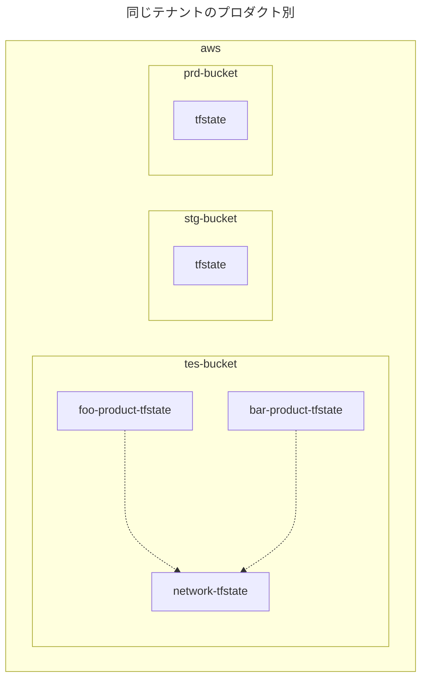

</div>

### リポジトリのディレクトリ構成

#### 異なるリポジトリの場合

同じテナントのプロダクト別に分割した`tfstate`ファイルを異なるリポジトリで管理する場合です。

(例)

`tfstate`ファイルの分割に基づいて、リポジトリのディレクトリ構成例は以下の通りです。

状態の依存関係図の項目に記載する状況と同じです。

```sh
# foo-productのtfstateファイルのリポジトリ
aws-foo-product-repository/
├── provider.tf
├── remote_state.tf # 他のtfstateファイルに依存する
├── tes # 検証環境
│   ├── backend.tfvars # tes用バックエンド内の/foo-product/terraform.tfstate
│   ...
│
├── stg # ユーザー受け入れ環境
│   ├── backend.tfvars # stg用バックエンド内の/foo-product/terraform.tfstate
│   ...
│
└── prd # 本番環境
    ├── backend.tfvars # prd用バックエンド内の/foo-product/terraform.tfstate
    ...
```

```sh
# bar-productのtfstateファイルのリポジトリ
aws-bar-product-repository/
├── provider.tf
├── remote_state.tf # 他のtfstateファイルに依存する
├── tes # 検証環境
│   ├── backend.tfvars # tes用バックエンド内の/bar-product/terraform.tfstate
│   ...
│
├── stg # ユーザー受け入れ環境
│   ├── backend.tfvars # stg用バックエンド内の/bar-product/terraform.tfstate
│   ...
│
└── prd # 本番環境
    ├── backend.tfvars # prd用バックエンド内の/bar-product/terraform.tfstate
       ...
```

```sh
# 共有network系コンポーネントのtfstateファイルのリポジトリ
aws-network-repository
├── provider.tf
├── output.tf # 他のtfstateファイルから依存される
├── route53.tf
├── vpc.tf
├── tes # 検証環境
│   ├── backend.tfvars # tes用バックエンド内の/network/terraform.tfstate
│   ...
│
├── stg # ユーザー受け入れ環境
│   ├── backend.tfvars # stg用バックエンド内の/network/terraform.tfstate
│   ...
│
└── prd # 本番環境
    ├── backend.tfvars # prd用バックエンド内の/network/terraform.tfstate
    ...
```

#### 同じリポジトリの場合

同じテナントのプロダクト別に分割した`tfstate`ファイルを同じリポジトリで管理する場合です。

(例)

`tfstate`ファイルの分割に基づいて、リポジトリのディレクトリ構成例は以下の通りです。

状態の依存関係図の項目に記載する状況と同じです。

```sh
aws-repository/
├── foo-product/
│   ├── provider.tf
│   ├── remote_state.tf # 他のtfstateファイルに依存する
│   ├── tes # 検証環境
│   │   ├── backend.tfvars # tes用バックエンド内の/foo-product/terraform.tfstate
│   │   ...
│   │
│   ├── stg # ユーザー受け入れ環境
│   │   ├── backend.tfvars # stg用バックエンド内の/foo-product/terraform.tfstate
│   │   ...
│   │
│   └── prd # 本番環境
│       ├── backend.tfvars # prd用バックエンド内の/foo-product/terraform.tfstate
│       ...
│
├── bar-product/
│   ├── provider.tf
│   ├── remote_state.tf # 他のtfstateファイルに依存する
│   ├── tes # 検証環境
│   │   ├── backend.tfvars # tes用バックエンド内の/bar-product/terraform.tfstate
│   │   ...
│   │
│   ├── stg # ユーザー受け入れ環境
│   │   ├── backend.tfvars # stg用バックエンド内の/bar-product/terraform.tfstate
│   │   ...
│   │
│   └── prd # 本番環境
│       ├── backend.tfvars # prd用バックエンド内の/bar-product/terraform.tfstate
│       ...
│
└── network
    ├── provider.tf
    ├── output.tf # 他のtfstateファイルから依存される
    ├── route53.tf
    ├── vpc.tf
    ├── tes # 検証環境
    │   ├── backend.tfvars # tes用バックエンド内の/network/terraform.tfstate
    │   ...
    │
    ├── stg # ユーザー受け入れ環境
    │   ├── backend.tfvars # stg用バックエンド内の/network/terraform.tfstate
    │   ...
    │
    └── prd # 本番環境
        ├── backend.tfvars # prd用バックエンド内の/network/terraform.tfstate
        ...
```

### リモートバックエンドのディレクトリ構成

#### 異なるリモートバックエンドの場合

同じテナントのプロダクト別の場合、異なるリモートバックエンドで管理するとバックエンドが増え過ぎてしまいます。

そのため、これはお勧めしません。

#### 同じリモートバックエンドの場合

同じテナントのプロダクト別に分割した`tfstate`ファイルを、異なるリモートバックエンドで管理します。

(例)

`tfstate`ファイルの分割に基づいて、リモートバックエンド内のディレクトリ構成例は以下の通りです。

状態の依存関係図の項目に記載する状況と同じです。

```sh
# tes用バケットの場合
tes-bucket/
├── foo-product
│   └── terraform.tfstate
│
├── bar-product
│   └── terraform.tfstate
│
└── network
    └── terraform.tfstate
```

<br>

## 運用チーム責務範囲別

### この分割方法について

運用チーム (例：アプリチーム、インフラチーム) のAWSリソースの責務範囲別で`tfstate`ファイルを分割し、中間レイヤーもこれに基づいて設計します。

この分割方法により、各運用チームが互いに影響を受けずにTerraformのソースコードを変更できるようになります。

この分割方法は、AWSドキュメントや著名な書籍で紹介され、実際に私も現在進行形で採用しているため、非常に実用的と考えています。

> ↪️：
>
> - [https://docs.aws.amazon.com/AWSCloudFormation/latest/UserGuide/best-practices.html#organizingstacks:title]
> - [asin:B09969GJ7L:title]

### 状態の依存関係図

(例)

以下の運用チームに分割した状況と仮定します。

- frontendチーム (アプリのフロントエンド領域担当)
- backendチーム (アプリのバックエンド領域担当)
- sreチーム (インフラ領域担当)

ここで仮定した状況では、各チームの`tfstate`ファイル間で状態の相互依存関係があるとします。

そのため、想定される状態の依存関係図は以下の通りです。


<div hidden>

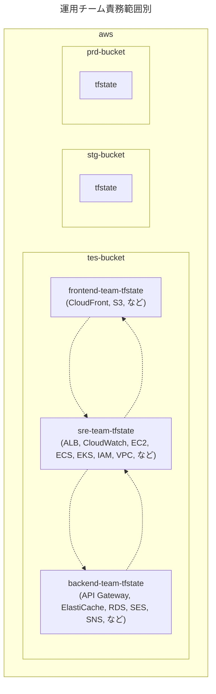

</div>

### リポジトリのディレクトリ構成

#### 異なるリポジトリの場合

運用チーム責務範囲別に分割した`tfstate`ファイルを同じリポジトリで管理する場合です。

(例)

`tfstate`ファイルの分割に基づいて、リポジトリのディレクトリ構成例は以下の通りです。

ここでは、状態の依存関係図と同じ状況を仮定しています。

```sh
aws-frontend-team-repository/ # frontendチーム
├── provider.tf
├── output.tf # 他のtfstateファイルから依存される
├── remote_state.tf # 他のtfstateファイルに依存する
├── cloudfront.tf
├── s3.tf
├── tes # 検証環境
│   ├── backend.tfvars # tes用バックエンド内の/frontend-team/terraform.tfstate
│   ...
│
├── stg # ユーザー受け入れ環境
│   ├── backend.tfvars # stg用バックエンド内の/frontend-team/terraform.tfstate
│   ...
│
└── prd # 本番環境
    ├── backend.tfvars # prd用バックエンド内の/frontend-team/terraform.tfstate
    ...
```

```sh
aws-backend-team-repository/ # backendチーム
├── provider.tf
├── output.tf # 他のtfstateファイルから依存される
├── remote_state.tf # 他のtfstateファイルに依存する
├── elasticache.tf
├── ses.tf
├── sns.tf
├── rds.tf
├── tes
│   ├── backend.tfvars # tes用バックエンド内の/backend-team/terraform.tfstate
│   ...
│
├── stg
│   ├── backend.tfvars # stg用バックエンド内の/backend-team/terraform.tfstate
│   ...
│
└── prd
    ├── backend.tfvars # prd用バックエンド内の/backend-team/terraform.tfstate
     ...
```

```sh
aws-sre-team-repository/ # sreチーム
├── provider.tf
├── output.tf # 他のtfstateファイルから依存される
├── remote_state.tf # 他のtfstateファイルに依存する
├── alb.tf
├── cloudwatch.tf
├── ec2.tf
├── ecs.tf
├── eks.tf
├── iam.tf
├── vpc.tf
├── tes
│   ├── backend.tfvars # tes用バックエンド内の/sre-team/terraform.tfstate
│   ...
│
├── stg
│   ├── backend.tfvars # stg用バックエンド内の/sre-team/terraform.tfstate
│   ...
│
└── prd
    ├── backend.tfvars # prd用バックエンド内の/sre-team/terraform.tfstate
    ...
```

#### 同じリポジトリの場合

運用チーム責務範囲別に分割した`tfstate`ファイルを異なるリポジトリで管理する場合です。

(例)

`tfstate`ファイルの分割に基づいて、リポジトリのディレクトリ構成例は以下の通りです。

ここでは、状態の依存関係図と同じ状況を仮定しています。

```sh
aws-repository/
├── frontend-team # frontendチーム
│   ├── provider.tf
│   ├── output.tf # 他のtfstateファイルから依存される
│   ├── remote_state.tf # 他のtfstateファイルに依存する
│   ├── cloudfront.tf
│   ├── s3.tf
│   ├── tes # 検証環境
│   │   ├── backend.tfvars # tes用バックエンド内の/frontend-team/terraform.tfstate
│   │   ...
│   │
│   ├── stg # ユーザー受け入れ環境
│   │   ├── backend.tfvars # stg用バックエンド内の/frontend-team/terraform.tfstate
│   │   ...
│   │
│   └── prd # 本番環境
│       ├── backend.tfvars # prd用バックエンド内の/frontend-team/terraform.tfstate
│       ...
│
├── backend-team # backendチーム
│   ├── provider.tf
│   ├── output.tf # 他のtfstateファイルから依存される
│   ├── remote_state.tf # 他のtfstateファイルに依存する
│   ├── elasticache.tf
│   ├── ses.tf
│   ├── sns.tf
│   ├── rds.tf
│   ├── tes
│   │   ├── backend.tfvars # tes用バックエンド内の/backend-team/terraform.tfstate
│   │   ...
│   │
│   ├── stg
│   │   ├── backend.tfvars # stg用バックエンド内の/backend-team/terraform.tfstate
│   │   ...
│   │
│   └── prd
│       ├── backend.tfvars # prd用バックエンド内の/backend-team/terraform.tfstate
│       ...
│
└── sre-team # sreチーム
    ├── provider.tf
    ├── output.tf # 他のtfstateファイルから依存される
    ├── remote_state.tf # 他のtfstateファイルに依存する
    ├── alb.tf
    ├── cloudwatch.tf
    ├── ec2.tf
    ├── ecs.tf
    ├── eks.tf
    ├── iam.tf
    ├── vpc.tf
    ├── tes
    │   ├── backend.tfvars # tes用バックエンド内の/sre-team/terraform.tfstate
    │   ...
    │
    ├── stg
    │   ├── backend.tfvars # stg用バックエンド内の/sre-team/terraform.tfstate
    │   ...
    │
    └── prd
        ├── backend.tfvars # prd用バックエンド内の/sre-team/terraform.tfstate
        ...
```

### リモートバックエンドのディレクトリ構成

#### 異なるリモートバックエンドの場合

運用チーム責務範囲別の場合、異なるリモートバックエンドで管理するとバックエンドが増え過ぎてしまいます。

そのため、これはお勧めしません。

#### 同じリモートバックエンドの場合

プロバイダー別に分割した`tfstate`ファイルを、異なるリモートバックエンドで管理します。

(例)

`tfstate`ファイルの分割に基づいて、リモートバックエンド内のディレクトリ構成例は以下の通りです。

ここでは、状態の依存関係図と同じ状況を仮定しています。

```sh
# tes用バケットの場合
tes-bucket/
├── frontend-team
│   └── terraform.tfstate
│
├── backend-team
│   └── terraform.tfstate
│
└── sre-team
    └── terraform.tfstate
```

<br>

## プロダクトのサブコンポーネント別

### この分割方法について

プロダクトのサブコンポーネント (例：アプリ、ネットワーク、認証/認可、監視、など) 別で`tfstate`ファイルを分割し、中間レイヤーもこれに基づいて設計します。

この分割方法により、サブコンポーネントの管理者が互いに影響を受けずにTerraformのソースコードを変更できるようになります。

一方で、サブコンポーネントは、分けようと思えばいくらでも細分化できてしまいます。

細分化した数だけ状態の依存関係図が複雑になっていくため、適度な数 (`3`~`4`個くらい) にしておくように注意が必要です。

> ↪️：
>
> - [https://www.endava.com/en/blog/Engineering/2019/11-Things-I-wish-I-knew-before-working-with-Terraform-I:title]
> - [https://charotamine.medium.com/terraform-organization-part-i-what-if-you-split-your-components-2fa3e8bf34b1:title]

### 状態の依存関係図

(例)

以下のサブコンポーネントに分割した状況と仮定します。

- application (Web3層系)
- auth (認証/認可系)
- monitor (監視系)
- network (ネットワーク系)

そのため、想定される状態の依存関係図は以下の通りです。


<div hidden>

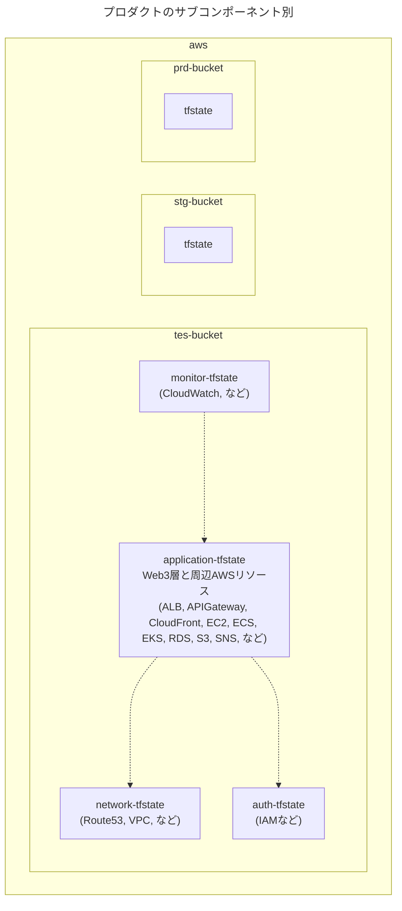

</div>

### リポジトリのディレクトリ構成

#### 異なるリポジトリの場合

プロダクトのサブコンポーネント別の分割手法の場合、異なるリポジトリで管理するとリポジトリが増え過ぎてしまいます。

そのため、これはお勧めしません。

#### 同じリポジトリの場合

プロダクトのサブコンポーネント別に分割した`tfstate`ファイルを同じリポジトリで管理する場合です。

(例)

`tfstate`ファイルの分割に基づいて、リポジトリのディレクトリ構成例は以下の通りです。

ここでは、状態の依存関係図と同じ状況を仮定しています。

```sh
aws-repository/
├── application/
│   ├── output.tf # 他のtfstateファイルから依存される
│   ├── remote_state.tf # 他のtfstateファイルに依存する
│   ├── provider.tf
│   ├── alb.tf
│   ├── cloudfront.tf
│   ├── ec2.tf
│   ├── ecs.tf
│   ├── eks.tf
│   ├── ses.tf
│   ├── sns.tf
│   ├── tes # 検証環境
│   │   ├── backend.tfvars # tes用バックエンド内の/application/terraform.tfstate
│   │   ...
│   │
│   ├── stg # ユーザー受け入れ環境
│   │   ├── backend.tfvars # stg用バックエンド内の/application/terraform.tfstate
│   │   ...
│   │
│   └── prd # 本番環境
│       ├── backend.tfvars # prd用バックエンド内の/application/terraform.tfstate
│       ...
│
├── auth/
│   ├── provider.tf
│   ├── output.tf # 他のtfstateファイルから依存される
│   ├── iam.tf
│   ├── tes # 検証環境
│   │   ├── backend.tfvars # tes用バックエンド内の/auth/terraform.tfstate
│   │   ...
│   │
│   ├── stg # ユーザー受け入れ環境
│   │   ├── backend.tfvars # stg用バックエンド内の/auth/terraform.tfstate
│   │   ...
│   │
│   └── prd # 本番環境
│       ├── backend.tfvars # prd用バックエンド内の/auth/terraform.tfstate
│       ...
│
├── monitor/
│   ├── provider.tf
│   ├── remote_state.tf # 他のtfstateファイルに依存する
│   ├── cloudwatch.tf
│   ├── tes # 検証環境
│   │   ├── backend.tfvars # tes用バックエンド内の/monitor/terraform.tfstate
│   │   ...
│   │
│   ├── stg # ユーザー受け入れ環境
│   │   ├── backend.tfvars # stg用バックエンド内の/monitor/terraform.tfstate
│   │   ...
│   │
│   └── prd # 本番環境
│       ├── backend.tfvars # prd用バックエンド内の/monitor/terraform.tfstate
│       ...
│
└── network
    ├── provider.tf
    ├── output.tf # 他のtfstateファイルから依存される
    ├── route53.tf
    ├── vpc.tf
    ├── tes # 検証環境
    │   ├── backend.tfvars # tes用バックエンド内の/network/terraform.tfstate
    │   ...
    │
    ├── stg # ユーザー受け入れ環境
    │   ├── backend.tfvars # stg用バックエンド内の/network/terraform.tfstate
    │   ...
    │
    └── prd # 本番環境
        ├── backend.tfvars # prd用バックエンド内の/network/terraform.tfstate
        ...
```

### リモートバックエンドのディレクトリ構成

#### 異なるリモートバックエンドの場合

プロダクトのサブコンポーネント別の分割手法の場合、異なるリモートバックエンドで管理するとバックエンドが増え過ぎてしまいます。

そのため、これはお勧めしません。

#### 同じリモートバックエンドの場合

プロダクトのサブコンポーネント別に分割した`tfstate`ファイルを、異なるリモートバックエンドで管理します。

(例)

`tfstate`ファイルの分割に基づいて、リモートバックエンド内のディレクトリ構成例は以下の通りです。

ここでは、状態の依存関係図と同じ状況を仮定しています。

```sh
# tes用バケットの場合
tes-bucket/
├── application
│   └── terraform.tfstate
│
├── auth
│   └── terraform.tfstate
│
├── monitor
│   └── terraform.tfstate
│
└── network
    └── terraform.tfstate

```

<br>

## AWSリソースの種類グループ別

### この分割方法について

AWSリソースの種類グループ別で`tfstate`ファイルを分割し、中間レイヤーもこれに基づいて設計します。

この分割方法により、各AWSリソースの種類グループも管理者が互いに影響を受けずにTerraformのソースコードを変更できるようになります。

一方で、AWSリソースの種類グループは、分けようと思えばいくらでも細分化できてしまいます。

細分化した数だけ状態の依存関係図が複雑になっていくため、適度な数 (`3`~`5`個くらい) にしておくように注意が必要です。

この分割方法は、グループ数がどんどん増えていく可能性があるため、お勧めしません。

### 状態の依存関係図

(例)

以下の種類グループに分割した状況と仮定します。

- application (Webサーバー、Appサーバー系)
- auth (認証/認可系)
- datastore (DBサーバー系)
- cicd (CI/CD系)
- monitor (監視系)
- network (ネットワーク系)

そのため、想定される状態の依存関係図は以下の通りです。


<div hidden>

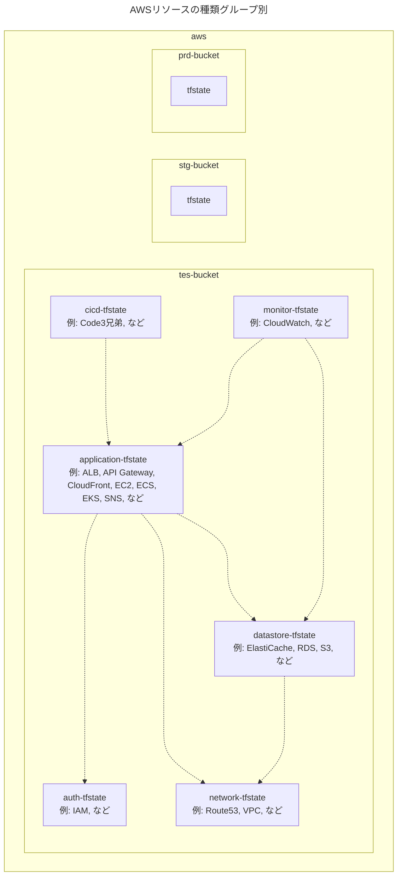

</div>

### リポジトリのディレクトリ構成

#### 異なるリポジトリの場合

AWSリソースの種類グループ別の分割手法の場合、異なるリポジトリで管理するとリポジトリが増え過ぎてしまいます。

そのため、これはお勧めしません。

#### 同じリポジトリの場合

AWSリソースの種類グループ別に分割した`tfstate`ファイルを同じリポジトリで管理する場合です。

(例)

`tfstate`ファイルの分割に基づいて、リポジトリのディレクトリ構成例は以下の通りです。

ここでは、状態の依存関係図と同じ状況を仮定しています。

```sh
aws-repository/
├── application/
│   ├── provider.tf
│   ├── remote_state.tf # 他のtfstateファイルに依存する
│   ├── output.tf # 他のtfstateファイルから依存される
│   ├── alb.tf
│   ├── api_gateway.tf
│   ├── cloudfront.tf
│   ├── ec2.tf
│   ├── ecs.tf
│   ├── eks.tf
│   ├── ses.tf
│   ├── sns.tf
│   ├── tes # 検証環境
│   │   ├── backend.tfvars # tes用バックエンド内の/application/terraform.tfstate
│   │   ...
│   │
│   ├── stg # ユーザー受け入れ環境
│   │   ├── backend.tfvars # stg用バックエンド内の/application/terraform.tfstate
│   │   ...
│   │
│   └── prd # 本番環境
│       ├── backend.tfvars # prd用バックエンド内の/application/terraform.tfstate
│       ...
│
├── auth/
│   ├── provider.tf
│   ├── output.tf # 他のtfstateファイルから依存される
│   ├── iam.tf
│   ├── tes # 検証環境
│   │   ├── backend.tfvars # tes用バックエンド内の/auth/terraform.tfstate
│   │   ...
│   │
│   ├── stg # ユーザー受け入れ環境
│   │   ├── backend.tfvars # stg用バックエンド内の/auth/terraform.tfstate
│   │   ...
│   │
│   └── prd # 本番環境
│       ├── backend.tfvars # prd用バックエンド内の/auth/terraform.tfstate
│       ...
│
├── cicd/
│   ├── provider.tf
│   ├── remote_state.tf # 他のtfstateファイルに依存する
│   ├── codebuild.tf
│   ├── codecommit.tf
│   ├── codedeploy.tf
│   ├── tes # 検証環境
│   │   ├── backend.tfvars # tes用バックエンド内の/cicd/terraform.tfstate
│   │   ...
│   │
│   ├── stg # ユーザー受け入れ環境
│   │   ├── backend.tfvars # stg用バックエンド内の/cicd/terraform.tfstate
│   │   ...
│   │
│   └── prd # 本番環境
│       ├── backend.tfvars # prd用バックエンド内の/cicd/terraform.tfstate
│       ...
│
├── datastore/
│   ├── provider.tf
│   ├── output.tf # 他のtfstateファイルから依存される
│   ├── remote_state.tf # 他のtfstateファイルに依存する
│   ├── elasticache.tf
│   ├── rds.tf
│   ├── s3.tf
│   ├── tes # 検証環境
│   │   ├── backend.tfvars # tes用バックエンド内の/datastore/terraform.tfstate
│   │   ...
│   │
│   ├── stg # ユーザー受け入れ環境
│   │   ├── backend.tfvars # stg用バックエンド内の/datastore/terraform.tfstate
│   │   ...
│   │
│   └── prd # 本番環境
│       ├── backend.tfvars # prd用バックエンド内の/datastore/terraform.tfstate
│       ...
│
├── monitor/
│   ├── provider.tf
│   ├── remote_state.tf # 他のtfstateファイルに依存する
│   ├── cloudwatch.tf
│   ├── tes # 検証環境
│   │   ├── backend.tfvars # tes用バックエンド内の/monitor/terraform.tfstate
│   │   ...
│   │
│   ├── stg # ユーザー受け入れ環境
│   │   ├── backend.tfvars # stg用バックエンド内の/monitor/terraform.tfstate
│   │   ...
│   │
│   └── prd # 本番環境
│       ├── backend.tfvars # prd用バックエンド内の/monitor/terraform.tfstate
│       ...
│
└── network
    ├── provider.tf
    ├── output.tf # 他のtfstateファイルから参照できるように、outputブロックを定義する
    ├── route53.tf
    ├── vpc.tf
    ├── tes # 検証環境
    │   ├── backend.tfvars # tes用バックエンド内の/network/terraform.tfstate
    │   ...
    │
    ├── stg # ユーザー受け入れ環境
    │   ├── backend.tfvars # stg用バックエンド内の/network/terraform.tfstate
    │   ...
    │
    └── prd # 本番環境
        ├── backend.tfvars # prd用バックエンド内の/network/terraform.tfstate
        ...
```

### リモートバックエンドのディレクトリ構成

#### 異なるリモートバックエンドの場合

AWSリソースの種類グループ別の分割手法の場合、異なるリモートバックエンドで管理するとバックエンドが増え過ぎてしまいます。

そのため、これはお勧めしません。

#### 同じリモートバックエンドの場合

AWSリソースの種類グループ別に分割した`tfstate`ファイルを、異なるリモートバックエンドで管理します。

(例)

`tfstate`ファイルの分割に基づいて、リモートバックエンド内のディレクトリ構成例は以下の通りです。

ここでは、状態の依存関係図と同じ状況を仮定しています。

```sh
# tes用バケットの場合
tes-bucket/
├── application
│   └── terraform.tfstate
│
├── auth
│   └── terraform.tfstate
│
├── cicd
│   └── terraform.tfstate
│
├── datastore
│   └── terraform.tfstate
│
├── monitor
│   └── terraform.tfstate
│
└── network
    └── terraform.tfstate
```

<br>

## AWSリソースの状態の変更頻度グループ別

### この分割方法について

AWSリソースの状態の変更頻度グループ別で`tfstate`ファイルを分割し、中間レイヤーもこれに基づいて設計します。

この分割方法により、各変更頻度グループの管理者が互いに影響を受けずにTerraformのソースコードを変更できるようになります。

この分割方法は、変更頻度の境目が曖昧なため、お勧めしません。

> ↪️：[https://www.reddit.com/r/Terraform/comments/126jwa1/comment/jea9bjk/?utm_source=share&utm_medium=web3x&utm_name=web3xcss&utm_term=1&utm_content=share_button:title]

### 状態の依存関係図

(例)

以下の変更頻度グループに分割した状況と仮定します。

- 変更高頻度グループ
- 変更中頻度グループ
- 変更低頻度グループ

そのため、想定される状態の依存関係図は以下の通りです。


<div hidden>

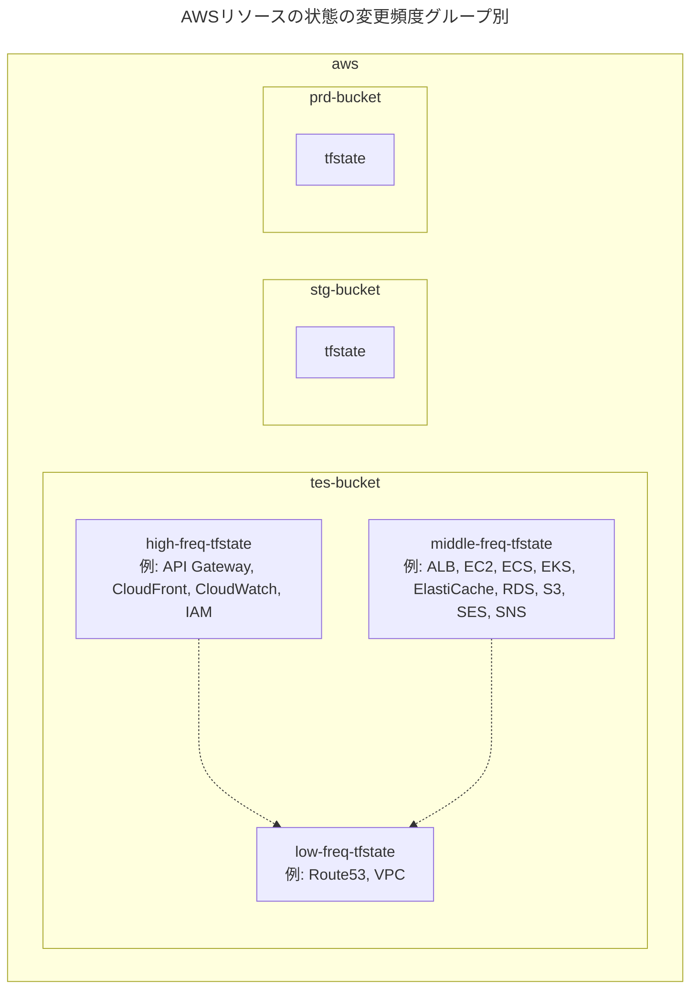

</div>

### リポジトリのディレクトリ構成

#### 異なるリポジトリの場合

AWSリソースの変更頻度グループ別の分割手法の場合、異なるリポジトリで管理するとリポジトリが増え過ぎてしまいます。

そのため、これはお勧めしません。

#### 同じリポジトリの場合

AWSリソースの変更頻度グループ別に分割した`tfstate`ファイルを同じリポジトリで管理する場合です。

(例)

`tfstate`ファイルの分割に基づいて、リポジトリのディレクトリ構成例は以下の通りです。

ここでは、状態の依存関係図と同じ状況を仮定しています。

```sh
aws-repository/
├── high-freq # 高頻度変更グループ
│   ├── provider.tf
│   ├── remote_state.tf # 他のtfstateファイルに依存する
│   ├── api_gateway.tf
│   ├── cloudfront.tf
│   ├── cloudwatch.tf
│   ├── ec2.tf
│   ├── ecs.tf
│   ├── eks.tf
│   ├── iam.tf
│   ├── tes # 検証環境
│   │   ├── backend.tfvars # tes用バックエンド内の/high-freq/terraform.tfstate
│   │   ...
│   │
│   ├── stg # ユーザー受け入れ環境
│   │   ├── backend.tfvars # stg用バックエンド内の/high-freq/terraform.tfstate
│   │   ...
│   │
│   └── prd # 本番環境
│       ├── backend.tfvars # prd用バックエンド内の/high-freq/terraform.tfstate
│       ...
│
├── low-freq # 低頻度変更グループ
│   ├── provider.tf
│   ├── output.tf # 他のtfstateファイルから依存される
│   ├── route53.tf
│   ├── vpc.tf
│   ├── tes
│   │   ├── backend.tfvars # tes用バックエンド内の/low-freq/terraform.tfstate
│   │   ...
│   │
│   ├── stg
│   │   ├── backend.tfvars # stg用バックエンド内の/low-freq/terraform.tfstate
│   │   ...
│   │
│   └── prd
│       ├── backend.tfvars # prd用バックエンド内の/low-freq/terraform.tfstate
│       ...
│
└── middle-freq # 中頻度変更グループ (高頻度とも低頻度とも言えないリソース)
    ├── provider.tf
    ├── remote_state.tf # 他のtfstateファイルに依存する
    ├── elasticache.tf
    ├── rds.tf
    ├── s3.tf
    ├── ses.tf
    ├── tes
    │   ├── backend.tfvars # tes用バックエンド内の/middle-freq/terraform.tfstate
    │   ...
    │
    ├── stg
    │   ├── backend.tfvars # stg用バックエンド内の/middle-freq/terraform.tfstate
    │   ...
    │
    └── prd
        ├── backend.tfvars # prd用バックエンド内の/middle-freq/terraform.tfstate
        ...
```

### リモートバックエンドのディレクトリ構成

#### 異なるリモートバックエンドの場合

AWSリソースの変更頻度グループ別の分割手法の場合、異なるリモートバックエンドで管理するとバックエンドが増え過ぎてしまいます。

そのため、これはお勧めしません。

#### 同じリモートバックエンドの場合

AWSリソースの変更頻度グループ別に分割した`tfstate`ファイルを、異なるリモートバックエンドで管理します。

(例)

`tfstate`ファイルの分割に基づいて、リモートバックエンド内のディレクトリ構成例は以下の通りです。

ここでは、状態の依存関係図と同じ状況を仮定しています。

```sh
# tes用バケットのディレクトリ構成
tes-bucket/
├── high-freq
│   └── terraform.tfstate
│
├── middle-freq
│   └── terraform.tfstate
│
└── low-freq
    └── terraform.tfstate
```

<br>

## 運用チーム責務範囲別 × プロダクトサブコンポーネント別

### この分割方法について

運用チーム責務範囲別とプロダクトサブコンポーネント別を組み合わせて`tfstate`ファイルを分割し、中間レイヤーもこれに基づいて設計します。

この分割方法により、各運用チーム内の複数の開発者が互いに影響を受けずにTerraformのソースコードを変更できるようになります。

この分割方法は、Terraformに携わる開発者が多い大規模なプロダクトほど効力を発揮し、実際に私も現在進行形で採用しているため、非常に実用的と考えています。

### 状態の依存関係図

以下の運用チームに分割した状況と仮定します。

また、各運用チームでTerraformを変更できる開発者が相当数するため、プロダクトのサブコンポーネント別にも分割したとします。

- frontendチーム
  - application
  - monitor
- backendチーム
  - application
  - monitor
- sreチーム
  - application
  - auth
  - monitor
  - network


<div hidden>

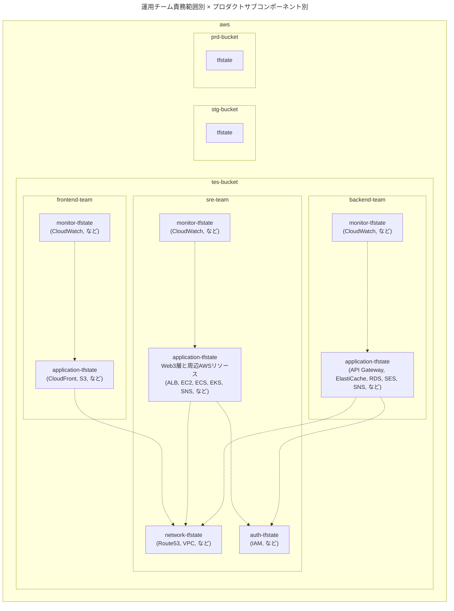

</div>

### リポジトリのディレクトリ構成

#### 異なるリポジトリの場合

```sh
aws-frontend-team-repository/
├── application/
│   ├── provider.tf
│   ├── output.tf # 他のtfstateファイルから依存される
│   ├── remote_state.tf # 他のtfstateファイルに依存する
│   ├── cloudfront.tf
│   ├── ses.tf
│   ├── tes # 検証環境
│   │   ├── backend.tfvars # tes用バックエンド内の/frontend-team/application/terraform.tfstate
│   │   ...
│   │
│   ├── stg # ユーザー受け入れ環境
│   │   ├── backend.tfvars # stg用バックエンド内の/frontend-team/application/terraform.tfstate
│   │   ...
│   │
│   └── prd # 本番環境
│       ├── backend.tfvars # prd用バックエンド内の/frontend-team/application/terraform.tfstate
│       ...
│
└── monitor/
    ├── provider.tf
    ├── remote_state.tf # 他のtfstateファイルに依存する
    ├── cloudwatch.tf
    ├── tes # 検証環境
    │   ├── backend.tfvars # tes用バックエンド内の/frontend-team/monitor/terraform.tfstate
    │   ...
    │
    ├── stg # ユーザー受け入れ環境
    │   ├── backend.tfvars # stg用バックエンド内の/frontend-team/monitor/terraform.tfstate
    │   ...
    │
    └── prd # 本番環境
        ├── backend.tfvars # prd用バックエンド内の/frontend-team/monitor/terraform.tfstate
        ...
```

```sh
aws-backend-team-repository/
├── application/
│   ├── provider.tf
│   ├── output.tf # 他のtfstateファイルから依存される
│   ├── remote_state.tf # 他のtfstateファイルに依存する
│   ├── api_gateway.tf
│   ├── elasticache.tf
│   ├── rds.tf
│   ├── ses.tf
│   ├── sns.tf
│   ├── tes # 検証環境
│   │   ├── backend.tfvars # tes用バックエンド内の/backend-team/application/terraform.tfstate
│   │   ...
│   │
│   ├── stg # ユーザー受け入れ環境
│   │   ├── backend.tfvars # stg用バックエンド内の/backend-team/application/terraform.tfstate
│   │   ...
│   │
│   └── prd # 本番環境
│       ├── backend.tfvars # prd用バックエンド内の/backend-team/application/terraform.tfstate
│       ...
│
└── monitor/
    ├── provider.tf
    ├── remote_state.tf # 他のtfstateファイルに依存する
    ├── cloudwatch.tf
    ├── tes # 検証環境
    │   ├── backend.tfvars # tes用バックエンド内の/backend-team/monitor/terraform.tfstate
    │   ...
    │
    ├── stg # ユーザー受け入れ環境
    │   ├── backend.tfvars # stg用バックエンド内の/backend-team/monitor/terraform.tfstate
    │   ...
    │
    └── prd # 本番環境
        ├── backend.tfvars # prd用バックエンド内の/backend-team/monitor/terraform.tfstate
        ...
```

```sh
aws-sre-team-repository/
├── application/
│   ├── provider.tf
│   ├── output.tf # 他のtfstateファイルから依存される
│   ├── remote_state.tf # 他のtfstateファイルに依存する
│   ├── alb.tf
│   ├── ec2.tf
│   ├── ecs.tf
│   ├── eks.tf
│   ├── tes # 検証環境
│   │   ├── backend.tfvars # バックエンド内の/sre-team/application/terraform.tfstate
│   │   ...
│   │
│   ├── stg # ユーザー受け入れ環境
│   │   ├── backend.tfvars # バックエンド内の/sre-team/application/terraform.tfstate
│   │   ...
│   │
│   └── prd # 本番環境
│       ├── backend.tfvars # バックエンド内の/sre-team/application/terraform.tfstate
│       ...
│
├── auth/
│   ├── provider.tf
│   ├── output.tf # 他のtfstateファイルから依存される
│   ├── iam.tf
│   ├── tes # 検証環境
│   │   ├── backend.tfvars # バックエンド内の/sre-team/application/terraform.tfstate
│   │   ...
│   │
│   ├── stg # ユーザー受け入れ環境
│   │   ├── backend.tfvars # バックエンド内の/sre-team/application/terraform.tfstate
│   │   ...
│   │
│   └── prd # 本番環境
│       ├── backend.tfvars # バックエンド内の/sre-team/application/terraform.tfstate
│       ...
│
├── monitor/
│   ├── provider.tf
│   ├── remote_state.tf # 他のtfstateファイルに依存する
│   ├── cloudwatch.tf
│   ├── tes # 検証環境
│   │   ├── backend.tfvars # tes用バックエンド内の/sre-team/monitor/terraform.tfstate
│   │   ...
│   │
│   ├── stg # ユーザー受け入れ環境
│   │   ├── backend.tfvars # stg用バックエンド内の/sre-team/monitor/terraform.tfstate
│   │   ...
│   │
│   └── prd # 本番環境
│       ├── backend.tfvars # prd用バックエンド内の/sre-team/monitor/terraform.tfstate
│       ...
│
└── network
    ├── provider.tf
    ├── output.tf # 他のtfstateファイルから依存される
    ├── route53.tf
    ├── vpc.tf
    ├── tes # 検証環境
    │   ├── backend.tfvars # バックエンド内の/sre-team/network/terraform.tfstate
    │   ...
    │
    ├── stg # ユーザー受け入れ環境
    │   ├── backend.tfvars # バックエンド内の/sre-team/network/terraform.tfstate
    │   ...
    │
    └── prd # 本番環境
        ├── backend.tfvars # バックエンド内の/sre-team/network/terraform.tfstate
        ...
```

#### 同じリポジトリの場合

運用チーム責務範囲別とプロダクトサブコンポーネント別を組み合わせる分割手法の場合、同じリポジトリで管理するとリポジトリが巨大になってしまいます。

そのため、これはお勧めしません。

### リモートバックエンドのディレクトリ構成

#### 異なるリモートバックエンドの場合

運用チーム責務範囲別とプロダクトサブコンポーネント別を組み合わせる分割手法の場合、異なるリモートバックエンドで管理するとバックエンドが増え過ぎてしまいます。

そのため、これはお勧めしません。

#### 同じリモートバックエンドの場合

```sh
# tes用バケットの場合
tes-bucket/
├── frontend-team
│   ├── application
│   │   └── terraform.tfstate
│   │
│   └── monitor
│       └── terraform.tfstate
│
├── backend-team
│   ├── application
│   │   └── terraform.tfstate
│   │
│   └── monitor
│       └── terraform.tfstate
│
└── sre-team
    ├── application
    │   └── terraform.tfstate
    │
    ├── auth
    │   └── terraform.tfstate
    │
    ├── monitor
    │   └── terraform.tfstate
    │
    └── network
        └── terraform.tfstate
```

<br>

# 09. おわりに

Terraformの`tfstate`ファイルの分割手法をもりもり布教しました。

ただ正直なところ、Terraformの開発現場の具体的な要件は千差万別であり、特に`tfstate`ファイル間の状態依存関係は様々です。

そのため、あらゆる要件を抽象化した分割手法を考えることは不可能だと思っています😇

もし、この記事を参考に設計してくださる方は、分割手法を現場に落とし込んで解釈いただけると幸いです。

<br>

最後に、お友達の記事内の言葉を引用しておきます。

> 「自分を信じても…信頼に足る仲間を信じても…誰にもわからない…」
>
> ([`@nwiizo`](https://twitter.com/nwiizo), 2023, https://syu-m-5151.hatenablog.com/entry/2023/05/19/154346:title)

<br>

# 謝辞

今回、Terraformの分割手法の収集にあたり、以下の方々からの意見や実装方法も参考にさせていただきました。

- [`@kiyo_12_07`](https://twitter.com/kiyo_12_07)
- [`@masasuzu`](https://twitter.com/masasuz)
- [`@tozastation`](https://twitter.com/tozastation)

(アルファベット順)

この場で感謝申し上げます🙇🏻‍

<br>
