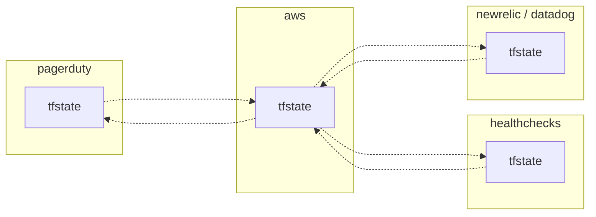
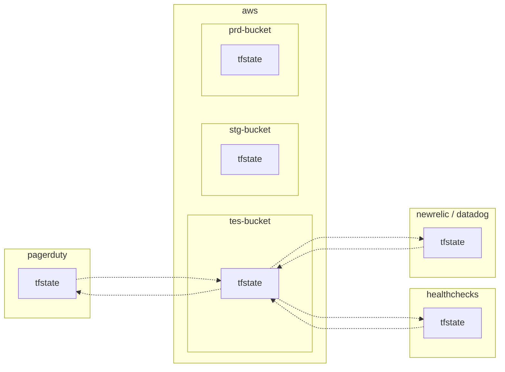
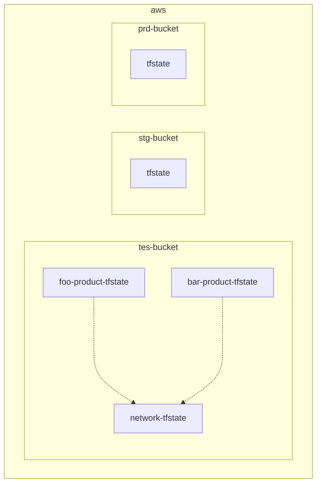

<br>

[:contents]

<br>

# 01. はじめに

前世の俺が徳を積まなかったせいで、Mitchell Hashimoto として現世に生まれることができませんした😭

さて最近の業務で、全プロダクトの技術基盤開発チームに携わっており、チームが使っているTerraform🧑🏻‍🚀のリポジトリをリプレイスする作業を担当しました。

このリポジトリでは単一の`tfstate`ファイルが状態を持ち過ぎている課題を抱えていたため、課題に合った適切な分割手法でリプレイスしました。

今回は、この時に整理した分割手法を記事で紹介しました。

なお、クラウドプロバイダーの中でもAWS向けの説明となってしまうことをご容赦ください。

それでは、もりもり布教していきます😗

<br>

# 02. なぜ`tfstate`ファイルを分割するのか

そもそも、なぜ`tfstate`ファイルを分割する必要なのでしょうか。

様々なインフラコンポーネントを単一の`tfstate`ファイルで状態を持つと、1回の`terraform`コマンド全ての状態を操作できて楽です。

その一方で、自身の作業ブランチ以外でインフラコンポーネントの状態を変更しかけていると、`terraform`コマンドで`target`オプションが必要になります。


<br>

この時に`tfstate`ファイルをいい感じに分割すると、まるで暗黙的に`target`オプションがついたように、他の作業ブランチの影響を受けずに`terraform`コマンドを実行できます。


<br>

# 03. `tfstate`ファイルの分割

## `tfstate`ファイルの分割

それでは、`tfstate`ファイルの分割の境目はどのようにして見つければよいのでしょうか。

これを見つけるコツは、『他の状態にできるだけ依存しないリソースの関係』に注目することだと考えています。

本記事では、`tfstate`ファイルが他の`tfstate`ファイルの状態を使用する場合、それを『依存』と表現することとします。

これは、オブジェクト指向でいうところの『依存』と同じような考え方と思っていただいてよいです

例えば、AWSリソースからなるプロダクトをいくつかの`tfstate`ファイル (`foo-tfstate`、`bar-tfstate`、`baz-tfstate`) に分割したと仮定します。

この時、これらの`tfstate`ファイルの間で使用する関係がないほどよいです。


<br>

## `tfstate`ファイルの分割に基づいた他の構成

### リポジトリのディレクトリ構成

リポジトリのディレクトリは、`tfstate`ファイルの分割に基づいて設計しましょう。

```yaml
repository/
├── foo/
│   ├── backend.tf # リモートバックエンド内の/foo/terraform.tfstate
│   ...
│
└── bar/
    ├── backend.tf # リモートバックエンド内の/bar/terraform.tfstate
    ...
```

<br>

### リモートバックエンドのディレクトリ構成

リモートバックエンド内のディレクトリ構成も、Terraformのディレクトリ構成とおおよそ同じである方がわかりやすいです。

```sh
bucket/
├── foo/
│   └── terraform.tfstate
│
└── bar/
    └── terraform.tfstate
```

<br>

###

[05. 分割手法]() リモートバックエンド自体を別々にする

<br>

# 04. `tfstate`ファイル間の依存関係について

## 依存関係図

`tfstate`ファイル間で依存関係がある場合には、依存関係図を考える必要があります。

(例)

AWSリソースからなるプロダクトをいくつかの`tfstate`ファイル (`foo-tfstate`、`bar-tfstate`) に分割したと仮定します。

この時、`foo-tfstate` ➡︎ `bar-tfstate` の方向に依存しています。

そのため、想定される依存関係図は以下の通りです。


<br>

## `terraform_remote_state`ブロックを使用する場合

### `terraform_remote_state`ブロックによる依存

**以降は、こちらを使用して依存関係を実装します。**

`tfstate`ファイルが他の`tfstate`ファイルに依存する方法として、`terraform_remote_state`ブロックがあります。

`terraform_remote_state`ブロックを使用する場合、以下のメリットがあります。

- 依存先のAWSリソースに関わらず、同じ`terraform_remote_state`ブロックを使い回すことができる

一方で、以下のデメリットがあります。

- 別途`output`ブロックの定義が必要になり、可読性が低くなる。
- 依存先と依存元の間でTerraformのバージョンに差がありすぎると、`tfstate`ファイル間で互換性がなくなり、`terraform_remote_state`ブロックで状態に依存できない場合があります。

### 依存関係図

(例)

AWSリソースからなるプロダクトをいくつかの`tfstate`ファイル (`foo-tfstate`、`bar-tfstate`) に分割したと仮定します。

この時、`foo-tfstate`ファイルはVPCの状態を持っており、`bar-tfstate`ファイルは`foo-tfstate`ファイルに依存しています。

そのため、想定される依存関係図は以下の通りです。


### リポジトリのディレクトリ構成

`tfstate`ファイルの分割に基づいて、ディレクトリ構成例は以下の通りです。

```sh
repository/
├── foo/
│   ├── backend.tf # リモートバックエンド内の/foo/terraform.tfstate
│   ├── output.tf # 他のtfstateファイルから依存される
│   ├── provider.tf
│   ...
│
└── bar/
    ├── backend.tf # リモートバックエンド内の/bar/terraform.tfstate
    ├── remote_state.tf # terraform_remote_stateブロックを使用し、foo-tfstateファイルに依存する
    ├── resource.tf
    ├── provider.tf
    ...
```

`bar-tfstate`ファイルが`foo-tfstate`ファイルに依存するために必要な実装は、以下の通りです。

```terraform
# VPCの状態は、foo-tfstateファイルで持つ
data "terraform_remote_state" "foo" {

  backend = "s3"

  config = {
    bucket = "foo-tfstate"
    key    = "foo/terraform.tfstate"
    region = "ap-northeast-1"
  }
}


# barリソースの状態は、bar-tfstateファイルで持つ
resource "example" "bar" {

  # barリソースは、foo-tfstateファイルのVPCに依存する
  vpc_id = data.terraform_remote_state.foo.outputs.vpc_id

  ...
}
```

```terraform
# VPCの状態は、foo-tfstateファイルで持つ
output "vpc_id" {
  value = aws_vpc.vpc.id
}
```

### リモートバックエンドのディレクトリ構成

`tfstate`ファイルの分割に基づいて、リモートバックエンド内のディレクトリ構成例は以下の通りです。

```sh
bucket/
├── foo
│   └── terraform.tfstate
│
└── bar
    └── terraform.tfstate
```

<br>

## `data`ブロックを使用する場合

### `data`ブロックによる依存とは

他の方法として、`data`ブロックがあります。

`data`ブロックは、`tfstate`ファイルが自身以外 (例：コンソール画面、他の`tfstate`ファイル) で作成されたAWSリソースの状態に依存するために使用できます。

`data`ブロックを使用する場合は、以下のメリットがあります。

- `output`ブロックが不要で可読性が高い。

一方で以下のデメリットがあります。

- 依存先のAWSリソースごとに`data`ブロックを定義する必要がある。

`terraform_remote_state`ブロックとは異なり、直接的には`tfstate`ファイルに依存しません。

`data`ブロックの場合は、実際のAWSリソースの状態に依存することにより、間接的にAWSリソースの`tfstate`ファイルに依存することになります。

### 依存関係図

(例)

`data`ブロックも同様にして、AWSリソースからなるプロダクトをいくつかの`tfstate`ファイル (`foo-tfstate`、`bar-tfstate`) に分割したと仮定します。

想定される依存関係図は以下の通りです。


### リポジトリのディレクトリ構成

ディレクトリ構成は、`tfstate`ファイルの分割に基づいて、以下の通りです。

```sh
repository/
├── foo/
│   ├── backend.tf # リモートバックエンド内の/foo/terraform.tfstate
│   ├── provider.tf
│   ...
│
└── bar/
    ├── backend.tf # リモートバックエンド内の/bar/terraform.tfstate
    ├── data.tf # dataブロックを使用し、foo-tfstateファイルに依存する
    ├── resource.tf
    ├── provider.tf
    ...
```

`bar-tfstate`ファイルが`foo-tfstate`ファイルに依存するために必要な実装は、以下の通りです。

```terraform
# VPCの状態は、foo-tfstateファイルで持つ
data "aws_vpc" "foo" {

  filter {
    name   = "tag:Name"
    values = ["<foo-tfstateが持つVPCの名前>"]
  }
}

# barリソースの状態は、bar-tfstateファイルで持つ
resource "example" "bar" {

  # barリソースは、foo-tfstateファイルのVPCに依存する
  vpc_id     = data.aws_vpc.foo.id
}
```

### リモートバックエンドのディレクトリ構成

`tfstate`ファイルの分割に基づいて、リモートバックエンド内のディレクトリ構成例は以下の通りです。

```sh
bucket/
├── foo
│   └── terraform.tfstate
│
└── bar
    └── terraform.tfstate
```

<br>

# 05. 分割手法パターンの概要

階層ごとにいくつかの分割パターンがあると考えています。

<table>
<thead>
  <tr>
    <th>必須<br>または<br>任意</th><th>ディレクトリ階層</th><th>パターン</th><th>おすすめ</th>
  </tr>
</thead>
<tbody>
  <tr>
    <td rowspan="3">必須</td>
  </tr>
  <tr>
    <td>リポジトリ構成<br>または<br>リポジトリのディレクトリ最上層の構成</td><td>クラウドプロバイダーのアカウント別</td><td align=center><code>⭕️</code></td>
  </tr>
  <tr>
    <td>リポジトリのディレクトリ最下層の構成</td><td>実行環境別</td><td align=center><code>⭕️</code></td>
  </tr>
  <tr>
    <td rowspan="6">任意</td><td rowspan="7">リポジトリのディレクトリ中間層の構成</td><td>同じテナント内のプロダクト別</td><td></td>
  </tr>
  <tr>
    <td>運用チーム責務範囲別</td><td align=center><code>⭕️</code></td>
  </tr>
  <tr>
    <td>プロダクトのサブコンポーネント別</td><td align=center><code>⭕️</code></td>
  </tr>
  <tr>
    <td>AWSリソースの種類別</td><td></td>
  </tr>
  <tr>
    <td>AWSリソースの状態の変更頻度別</td><td></td>
  </tr>
  <tr>
    <td>運用チーム責務範囲別とプロダクトのサブコンポーネント別の組み合わせ</td><td align=center><code>⭕️</code></td>
  </tr>
</tbody>
</table>
<br>

# 06. 最上層ディレクトリの構成 (必須)

## クラウドプロバイダーのアカウント別

### この分割方法について

クラウドプロバイダーのアカウント別に`tfstate`ファイルを分割し、最上層ディレクトリもこれに基づいて設計します。

この分割方法により、各プロバイダーの管理者が互いに影響を受けずに、Terraformのソースコードを変更できるようになります。

### 依存関係図

(例)

以下のプロバイダーを使用したい状況と仮定します。

- 主要プロバイダー (AWS)
- アプリ/インフラ監視プロバイダー (NewRelic、Datadog、など)
- ジョブ監視プロバイダー (Healthchecks)
- インシデント管理プロバイダー (PagerDuty)

この時、プロバイダー間で相互に依存関係があります。

そのため、想定される依存関係図は以下の通りです。



### リポジトリのディレクトリ構成

#### 異なるリポジトリの場合

クラウドプロバイダー別に分割した`tfstate`ファイルを異なるリポジトリで管理する場合です。

`tfstate`ファイルの分割に基づいて、ディレクトリ構成例は以下の通りです。

(例)

同上の状況です。

```sh
aws-repository/
├── backend.tf # バックエンド内のaws用terraform.tfstate
├── output.tf # 他のtfstateファイルから依存される
├── remote_state.tf # 他のtfstateファイルに依存する
├── provider.tf
...
```

```sh
<newrelic、datadog>-repository/
├── backend.tf # バックエンド内のnewrelic、datadog用terraform.tfstate
├── output.tf # 他のtfstateファイルから依存される
├── remote_state.tf # 他のtfstateファイルに依存する
├── provider.tf
...
```

```sh
<healthchecks>-repository/
├── backend.tf # healthchecks用バックエンド内のterraform.tfstate
├── output.tf # 他のtfstateファイルから依存される
├── remote_state.tf # 他のtfstateファイルに依存する
├── provider.tf
...
```

```sh
<pagerDuty>-repository/
├── backend.tf # pagerduty用バックエンド内のterraform.tfstate
├── output.tf # 他のtfstateファイルから依存される
├── remote_state.tf # 他のtfstateファイルに依存する
├── provider.tf
...
```

#### 同じリポジトリの場合

クラウドプロバイダー別に分割した`tfstate`ファイルを同じリポジトリで管理する場合です。

`tfstate`ファイルの分割に基づいて、ディレクトリ構成例は以下の通りです。

(例)

依存関係図の項目に記載する状況と同じです。

```sh
repository/
├── aws/
│   ├── backend.tf # バックエンド内のaws用terraform.tfstate
│   ├── output.tf # 他のtfstateファイルから依存される
│   ├── remote_state.tf # 他のtfstateファイルに依存する
│   ├── provider.tf
│   ...
│
├── <newrelic、datadog>/
│   ├── backend.tf # バックエンド内のdatadog用terraform.tfstate
│   ├── output.tf # 他のtfstateファイルから依存される
│   ├── remote_state.tf # 他のtfstateファイルに依存する
│   ├── provider.tf
│   ...
│
├── <healthchecks>/
│   ├── backend.tf # バックエンド内のhealthchecks用terraform.tfstate
│   ├── output.tf # 他のtfstateファイルから依存される
│   ├── remote_state.tf # 他のtfstateファイルに依存する
│   ├── provider.tf
│   ...
│
└── <pagerduty>/
     ├── backend.tf # バックエンド内のpagerduty用terraform.tfstate
     ├── output.tf # 他のtfstateファイルから依存される
     ├── remote_state.tf # 他のtfstateファイルに依存する****
     ├── provider.tf
     ...
```

<br>

### リモートバックエンドのディレクトリ構成

#### 異なるリモートバックエンドの場合

クラウドプロバイダー別に分割した`tfstate`ファイルを、異なるリモートバックエンドで管理します。

`tfstate`ファイルの分割に基づいて、リモートバックエンド内のディレクトリ構成例は以下の通りです。

(例)

依存関係図の項目に記載する状況と同じです。

```sh
aws-bucket/
└── terraform.tfstate # AWSの状態を持つ
```

```sh
<newrelic、datadog>-bucket/
└── terraform.tfstate # NewRelic、Datadog、の状態を持つ
```

```sh
<healthchecks>-bucket/
└── terraform.tfstate # Healthchecksの状態を持つ
```

```sh
<pagerduty>-bucket/
└── terraform.tfstate # PagerDutyの状態を持つ
```

#### 同じリモートバックエンドの場合

クラウドプロバイダー別に分割した`tfstate`ファイルを、同じリモートバックエンドで管理します。

`tfstate`ファイルの分割に基づいて、リモートバックエンド内のディレクトリ構成例は以下の通りです。

(例)

依存関係図の項目に記載する状況と同じです。

```sh
bucket/
├── aws
│   └── terraform.tfstate # AWSの状態を持つ
│
├── <newrelic、datadog>
│   └── terraform.tfstate # NewRelic、Datadog、の状態を持つ
│
├── <healthchecks>
│   └── terraform.tfstate # Healthchecksの状態を持つ
│
└── <pagerduty>
    └── terraform.tfstate # PagerDutyの状態を持つ
```

<br>

# 07. 最下層ディレクトリの構成 (必須)

## 実行環境別

### この分割方法について

実行環境別に`tfstate`ファイルを分割し、最下層ディレクトリもこれに基づいて設計します。

この分割方法により、各実行環境の管理者が互いに影響を受けずに、Terraformのソースコードを変更できるようになります。

### 依存関係図

(例)

以下の実行環境を構築したい状況と仮定します。

- `tes` (検証環境)
- `stg` (ユーザー受け入れ環境)
- `prd` (本番環境)

かつ、以下のプロバイダーを使用したい状況と仮定します。

- 主要プロバイダー (AWS)
- アプリ/インフラ監視プロバイダー (NewRelic、Datadog、など)
- ジョブ監視プロバイダー (Healthchecks)
- インシデント管理プロバイダー (PagerDuty)

この時、その実行環境の`tfstate`ファイルは他の実行環境には依存していません。

そのため、想定される依存関係図は以下の通りです。



### リポジトリのディレクトリ構成

#### 異なるリポジトリの場合

**以降は、こちらを使用して依存関係を実装します。**

クラウドプロバイダー別に`tfstate`ファイルを分割することは必須としているため、その上でディレクトリ構成を考えます。

`tfstate`ファイルの分割に基づいて、ディレクトリ構成例は以下の通りです。

(例)

依存関係図の項目に記載する状況と同じです。

```sh
aws-repository/
├── provider.tf
├── tes/ # 検証環境
│   ├── backend.tfvars # aws用バックエンド内のterraform.tfstate
│   ...
│
├── stg/ # ユーザー受け入れ環境
└── prd/ # 本番環境
```

```sh
<newrelic、datadog>-repository/
├── provider.tf
├── tes/
├── stg/
└── prd/
```

```sh
<healthchecks>-repository/
├── provider.tf
├── tes/
├── stg/
└── prd/
```

```sh
<pagerduty>-repository/
├── provider.tf
├── tes/
├── stg/
└── prd/
```

#### 同じリポジトリの場合

クラウドプロバイダー別に`tfstate`ファイルを分割することは必須としているため、その上でディレクトリ構成を考えます。

`tfstate`ファイルの分割に基づいて、ディレクトリ構成例は以下の通りです。

(例)

依存関係図の項目に記載する状況と同じです。

```sh
repository/
├── aws/
│   ├── tes/ # 検証環境
│   │   ├── backend.tfvars # aws用バックエンド内のterraform.tfstate
│   │   ...
│   │
│   ├── stg/ # ユーザー受け入れ環境
│   └── prd/ # 本番環境
│
├── <newrelic、datadog>/
│   ├── tes/
│   ├── stg/
│   └── prd/
│
├── <healthchecks>/
│   ├── tes/
│   ├── stg/
│   └── prd/
│
└── <pagerduty>/
    ├── tes/
    ├── stg/
    └── prd/

```

### リモートバックエンドのディレクトリ構成

#### 異なるリモートバックエンドの場合

実行環境別に分割した`tfstate`ファイルを、異なるリモートバックエンドで管理します。

`tfstate`ファイルの分割に基づいて、リモートバックエンド内のディレクトリ構成例は以下の通りです。

(例)

依存関係図の項目に記載する状況と同じです。

```sh
tes-aws-bucket/
└── terraform.tfstate # AWSの状態を持つ
```

```sh
tes-<newrelic、datadog>-bucket/
└── terraform.tfstate # NewRelic、Datadog、の状態を持つ
```

```sh
tes-<healthchecks>-bucket/
└── terraform.tfstate # Healthchecksの状態を持つ
```

```sh
tes-<pagerduty>-bucket/
└── terraform.tfstate # PagerDutyの状態を持つ
```

#### 同じリモートバックエンド x AWSアカウントごと異なる実行環境 の場合

**以降は、こちらを使用してディレクトリを構成します。**

クラウドプロバイダー別に分割した`tfstate`ファイルを、同じリモートバックエンドで管理します。

また、AWSアカウントごとに異なる実行環境を構築していると仮定します。

`tfstate`ファイルの分割に基づいて、リモートバックエンド内のディレクトリ構成例は以下の通りです。

(例)

依存関係図の項目に記載する状況と同じです。

```sh
tes-bucket/
├── aws/
│   └── terraform.tfstate # AWSの状態を持つ
│
├── <newrelic、datadog>/
│   └── terraform.tfstate # NewRelic、Datadog、の状態を持つ
│
├── <healthchecks>/
│   └── terraform.tfstate # Healthchecksの状態を持つ
│
└── <pagerduty>/
    └── terraform.tfstate # PagerDutyの状態を持つ

```

#### 同じリモートバックエンド x 単一のAWSアカウント内に全ての実行環境 の場合

クラウドプロバイダー別に分割した`tfstate`ファイルを、同じリモートバックエンドで管理します。

また、単一のAWSアカウント内に全実行環境を構築しているとします。

`tfstate`ファイルの分割に基づいて、リモートバックエンド内のディレクトリ構成例は以下の通りです。

(例)

依存関係図の項目に記載する状況と同じです。

```sh
bucket/
├── aws/
│   ├── tes/ # 検証環境
│   │   └── terraform.tfstate # AWSの状態を持つ
│   │
│   ├── stg/ # ユーザー受け入れ環境
│   └── prd/ # 本番環境
│
├── <newrelic、datadog>/
│   ├── tes/
│   │   └── terraform.tfstate # NewRelic、Datadog、の状態を持つ
│   │
│   ├── stg/
│   └── prd/
│
├── <healthchecks>/
│   ├── tes/
│   │   └── terraform.tfstate # Healthchecksの状態を持つ
│   │
│   ├── stg/
│   └── prd/
│
└── <pagerduty>/
    ├── tes/
    │   └── terraform.tfstate # PagerDutyの状態を持つ
    │
    ├── stg/
    └── prd/
```

<br>

# 08. 中間層ディレクトリの構成 (任意)

**ここからは、依存関係図を複雑にしないために、AWSプロバイダー内の`tfsfate`ファイルの依存関係のみを考えることとします。**

## 同じテナントのプロダクト別

### この分割方法について

同じテナント (例：同じAWSアカウントの同じVPC) 内に複数のプロダクトがある場合に、プロダクト別で`tfstate`ファイルを分割し、中間層ディレクトリもこれに基づいて設計します。

ここでいうプロダクトは、アプリを動かすプラットフォーム (例：EKS、ECS、AppRunner、EC2) とそれを取り巻くAWSリソースを指しています。

各プロダクトの使用するIPアドレス数が少なく、プロダクト別にVPCを分割するのが煩雑という背景があるとしています。

この分割方法により、各プロダクトの管理者が互いに影響を受けずに、Terraformのソースコードを変更できるようになります。

### 依存関係図

(例)

以下のプロダクトがある状況と仮定します。

- foo-product
- bar-product
- 共有network系コンポーネント (例：VPC、Route53)

この時、各プロダクトの`tfstate`ファイルは、共有network系コンポーネントの`tfstate`ファイルに依存しています。

そのため、想定される依存関係図は以下の通りです。



### リポジトリのディレクトリ構成

#### 異なるリポジトリの場合

同じテナントのプロダクト別に分割した`tfstate`ファイルを異なるリポジトリで管理する場合です。

`tfstate`ファイルの分割に基づいて、ディレクトリ構成例は以下の通りです。

(例)

依存関係図の項目に記載する状況と同じです。

```sh
# foo-productのtfstateファイルのリポジトリ
aws-foo-product-repository/
├── provider.tf
├── remote_state.tf # 他のtfstateファイルに依存する
├── tes # 検証環境
│   ├── backend.tfvars # tes用バックエンド内の/foo-product/terraform.tfstate
│   ...
│
├── stg # ユーザー受け入れ環境
│   ├── backend.tfvars # stg用バックエンド内の/foo-product/terraform.tfstate
│   ...
│
└── prd # 本番環境
    ├── backend.tfvars # prd用バックエンド内の/foo-product/terraform.tfstate
    ...
```

```sh
# bar-productのtfstateファイルのリポジトリ
aws-bar-product-repository/
├── provider.tf
├── remote_state.tf # 他のtfstateファイルに依存する
├── tes # 検証環境
│   ├── backend.tfvars # tes用バックエンド内の/bar-product/terraform.tfstate
│   ...
│
├── stg # ユーザー受け入れ環境
│   ├── backend.tfvars # stg用バックエンド内の/bar-product/terraform.tfstate
│   ...
│
└── prd # 本番環境
    ├── backend.tfvars # prd用バックエンド内の/bar-product/terraform.tfstate
       ...
```

```sh
# 共有network系コンポーネントのtfstateファイルのリポジトリ
aws-network-repository
├── provider.tf
├── output.tf # 他のtfstateファイルから依存される
├── route53.tf
├── vpc.tf
├── tes # 検証環境
│   ├── backend.tfvars # tes用バックエンド内の/network/terraform.tfstate
│   ...
│
├── stg # ユーザー受け入れ環境
│   ├── backend.tfvars # stg用バックエンド内の/network/terraform.tfstate
│   ...
│
└── prd # 本番環境
    ├── backend.tfvars # prd用バックエンド内の/network/terraform.tfstate
    ...
```

#### 同じリポジトリの場合

同じテナントのプロダクト別に分割した`tfstate`ファイルを同じリポジトリで管理する場合です。

`tfstate`ファイルの分割に基づいて、ディレクトリ構成例は以下の通りです。

(例)

依存関係図の項目に記載する状況と同じです。

```sh
aws-repository/
├── foo-product/
│   ├── provider.tf
│   ├── remote_state.tf # 他のtfstateファイルに依存する
│   ├── tes # 検証環境
│   │   ├── backend.tfvars # tes用バックエンド内の/foo-product/terraform.tfstate
│   │   ...
│   │
│   ├── stg # ユーザー受け入れ環境
│   │   ├── backend.tfvars # stg用バックエンド内の/foo-product/terraform.tfstate
│   │   ...
│   │
│   └── prd # 本番環境
│       ├── backend.tfvars # prd用バックエンド内の/foo-product/terraform.tfstate
│       ...
│
├── bar-product/
│   ├── provider.tf
│   ├── remote_state.tf # 他のtfstateファイルに依存する
│   ├── tes # 検証環境
│   │   ├── backend.tfvars # tes用バックエンド内の/bar-product/terraform.tfstate
│   │   ...
│   │
│   ├── stg # ユーザー受け入れ環境
│   │   ├── backend.tfvars # stg用バックエンド内の/bar-product/terraform.tfstate
│   │   ...
│   │
│   └── prd # 本番環境
│       ├── backend.tfvars # prd用バックエンド内の/bar-product/terraform.tfstate
│       ...
│
└── network
    ├── provider.tf
    ├── output.tf # 他のtfstateファイルから依存される
    ├── route53.tf
    ├── vpc.tf
    ├── tes # 検証環境
    │   ├── backend.tfvars # tes用バックエンド内の/network/terraform.tfstate
    │   ...
    │
    ├── stg # ユーザー受け入れ環境
    │   ├── backend.tfvars # stg用バックエンド内の/network/terraform.tfstate
    │   ...
    │
    └── prd # 本番環境
        ├── backend.tfvars # prd用バックエンド内の/network/terraform.tfstate
        ...
```

### リモートバックエンドのディレクトリ構成

#### 異なるリモートバックエンドの場合

中間層ディレクトリの場合、異なるリモートバックエンドで管理する必要はないと考えています。

そのため、ここでは説明を省略します。

#### 同じリモートバックエンドの場合

同じテナントのプロダクト別に分割した`tfstate`ファイルを、異なるリモートバックエンドで管理します。

`tfstate`ファイルの分割に基づいて、リモートバックエンド内のディレクトリ構成例は以下の通りです。

(例)

依存関係図の項目に記載する状況と同じです。

```sh
tes-bucket/
├── foo-product
│   └── terraform.tfstate
│
├── bar-product
│   └── terraform.tfstate
│
└── network
    └── terraform.tfstate
```

<br>

## 運用チーム責務範囲別

### この分割方法について

運用チームのAWSリソースの責務範囲別でtfstateファイルを分割し、中間層ディレクトリもこれに基づいて設計します。

この分割方法により、各チームが互いに影響を受けずにTerraformのソースコードを変更できるようになります。

### 依存関係図

以下の運用チームがある状況と仮定します。

- frontendチーム
- backendチーム
- sreチーム

```sh
%%{init:{'theme':'natural'}}%%
flowchart TB
    subgraph aws
        subgraph tes-bucket
            Frontend["frontend-team-tfstate<br>(CloudFront, S3, など)"]
            Backend["backend-team-tfstate<br>(API Gateway, ElastiCache, RDS, SES, SNS, など)"]
            Sre["sre-team-tfstate<br>(ALB, CloudWatch, EC2, ECS, EKS, IAM, VPC, など)"]
            Frontend-..->Sre
            Backend-..->Sre
            Sre-..->Frontend
            Sre-..->Backend
        end
    subgraph stg-bucket
        Stg[tfstate]
    end
    subgraph prd-bucket
        Prd[tfstate]
    end
    end
```

### リポジトリのディレクトリ構成

### リモートバックエンドのディレクトリ構成

<br>

## プロダクトのサブコンポーネント別

### この分割方法について

### 依存関係図

### リポジトリのディレクトリ構成

### リモートバックエンドのディレクトリ構成

<br>

## AWSリソースの種類別

### この分割方法について

### 依存関係図

### リポジトリのディレクトリ構成

### リモートバックエンドのディレクトリ構成

<br>

## AWSリソースの状態の変更頻度別

### この分割方法について

### 依存関係図

### リポジトリのディレクトリ構成

### リモートバックエンドのディレクトリ構成

<br>

## 運用チーム責務範囲別 × プロダクトサブコンポーネント別

### この分割方法について

### 依存関係図

### リポジトリのディレクトリ構成

### リモートバックエンドのディレクトリ構成

<br>

# 09. おわりに

Terraformの`tfstate`ファイルの分割手法をもりもり布教しました。

ただ正直なところ、Terraformの開発現場の具体的な要件は千差万別であり、特に`tfstate`ファイル間の依存関係は様々です。

そのため、あらゆる要件を抽象化した分割手法を考えることは不可能だと思っています😇

もし、この記事を参考に設計してくださる方は、分割手法を現場に落とし込んで解釈いただけると幸いです。

なお、`tfstate`ファイルの分割の考え方は、”State File Isolation” というテーマで以下の書籍にも記載されていますので、ぜひご一読いただけると🙇🏻‍

> ↪️：
>
> - [isbn:1098116747:title]
> - [https://www.oreilly.com/library/view/terraform-up-and/9781098116736/ch03.html:title]

<br>

最後に、お友達の記事内の言葉を引用しておきます。

> 「自分を信じても…信頼に足る仲間を信じても…誰にもわからない…」
>
> ([`@nwiizo`](https://twitter.com/nwiizo), 2023, https://syu-m-5151.hatenablog.com/entry/2023/05/19/154346:title)

<br>

# 謝辞

今回、Terraformの分割手法の収集にあたり、以下の方々からの意見や実装方法も参考にさせていただきました。

- [`@kiyo_12_07`](https://twitter.com/kiyo_12_07)
- [`@masasuzu`](https://twitter.com/masasuz)
- [`@tozastation`](https://twitter.com/tozastation)

(アルファベット順)

この場で感謝申し上げます🙇🏻‍

<br>
