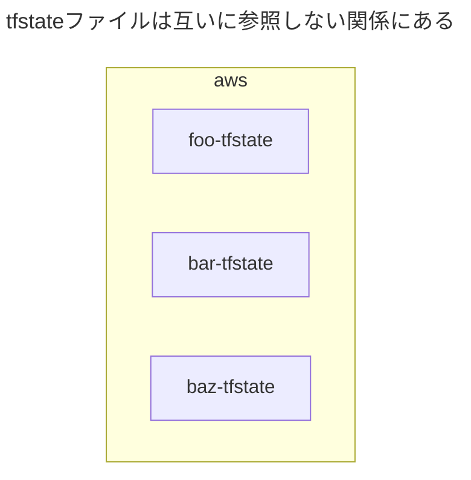
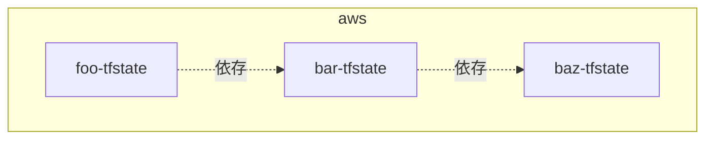
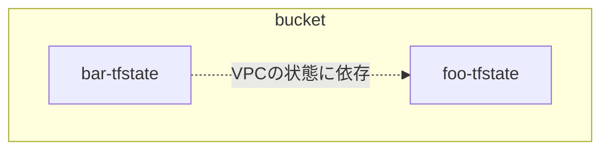

<br>

[:contents]

<br>

# 01. はじめに

前世の俺が徳を積まなかったせいで、Mitchell Hashimoto として現世に生まれることができなった。

さて最近の業務で、全プロダクト基盤開発チームがAWSをコード化するために使っているTerraform 🌏のリポジトリを、丸々リプレイスしました。

この時、ディレクトリ構成と`tfstate`ファイル分割の設計パターンをざっと整理し、その上で適切な新設計を採用しました。

今回は、この設計パターンを記事で紹介しました。

なお、クラウドプロバイダーの中でもAWS向けの説明となってしまうことをご容赦ください。

それでは、もりもり布教していきます😗

<br>

# 02. なぜ`tfstate`ファイルを分割するのか

そもそも、なぜ`tfstate`ファイルを分割する必要なのでしょうか。

様々なインフラコンポーネントを単一の`tfstate`ファイルで状態を持つと、1回の`terraform`コマンド全ての状態を操作できて楽です。

その一方で、自身の作業ブランチ以外でインフラコンポーネントの状態を変更しかけていると、`terraform`コマンドで`target`オプションが必要になります。


この時に`tfstate`ファイルをいい感じに分割すると、まるで暗黙的に`target`オプションがついたように、他の作業ブランチの影響を受けずに`terraform`コマンドを実行できます。


<br>

# 03. Terraformのディレクトリ構成

## 分割方法

大前提として、Terraformのディレクトリ構成は、`tfstate`ファイルの粒度に基づいて分割しましょう。

```yaml
repository/
├── foo/
│   ├── backend.tf # バックエンド内の/foo/terraform.tfstate
│   ...
│
├── bar/
│   ├── backend.tf # バックエンド内の/bar/terraform.tfstate
│   ...
│
...
```

<br>

## `tfstate`ファイルの境目

それでは、`tfstate`ファイルの境目はどのようにして見つければよいのでしょうか。

これを見つけるコツは、**他の状態にできるだけ依存しないリソースの関係**に注目することだと考えています。

本記事では、`tfstate`ファイルが他の`tfstate`ファイルの状態を使用する場合、それを『**依存**』と表現することとします。

これは、オブジェクト指向でいうところの『**依存**』と同じような考え方と思っていただいてよいです

例えば、AWSリソースからなるプロダクトをいくつかの`tfstate`ファイル (`foo-tfstate`、`bar-tfstate`、`baz-tfstate`) に分割したと仮定します。

この時、これらの`tfstate`ファイルの間で使用する関係がないほどよいです。



<br>

# 04. `tfstate`ファイル間の依存関係について

## 依存関係図

`tfstate`ファイル間で依存関係がある場合には、依存関係図を考える必要があります。


例えば、AWSリソースからなるプロダクトをいくつかの`tfstate`ファイル (`foo-tfstate`、`bar-tfstate`、`baz-tfstate`) に分割したと仮定します。

この時、`foo-tfstate` ➡︎ `bar-tfstate` ➡︎ `baz-tfstate` の方向に依存関係があると、依存関係図は以下の通りです。



<br>

## `terraform_remote_state`ブロックを使用する場合

### `terraform_remote_state`ブロックによる依存

`tfstate`ファイルが他の`tfstate`ファイルに依存する方法として、`terraform_remote_state`ブロックがあります。

`terraform_remote_state`ブロックを使用する場合、以下のメリットがあります。

- 依存先のAWSリソースに関わらず、同じ`terraform_remote_state`ブロックを使い回すことができる

一方で、以下のデメリットがあります。

- 別途`output`ブロックの定義が必要になり、可読性が低くなる。
- 依存先と依存元の間でTerraformのバージョンに差がありすぎると、`tfstate`ファイル間で互換性がなくなり、`terraform_remote_state`ブロックで状態を参照できない場合がある。

### 依存関係図とディレクトリ構成

例えば、AWSリソースからなるプロダクトをいくつかの`tfstate`ファイル (`foo-tfstate`、`bar-tfstate`) に分割したと仮定します。

`foo-tfstate`では、VPCの状態を持っているとします。

`bar-tfstate`は`foo-tfstate`が持つVPCに依存することとなり、依存関係図は以下の通りです。



ディレクトリ構成は、`tfstate`ファイルの粒度に合わせて、以下の通りです。

```yaml
repository/
├── foo/
│   ├── backend.tf # バックエンド内の/foo/terraform.tfstate
│   ├── output.tf # 他のtfstateファイルから依存される
│   ├── provider.tf
│   ...
│
├── bar/
│   ├── backend.tf # バックエンド内の/bar/terraform.tfstate
│   ├── remote_state.tf # 他のtfstateファイルに依存する
│   ├── resource.tf # fooのtfstateファイルから参照した状態を使用する   
│   ├── provider.tf
│   ...
│
...
```

`bar-tfstate`が`foo-tfstate`に必要な実装は、以下の通りです。

```terraform
# VPCの状態は、foo-tfstateで持つ
data "terraform_remote_state" "foo" {

  backend = "s3"

  config = {
    bucket = "foo-tfstate"
    key    = "foo/terraform.tfstate"
    region = "ap-northeast-1"
  }
}


# barリソースの状態は、bar-tfstateで持つ
resource "example" "bar" {
  
  # barリソースは、foo-tfstateのVPCに依存する
  vpc_id = data.terraform_remote_state.foo.outputs.vpc_id 

  ...
}
```

```terraform
# VPCの状態は、foo-tfstateで持つ
output "vpc_id" {
  value = aws_vpc.vpc.id
}
```

<br>

## `data`ブロックを使用する場合

### `data`ブロックによる依存とは

他の方法として、`data`ブロックがあります。

<br>

## 05. 分割パターン

<div class="text-box">
社内で意見を聞くと、`tfstate`ファイル分割は、Terraformのコードを変更する開発者が少ないような小規模開発 (例：数人しかコードに触らない) ではメリットが少なく、反対に変更する人が増えていくほどメリットが大きくなる印象がありました。
</div>

<br>

<br>

# おわりに

Terraformのディレクトリ構成と`tfstate`ファイル分割の設計パターンをもりもり布教しました。

ただ正直なところ、Terraformの開発現場の具体的な要件は千差万別であり、特に`tfstate`ファイル間の依存関係は様々です。

そのため、あらゆる要件を抽象化した設計パターンを考えることは不可能だと思っています😇

> 「自分を信じても…信頼に足る仲間を信じても…誰にもわからない…」([`@nwiizo`](https://twitter.com/nwiizo), 2023)
>
> [https://syu-m-5151.hatenablog.com/entry/2023/05/19/154346:title]

もし、この記事を参考に設計してくださる方は、設計パターンを現場に落とし込んで解釈いただけると幸いです。

なお、`tfstate`ファイルの分割の考え方は以下の書籍にも記載されていますので、ぜひご一読いただけると🙇🏻‍

> ↪️：[isbn:1098116747:title]

<br>

# 謝辞

今回のTerraformの設計パターンの収集にあたり、以下の方々からの意見や実装方法も参考にさせていただきました。

- [@kiyo_12_07](https://twitter.com/kiyo_12_07)
- [@masasuzu](https://twitter.com/masasuz)
- [@tozastation](https://twitter.com/tozastation)

(アルファベット順)

この場で感謝申し上げます🙇🏻‍

<br>
