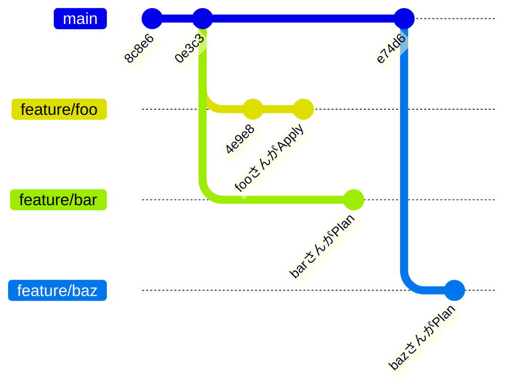

<br>

[:contents]

<br>

# 01. はじめに

前世の俺が徳を積まなかったせいで、Mitchell Hashimoto として現世に生まれることができませんでした...

さて最近の業務で、全プロダクト基盤開発チームがAWSをコード化するために使っているTerraform 🌏のリポジトリを、丸々リプレイスしました。

この時、ディレクトリ構成と`tfstate`ファイル分割の設計パターンをざっと整理し、その上で適切な新設計を採用しました。

今回は、この設計パターンを記事で紹介しました。

なお、クラウドプロバイダーの中でも、AWS向けの説明となってしまうことをご容赦ください。

それでは、もりもり布教していきます😗

<br>

# 02. なぜ`tfstate`ファイルを分割するのか

そもそも、なぜ`tfstate`ファイルを分割する必要なのでしょうか。

様々なインフラコンポーネントを単一の`tfstate`ファイルで状態を管理すると、1回の`terraform`コマンド全ての状態を操作できて楽です。

その一方で、自身の作業ブランチ以外でインフラコンポーネントの状態を変更しかけていると、`terraform`コマンドで`target`オプションが必要になります。



この時に`tfstate`ファイルをいい感じに分割すると、まるで暗黙的に`target`オプションがついたように、他の作業ブランチの影響を受けずに`terraform`コマンドを実行できます。

ただし社内で意見を聞くと、`tfstate`ファイル分割は、Terraformのコードを変更する開発者が少ないような環境 (例：数人からなるSREチームしか触らない) ではデメリットが多く、反対に変更する人が増えていくほどメリットが大きくなる印象がありました。

<br>

# 04. `tfstate`ファイル間の依存関係について

[@tmknom](https://twitter.com/tmknom) さんも、ソフトウェアエンジニアリングを知識の土台に置いてました。

<iframe class="speakerdeck-iframe" frameborder="0" src="https://speakerdeck.com/player/ba0d8c6b4ecf47b0877998580d00f51b?slide=49" title="Terraform Module Designs" allowfullscreen="true" style="border: 0px; background: padding-box padding-box rgba(0, 0, 0, 0.1); margin: 0px; padding: 0px; border-radius: 6px; box-shadow: rgba(0, 0, 0, 0.2) 0px 5px 40px; width: 100%; height: auto; aspect-ratio: 560 / 314;" data-ratio="1.78343949044586"></iframe>

<br>

# 03. `tfstate`ファイルの粒度に基づくディレクトリ分割

まず、Terraformのディレクトリ構成はtfstateファイルの粒度に基づいて分割する。

```yaml
repository/
├── foo/
│   ├── backend.tf # バックエンド内の/foo/terraform.tfstate
│   ...
│
├── bar/
│   ├── backend.tf # バックエンド内の/bar/terraform.tfstate
│   ...
│
...
```

<br>

# おわりに

Terraformのディレクトリ構成と`tfstate`ファイル分割の設計パターンをもりもり布教しました。

ただ正直なところ、Terraformの開発現場の具体的な要件は千差万別であり、特に`tfstate`ファイル間の依存関係は様々です。

そのため、あらゆる要件を抽象化した設計パターンを考えることは不可能だと思っています😇

> 「自分を信じても…信頼に足る仲間を信じても…誰にもわからない…」([`@nwiizo`](https://twitter.com/nwiizo), 2023)
>
> [https://syu-m-5151.hatenablog.com/entry/2023/05/19/154346:title]

もし、この記事を参考に設計してくださる方は、設計パターンを現場に落とし込んで解釈いただけると幸いです。

なお、`tfstate`ファイルの分割の考え方は以下の書籍にも記載されていますので、ぜひご一読いただけると🙇🏻‍

> ↪️：[isbn:1098116747:title]

<br>

# 謝辞

今回のTerraformの設計パターンの収集にあたり、以下の方々からの意見や実装方法も参考にさせていただきました。

- [@kiyo_12_07](https://twitter.com/kiyo_12_07)
- [@masasuzu](https://twitter.com/masasuz)
- [@tozastation](https://twitter.com/tozastation)

この場で感謝申し上げます🙇🏻‍

<br>
