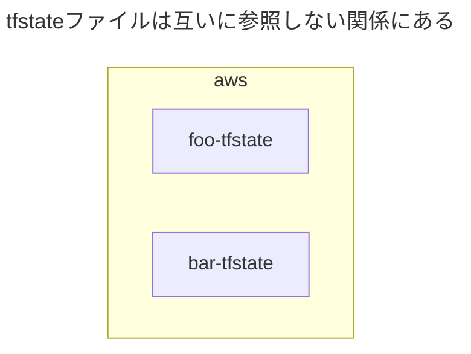
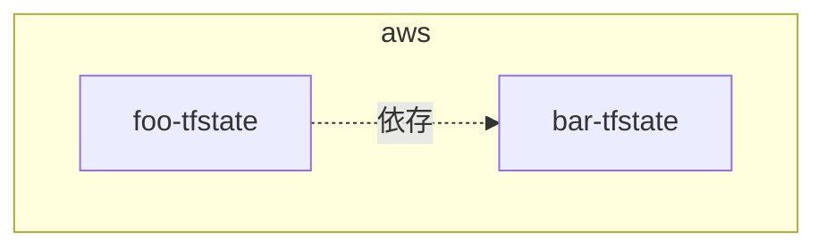

<br>

[:contents]

<br>

# 01. はじめに

前世の俺が徳を積まなかったせいで、Mitchell Hashimoto として現世に生まれることができなった。

さて最近の業務で、全プロダクト基盤開発チームがAWSをコード化するために使っているTerraform🧑🏻‍🚀のリポジトリを、丸々リプレイスしました。

この時、`tfstate`ファイルの分割手法をざっと整理し、その上で適切な新設計を採用しました。

今回は、これを記事で紹介しました。

なお、クラウドプロバイダーの中でもAWS向けの説明となってしまうことをご容赦ください。

それでは、もりもり布教していきます😗

<br>

# 02. なぜ`tfstate`ファイルを分割するのか

そもそも、なぜ`tfstate`ファイルを分割する必要なのでしょうか。

様々なインフラコンポーネントを単一の`tfstate`ファイルで状態を持つと、1回の`terraform`コマンド全ての状態を操作できて楽です。

その一方で、自身の作業ブランチ以外でインフラコンポーネントの状態を変更しかけていると、`terraform`コマンドで`target`オプションが必要になります。


この時に`tfstate`ファイルをいい感じに分割すると、まるで暗黙的に`target`オプションがついたように、他の作業ブランチの影響を受けずに`terraform`コマンドを実行できます。


<br>

# 03. `tfstate`ファイルの分割

## `tfstate`ファイルの分割

それでは、`tfstate`ファイルの分割の境目はどのようにして見つければよいのでしょうか。

これを見つけるコツは、**他の状態にできるだけ依存しないリソースの関係**に注目することだと考えています。

本記事では、`tfstate`ファイルが他の`tfstate`ファイルの状態を使用する場合、それを『**依存**』と表現することとします。

これは、オブジェクト指向でいうところの『**依存**』と同じような考え方と思っていただいてよいです

例えば、AWSリソースからなるプロダクトをいくつかの`tfstate`ファイル (`foo-tfstate`、`bar-tfstate`、`baz-tfstate`) に分割したと仮定します。

この時、これらの`tfstate`ファイルの間で使用する関係がないほどよいです。



<br>

## `tfstate`ファイルの分割に基づいた他の構成

### リポジトリのディレクトリ構成

リポジトリのディレクトリ構成は、`tfstate`ファイルの粒度に基づいて分割しましょう。

```yaml
repository/
├── foo/
│   ├── backend.tf # リモートバックエンド内の/foo/terraform.tfstate
│   ...
│
└── bar/
    ├── backend.tf # リモートバックエンド内の/bar/terraform.tfstate
    ...
```

<br>

### リモートバックエンドのディレクトリ構成

リモートバックエンド内のディレクトリ構成も、Terraformのディレクトリ構成とおおよそ同じである方がわかりやすいです。

```yaml
bucket/
├── foo/
│   └── terraform.tfstate
│
└── bar/
└── terraform.tfstate
```

<br>

###

[05. 分割手法]() リモートバックエンド自体を別々にする

<br>

# 04. `tfstate`ファイル間の依存関係について

## 依存関係図

`tfstate`ファイル間で依存関係がある場合には、依存関係図を考える必要があります。

例えば、AWSリソースからなるプロダクトをいくつかの`tfstate`ファイル (`foo-tfstate`、`bar-tfstate`) に分割したと仮定します。

この時、`foo-tfstate` ➡︎ `bar-tfstate` の方向に依存関係があると、依存関係図は以下の通りです。



<br>

## `terraform_remote_state`ブロックを使用する場合

### `terraform_remote_state`ブロックによる依存

`tfstate`ファイルが他の`tfstate`ファイルに依存する方法として、`terraform_remote_state`ブロックがあります。

`terraform_remote_state`ブロックを使用する場合、以下のメリットがあります。

- 依存先のAWSリソースに関わらず、同じ`terraform_remote_state`ブロックを使い回すことができる

一方で、以下のデメリットがあります。

- 別途`output`ブロックの定義が必要になり、可読性が低くなる。
- 依存先と依存元の間でTerraformのバージョンに差がありすぎると、`tfstate`ファイル間で互換性がなくなり、`terraform_remote_state`ブロックで状態を参照できない場合がある。

### 依存関係図

例えば、AWSリソースからなるプロダクトをいくつかの`tfstate`ファイル (`foo-tfstate`、`bar-tfstate`) に分割したと仮定します。

`foo-tfstate`ファイルでは、VPCの状態を持っているとします。

`bar-tfstate`ファイルは`foo-tfstate`ファイルが持つVPCに依存することとなり、依存関係図は以下の通りです。


### リポジトリのディレクトリ構成

ディレクトリ構成は、`tfstate`ファイルの粒度に合わせて、以下の通りです。

```yaml
repository/
├── foo/
│   ├── backend.tf # リモートバックエンド内の/foo/terraform.tfstate
│   ├── output.tf # 他のtfstateファイルから依存される
│   ├── provider.tf
│   ...
│
└── bar/
    ├── backend.tf # リモートバックエンド内の/bar/terraform.tfstate
    ├── remote_state.tf # terraform_remote_stateブロックを使用し、foo-tfstateファイルに依存する
    ├── resource.tf
    ├── provider.tf
    ...

...
```

`bar-tfstate`ファイルが`foo-tfstate`ファイルに依存するために必要な実装は、以下の通りです。

```terraform
# VPCの状態は、foo-tfstateファイルで持つ
data "terraform_remote_state" "foo" {

  backend = "s3"

  config = {
    bucket = "foo-tfstate"
    key    = "foo/terraform.tfstate"
    region = "ap-northeast-1"
  }
}


# barリソースの状態は、bar-tfstateファイルで持つ
resource "example" "bar" {

  # barリソースは、foo-tfstateファイルのVPCに依存する
  vpc_id = data.terraform_remote_state.foo.outputs.vpc_id

  ...
}
```

```terraform
# VPCの状態は、foo-tfstateファイルで持つ
output "vpc_id" {
  value = aws_vpc.vpc.id
}
```

### リモートバックエンドのディレクトリ構成

リモートバックエンド内のディレクトリ構成は以下の通りです。

```yaml
bucket/
├── foo
│   └── terraform.tfstate
│
└── bar #
    └── terraform.tfstate
```

<br>

## `data`ブロックを使用する場合

### `data`ブロックによる依存とは

他の方法として、`data`ブロックがあります。

`data`ブロックは、`tfstate`ファイルが自身以外 (例：コンソール画面、他の`tfstate`ファイル) で作成されたAWSリソースの状態を参照するために使用できる。

- `output`ブロックが不要で可読性が高い。

一方で以下のデメリットがあります。

- 依存先のAWSリソースごとに`data`ブロックを定義する必要がある。

### 依存関係図

`data`ブロックも同様にして、AWSリソースからなるプロダクトをいくつかの`tfstate`ファイル (`foo-tfstate`、`bar-tfstate`) に分割したと仮定します。

依存関係図は以下の通りです。


### リポジトリのディレクトリ構成

ディレクトリ構成は、`tfstate`ファイルの粒度に合わせて、以下の通りです。

```yaml
repository/
├── foo/
│   ├── backend.tf # リモートバックエンド内の/foo/terraform.tfstate
│   ├── provider.tf
│   ...
│
└── bar/
    ├── backend.tf # リモートバックエンド内の/bar/terraform.tfstate
    ├── data.tf # dataブロックを使用し、foo-tfstateファイルに依存する
    ├── resource.tf
    ├── provider.tf
    ...

...
```

リモートバックエンド内のディレクトリ構成は以下の通りです。

```yaml
bucket/
├── foo
│   └── terraform.tfstate
│
└── bar
└── terraform.tfstate
```

`bar-tfstate`ファイルが`foo-tfstate`ファイルに依存するために必要な実装は、以下の通りです。

```terraform
# VPCの状態は、foo-tfstateファイルで持つ
data "aws_vpc" "foo" {

  filter {
    name   = "tag:Name"
    values = ["<foo-tfstateが持つVPCの名前>"]
  }
}

# barリソースの状態は、bar-tfstateファイルで持つ
resource "example" "bar" {

  # barリソースは、foo-tfstateファイルのVPCに依存する
  vpc_id     = data.aws_vpc.foo.id
}
```

### リモートバックエンドのディレクトリ構成

リモートバックエンド内のディレクトリ構成は以下の通りです。

```yaml
bucket/
├── foo
│   └── terraform.tfstate
│
└── bar
└── terraform.tfstate
```

<br>

# 05. 分割手法パターン

## 全体像

階層ごとにいくつかの分割パターンがあると考えています。

<table>
<thead>
  <tr>
    <th>必須 / 任意</th><th>階層</th><th>パターン</th><th>おすすめ</th>
  </tr>
</thead>
<tbody>
  <tr>
    <td rowspan="3">必須</td>
  </tr>
  <tr>
    <td>リポジトリ自体 / リポジトリのディレクトリ最上層</td><td>クラウドプロバイダーのアカウント別</td><td align=center>`⭕️`</td>
  </tr>
  <tr>
    <td>リポジトリのディレクトリ最下層</td><td>実行環境別</td><td align=center>`⭕️`</td>
  </tr>
  <tr>
    <td rowspan="6">任意</td><td rowspan="7">リポジトリのディレクトリ中間層</td><td>同じテナント内のプロダクト別</td>
  </tr>
  <tr>
    <td>運用チーム責務範囲別</td><td align=center>`⭕️`</td>
  </tr>
  <tr>
    <td>プロダクトのサブコンポーネント別</td><td align=center>`⭕️`</td>
  </tr>
  <tr>
    <td>AWSリソースの種類別</td>
  </tr>
  <tr>
    <td>AWSリソースの状態の変更頻度別</td>
  </tr>
  <tr>
    <td>運用チーム責務範囲別とプロダクトのサブコンポーネント別の組み合わせ</td><td align=center>`⭕️`</td>
  </tr>
</tbody>
</table>

<br>

<br>

# おわりに

Terraformの`tfstate`ファイルの分割手法をもりもり布教しました。

ただ正直なところ、Terraformの開発現場の具体的な要件は千差万別であり、特に`tfstate`ファイル間の依存関係は様々です。

そのため、あらゆる要件を抽象化した分割手法を考えることは不可能だと思っています😇

> 「自分を信じても…信頼に足る仲間を信じても…誰にもわからない…」([`@nwiizo`](https://twitter.com/nwiizo), 2023)
>
> [https://syu-m-5151.hatenablog.com/entry/2023/05/19/154346:title]

もし、この記事を参考に設計してくださる方は、分割手法を現場に落とし込んで解釈いただけると幸いです。

なお、`tfstate`ファイルの分割の考え方は、”State File Isolation” というテーマで以下の書籍にも記載されていますので、ぜひご一読いただけると🙇🏻‍

> ↪️：
>
> - [isbn:1098116747:title]
> - [https://www.oreilly.com/library/view/terraform-up-and/9781098116736/ch03.html:title]

<br>

# 謝辞

今回、Terraformの分割手法の収集にあたり、以下の方々からの意見や実装方法も参考にさせていただきました。

- [@kiyo_12_07](https://twitter.com/kiyo_12_07)
- [@masasuzu](https://twitter.com/masasuz)
- [@tozastation](https://twitter.com/tozastation)

(アルファベット順)

この場で感謝申し上げます🙇🏻‍

<br>
