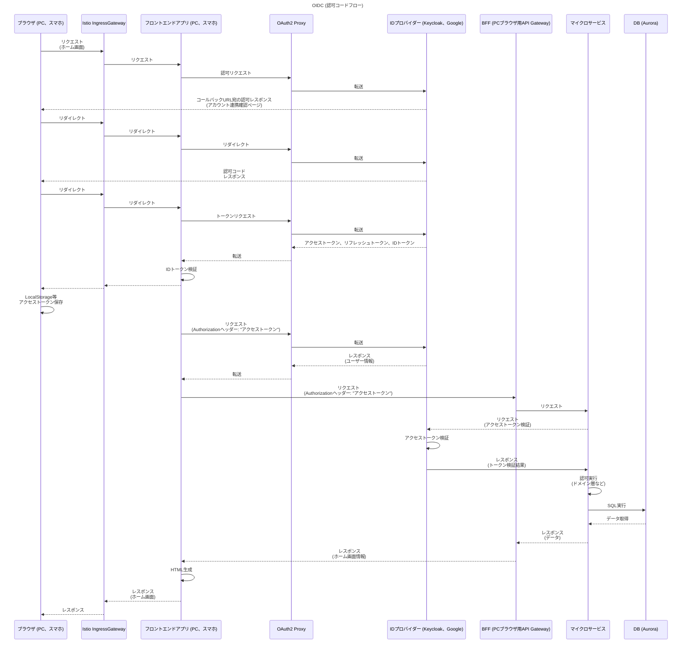

 

# この記事から得られる知識

この記事を読むと、以下を **"完全に理解"** できます✌️

 

[:contents]

 

# 01. はじめに

 

どうも、日給3500ペリカの地下強制労働者です。

普段は、マイクロサービスアーキテクチャのインフラ領域に軸足を置きつつ、アプリ領域にもちょっと携わっています。

マイクロサービスアーキテクチャの設計に関する知見を探してみると、フルスクラッチの例は見つかりますが、ツール (OSS、マネージドサービス、など) を使用した具体例の記事は少ないです。

そこで、様々な情報 (今まで/現在携わっているプロダクト、書籍、事例記事、ドキュメント、GitHubのサンプル実装) を集約しつつ、どんなツールを使用すれば、マイクロサービスアーキテクチャを効率的に設計できそうかを考察してみました。

なお、OSSとしてはCNCF、マネージドサービスとしてはAWSを使用するを想定しています。

考察記事ということで動かせるサンプル実装を用意できていないため、『それやってみたけど、無理やったで』『こっちのツールのほうがええで』みたいな知見も大募集です！

それでは、もりもり布教していきます😗

 

# 02. 題材にするマイクロサービスアーキテクチャ

## AWSアーキテクチャ

アーキテクチャは以下の通りです。

AWSリソースで代替しても不都合のない機能は、AWSリソースを使うことを想定しています。

## アプリ領域の設計

AWS ALBとIstio IngressGatewayを繋ぐ時に、AWS Load Balancer Controllerを使用してもいいですが、なくても良いと考えています。

Istio IngressGatewayにNodePort Serviceを使用すれば、AWS Load Balancer Controllerが不要になります。

Istio IngressGatewayはKubernetesで、ALBはTerraformで管理します。

 

## インフラ領域の設計

 

# 03. 認証認可

## 全体像

## マイクロサービス

RequestAuthenticationリソースを使用して、`istio-proxy`コンテナに認証ロジックを切り分けてもよいです。

ただ、アプリチームとしては、`istio-proxy`コンテナ側に認証ロジックがあるよりも、アプリ側にロジックがある方が直感的かと思います。

 

# 03. AWS EKS以外の選択肢

ここまで、マイクロサービスアーキテクチャをAWS EKSで動かす例を解説しました。

ここでは、他のAWSリソースの選択肢と、マイクロサービスアーキテクチャとの相性を考えようと思います。

あくまで僕の宗派ですので、以下のAWSリソースでマイクロサービスアーキテクチャを作るべきだという方もいると思います。

### AWS ECS

AWS ECSを使用して、マイクロサービスアーキテクチャを動かします。

この場合、マイクロサービスをAWS ECSサービスに対応させ、AWS ECSタスクでマイクロサービスをスケーリングすることになります。

また、マイクロサービス間の通信はリクエストリプライ方式になります。

AWS ECSは、AWS EKSよりもアプリ領域とインフラ領域の責務がより曖昧になります。

アプリ領域とインフラ領域が分業が進んでいない組織では、責務の境界が曖昧でも問題は起こりにくいです。

その一方で、組織が大きくなるほどAWS ECSの管理者がボトルネックになります。

例えば、AWS ECSを管理しているのがインフラチームだとして、ただアプリチームのコンテナの設定はAWS ECSに反映しないといけないです。

この時、インフラチームに依頼することになるのですが、インフラチームが手一杯であれば、スピード感が落ちます。

システムの将来的な拡張性を想定してマイクロサービスアーキテクチャを採用したはずなのに、これでは本末転倒かなと思います。

ただ、AWS EKSに至るまでの中継地点として、AWS ECSを採用することはアリと考えています。

 

### AWS Lambda

AWS Lambdaを使用して、マイクロサービスアーキテクチャを動かします。

この場合、マイクロサービスをAWS Lambdaに対応させることになります。

また、マイクロサービス間の通信はイベント駆動方式になります。

AWS Lambdaは、AWS EKSやAWS ECSよりもさらにアプリ領域とインフラ領域の責務がより曖昧になります。

組織が大きくなるほどAWS Lambdaの管理者がボトルネックになり、AWS ECSよりも拡張性の問題は顕著です。

また、イベント駆動方式とリクエストリプライ方式はドメインのモデリング方法が大きくことなります。

そのため、AWS EKSやAWS ECSに至るまでの中継地点としても採用する場合、イベント駆動方式を採用し続けることになります。

これらのことから、AWS Lambdaでマイクロサービスアーキテクチャを採用するべきではないと考えています。

 

# 04. おわりに

今回は設計の概要しか解説できませんでした。

それぞれのトピックをもう少し丁寧に解説した記事も出したいです。

借金全額返済まで残り1050年っ...！

 
