<br>

[:contents]

<br>

# 01. はじめに

<br>


<br>

前世で徳を積んで、Mitchell Hashimoto として生まれたかった...

さて最近の業務で、全プロダクトの技術基盤開発チームに携わっており、チームが使っているTerraform🧑🏻‍🚀のリポジトリをリプレイスする作業を担当しました。

このリポジトリでは単一の`tfstate`ファイルが状態を持ち過ぎている課題を抱えていたため、課題に合った適切な分割パターンでリプレイスしました。

今回は、この時に整理した分割パターンを記事で紹介しました。

なお、プロバイダーの中でもAWS向けの説明となってしまうことをご容赦ください。

それでは、もりもり布教していきます😗

<div class="text-box">
記事中のこのボックスは、補足情報を記載しています。
<br>
<br>
飛ばしていただいても大丈夫ですが、読んでもらえるとより理解が深まるはずです👍
</div>

<br>

# 02. なぜtfstateファイルを分割するのか

### 分割していない場合

そもそも、なぜ`tfstate`ファイルを分割する必要なのでしょうか。

様々なインフラコンポーネントを単一の`tfstate`ファイルで状態を持つと、1回の`terraform`コマンド全てのコンポーネントの状態を操作できて楽です。

ただし、複数の作業ブランチがある状況だと煩わしいことが起こります。

各作業ブランチでインフラコンポーネントの状態を変更しかけていると、`terraform`コマンドで`target`オプションが必要になります。


### 分割している場合

一方で、`tfstate`ファイルをいい感じに分割したとします。

各作業ブランチでは、まるで暗黙的に`target`オプションがついたように、他の作業ブランチの影響を受けずに`terraform`コマンドを実行できます。

よって、各`tfstate`ファイルの管理者は互いに影響を受けずに、Terraformのソースコードを変更できるようになります。


> - [isbn:1492046906:title]
> - [https://cloudcasts.io/course/terraform/organizing-with-multiple-states:title]

<br>

# 03. tfstateファイルの分割

## 分割の境目

それでは、`tfstate`ファイルの分割の境界はどのようにして見つければよいのでしょうか。

これを見つけるコツは、『他の状態にできるだけ依存しないリソースの関係』に注目することだと考えています。

ここでいう依存とは、`tfstate`ファイルが他の`tfstate`ファイルの状態を使用することです。

`tfstate`ファイルの分割パターンについては後述します。

<div class="text-box">
アプリケーション設計の文脈では、他を使用することを『依存』と表現します。
<br>
<br>
そのため便宜上、<code>tfstate</code>ファイルでも『依存』と表現することにしました。
</div>

<br>

## 状態の依存関係図

### 依存関係図とは

分割した`tfstate`ファイル間の状態の依存関係を表現した図です。

これは一般的な図ではなく、(おそらく) 私が勝手に考えた図です。

### 依存関係の表現

`tfstate`ファイル間で状態の依存関係がある場合、これを図で表現すると分割の状況がわかりやすくなります。

『依存』は、`--->` (波線矢印) で表現することとします。

設定値の参照数が少ないほどよいです。

<div class="text-box">
アプリケーション設計の文脈では、『依存』を<code>---></code> (波線矢印) で表現します。
<br>
<br>
そのため便宜上、<code>tfstate</code>ファイルでも『依存』と表現することにしました。
</div>

#### ▼ 依存関係がない場合

例えば、AWSリソースからなるプロダクトをいくつかの`tfstate`ファイル (`foo-tfstate`、`bar-tfstate`、`baz-tfstate`) に分割したと仮定します。

ここで仮定した状況では、`tfstate`ファイル間に依存関係はありません。

そのため、想定される状態の依存関係図は以下の通りです。


<div hidden>

```mermaid
---
title: tfstateファイル間に依存関係はない
---
%%{init:{'theme':'default'}}%%
flowchart TB
    subgraph AWS
        foo["foo-tfstate"]
        bar["bar-tfstate"]
    end
```

</div>

#### ▼ 依存関係がある場合

同様に分割したと仮定します。

ここで仮定した状況では、`foo-tfstate` ➡︎ `bar-tfstate` の方向に依存しているため、`--->` (波線矢印) を使用します。

そのため、想定される状態の依存関係図は以下の通りです。


<div hidden>

```mermaid
---
title: foo-tfstateファイルは、bar-tfstateファイルに依存
---
%%{init:{'theme':'default'}}%%
flowchart TD
    subgraph AWS
        foo["foo-tfstate"]
        bar["bar-tfstate"]
    end
    foo -. 依存 .-> bar
```

</div>

<br>

# 04. `tfstate`ファイルに基づくその他の設計

## リポジトリ 🏭 の設計

### リポジトリ分割

リポジトリ自体の分割は、`tfstate`ファイル分割に基づいて設計しましょう。

分割パターンによっては、異なるリポジトリに`tfstate`ファイルをおいた方が良い場合があります。

```sh
🏭 foo-repository/
├── backend.tf # リモートバックエンド内の/foo/terraform.tfstate
...
```

```sh
🏭 bar-repository/
├── backend.tf # リモートバックエンド内の/bar/terraform.tfstate
...
```

### ディレクトリ 📂 構成

リポジトリ内のディレクトリ構成も、`tfstate`ファイル分割に基づいて設計しましょう。

率直に言うと、Terraformのディレクトリ構成のパターンは無数にあります。

そのため、**<font color="#FF0000">ディレクトリ構成自体の設計が本質的ではない</font>** と考えています。

一方で、このディレクトリ構成を`tfstate`ファイル分割に基づいて設計することにより、意義のあるパターンとして抽出できるようになります。

```sh
🏭 repository/
├── 📂 foo/
│    ├── backend.tf # リモートバックエンド内の/foo/terraform.tfstate
│    ...
│
└── 📂 bar/
      ├── backend.tf # リモートバックエンド内の/bar/terraform.tfstate
      ...
```

<br>

## リモートバックエンド 🪣 の設計

### リモートバックエンド分割

本記事では、リモートバックエンドとしてAWS S3バケットを使用することを想定しています。

リモートバックエンドの分割は、`tfstate`ファイル分割に基づいて設計しましょう。

分割パターンによっては、異なるリモートバックエンドに`tfstate`ファイルをおいた方が良い場合があります。

```sh
🪣 foo-bucket/
│
└── terraform.tfstate
```

```sh
🪣 bar-bucket/
│
└── terraform.tfstate
```

### ディレクトリ構成

リモートバックエンド内のディレクトリ構成も、`tfstate`ファイル分割に基づいて設計しましょう。

```sh
🪣 bucket/
├── 📂 foo/
│    └── terraform.tfstate
│
└── 📂 bar/
      └── terraform.tfstate
```

<br>

# 05. 状態の依存関係の定義方法

## terraform_remote_stateブロックを使用する場合

### terraform_remote_stateブロックによる依存

**<font color="#FF0000">本記事では、`terraform_remote_state`ブロックを使用して状態依存関係を定義していきます。</font>**

`tfstate`ファイルが他の`tfstate`ファイルに依存する方法として、`terraform_remote_state`ブロックがあります。

`terraform_remote_state`ブロックを使用する場合、以下のメリットがあります。

- 依存先のAWSリソースに関わらず、同じ`terraform_remote_state`ブロックを使い回すことができる

一方で、以下のデメリットがあります。

- 別途`output`ブロックの定義が必要になり、可読性が低くなる。
- 依存先と依存元の間でTerraformのバージョンに差がありすぎると、`tfstate`ファイル間で互換性がなくなり、`terraform_remote_state`ブロックで状態に依存できない場合があります。

> [https://developer.hashicorp.com/terraform/language/state/remote-state-data:title]

### 状態の依存関係図

例えば、AWSリソースからなるプロダクトをいくつかの`tfstate`ファイル (`foo-tfstate`、`bar-tfstate`) に分割したと仮定します。

ここで仮定した状況では、`bar-tfstate`ファイルはVPCの状態を持っており、`foo-tfstate`ファイルは`bar-tfstate`ファイルに依存しています。

そのため、想定される状態の依存関係図は以下の通りです。


<div hidden>

```mermaid
---
title: terraform_remote_stateブロックを使用した依存関係
---
%%{init:{'theme':'default'}}%%
flowchart TD
    subgraph bucket
        foo["foo-tfstate"]
        bar["bar-tfstate"]
    end
    foo -. VPCの状態に依存 .-> bar
```

</div>

### リポジトリのディレクトリ構成

`tfstate`ファイル分割に基づいて、リポジトリのディレクトリ構成例は以下の通りです。

```sh
🏭 repository/
├── 📂 foo/
│    ├── backend.tf # リモートバックエンド内の/foo/terraform.tfstate
│    ├── remote_state.tf # terraform_remote_stateブロックを使用し、bar-tfstateファイルに依存する
│    ├── provider.tf
│    ...
│
└── 📂 bar/
      ├── backend.tf # リモートバックエンド内の/bar/terraform.tfstate
      ├── output.tf # 他のtfstateファイルから依存される
      ├── provider.tf
      ...
```

`foo-tfstate`ファイルが`bar-tfstate`ファイルに依存するために必要な実装は、以下の通りです。

```terraform
# fooリソースの状態は、bar-tfstateファイルで持つ
resource "example" "foo" {

  # fooリソースは、bar-tfstateファイルのVPCに依存する
  vpc_id = data.terraform_remote_state.bar.outputs.bar_vpc_id

  ...
}

# VPCの状態は、bar-tfstateファイルで持つ
data "terraform_remote_state" "bar" {

  backend = "s3"

  config = {
    bucket = "bar-tfstate"
    key    = "bar/terraform.tfstate"
    region = "ap-northeast-1"
  }
}
```

```terraform
# VPCの状態は、bar-tfstateファイルで持つ
output "bar_vpc_id" {
  value = aws_vpc.bar.id
}

resource "aws_vpc" "bar" {
  ...
}
```

### リモートバックエンドのディレクトリ構成

`tfstate`ファイル分割に基づいて、リモートバックエンド内のディレクトリ構成例は以下の通りです。

```sh
🪣 bucket/
├── 📂 foo
│    └── terraform.tfstate
│
└── 📂 bar
      └── terraform.tfstate
```

<br>

## dataブロックを使用する場合

### dataブロックによる依存とは

依存関係の定義方法として、`data`ブロックがあります。

`data`ブロックは、`tfstate`ファイルが自身以外 (例：コンソール画面、他の`tfstate`ファイル) で作成されたAWSリソースの状態に依存するために使用できます。

`data`ブロックを使用する場合は、以下のメリットがあります。

- `output`ブロックが不要で可読性が高い。

一方で以下のデメリットがあります。

- 依存先のAWSリソースごとに`data`ブロックを定義する必要がある。

`terraform_remote_state`ブロックとは異なり、直接的には`tfstate`ファイルに依存しません。

`data`ブロックの場合は、実際のAWSリソースの状態に依存することにより、間接的にAWSリソースの`tfstate`ファイルに依存することになります。

> [https://developer.hashicorp.com/terraform/language/data-sources:title]


### 状態の依存関係図

例えば、`data`ブロックも同様にして、AWSリソースからなるプロダクトをいくつかの`tfstate`ファイル (`foo-tfstate`、`bar-tfstate`) に分割したと仮定します。

ここで仮定した状況では、`bar-tfstate`ファイルはVPCの状態を持っており、`foo-tfstate`ファイルは`bar-tfstate`ファイルに依存しています。

想定される状態の依存関係図は以下の通りです。


<div hidden>

```mermaid
---
title: dataブロックを使用した依存関係
---
%%{init:{'theme':'default'}}%%
flowchart TD
    subgraph bucket
        foo["foo-tfstate"]
        bar["bar-tfstate"]
    end
    foo -. VPCの状態に依存 .-> bar
```

</div>

### リポジトリのディレクトリ構成

ディレクトリ構成は、`tfstate`ファイル分割に基づいて、以下の通りです。

```sh
🏭 repository/
├── 📂 foo/
│    ├── backend.tf # リモートバックエンド内の/foo/terraform.tfstate
│    ├── data.tf # dataブロックを使用し、bar-tfstateファイルに依存する
│    ├── provider.tf
│    ...
│
└── 📂 bar/
      ├── backend.tf # リモートバックエンド内の/bar/terraform.tfstate
      ├── provider.tf
      ...
```

`foo-tfstate`ファイルが`bar-tfstate`ファイルに依存するために必要な実装は、以下の通りです。

```terraform
# fooリソースの状態は、foo-tfstateファイルで持つ
resource "example" "foo" {

  # fooリソースは、bar-tfstateファイルのVPCに依存する
  vpc_id     = data.aws_vpc.bar.id
}

# VPCの状態は、bar-tfstateファイルで持つ
data "aws_vpc" "bar" {

  filter {
    name   = "tag:Name"
    values = ["<bar-tfstateが持つVPCの名前>"]
  }
}
```

### リモートバックエンドのディレクトリ構成

`tfstate`ファイル分割に基づいて、リモートバックエンド内のディレクトリ構成例は以下の通りです。

```sh
🪣 bucket/
├── 📂 foo
│    └── terraform.tfstate
│
└── 📂 bar
      └── terraform.tfstate
```

<br>

# 06. 分割パターン

## 一覧

前述の通り、`tfstate`ファイルの分割の境界は、『他の状態にできるだけ依存しないリソースの関係』から見つけることができます。

今回は、私が考える分割パターンをいくつか紹介します。

なお、全てが実用的なパターンというわけでないので、おすすめするものを `⭕️` としています。

<table>
<thead>
  <tr>
    <th>必須<br>/<br>任意</th><th>tfstateファイル<br>分割パターン</th><th>影響する<br>ディレクトリ構成</th><th>パターン</th><th>おすすめ</th>
  </tr>
</thead>
<tbody>
  <tr>
    <td rowspan="2">必須</td><td>上層</td><td>リポジトリまたは上層ディレクトリ</td><td>プロバイダーのアカウント別</td><td align=center><code>⭕️</code></td>
  </tr>
  <tr>
    <td>下層</td><td>下層ディレクトリ</td><td>実行環境別</td><td align=center><code>⭕️</code></td>
  </tr>
  <tr>
    <td rowspan="6">任意</td><td rowspan="6">中間層</td><td rowspan="6">中間層ディレクトリ</td><td>同じテナント内のプロダクト別</td><td></td>
  </tr>
  <tr>
    <td>運用チーム責務範囲別</td><td align=center><code>⭕️</code></td>
  </tr>
  <tr>
    <td>プロダクトのサブコンポーネント別</td><td align=center><code>⭕️</code></td>
  </tr>
  <tr>
    <td>AWSリソースの種類グループ別</td><td></td>
  </tr>
  <tr>
    <td>AWSリソースの状態の変更頻度グループ別</td><td></td>
  </tr>
  <tr>
    <td>運用チーム責務範囲別とプロダクトのサブコンポーネント別の組み合わせ</td><td align=center><code>⭕️</code></td>
  </tr>
</tbody>
</table>

<br>

## 各層とリポジトリ/ディレクトリ構成の対応

`tfstate`ファイルの分割パターンは、高/中間/低 の層に大別できると考えています。

これらの層は、以下の通りリポジトリやディレクトリ構成の設計方法に影響します。

```sh
# 上層のtfstateファイル分割がリポジトリの場合
🏭 上層/
├── 📂 中間層/
│    ├── 📂 下層/
│    │    ├── backend.tfvars # バックエンド内のterraform.tfstateファイルを指定
│    │    ...
│    │
...
```

```sh
# 上層のtfstateファイル分割がディレクトリの場合
🏭 リポジトリ/
├── 📂 上層/
│    ├── 📂 中間層/
│    │    ├── 📂 下層/
│    │    │    ├── backend.tfvars # バックエンド内のterraform.tfstateファイルを指定
│    │    │    ...
│    │    │
...
```

<br>

# 07. 上層の分割 (必須)

## 上層の分割について

上層の分割は **<font color="#FF0000">必須</font>** です。

`tfstate`ファイルをパターンに応じて分割し、これに基づいてディレクトリやバックエンドも設計しましょう。

<br>

## プロバイダーのアカウント別

### この分割方法について

上層分割の中でも、基本的な方法の1つです。

プロバイダー (AWS、GoogleCloud、Azure) のアカウント別に`tfstate`ファイルを分割し、上層もこれに基づいて設計します。

この分割方法により、各プロバイダーの管理者が互いに影響を受けずに、Terraformのソースコードを変更できるようになります。

### 状態の依存関係図

例えば、以下のプロバイダーを使用したい状況と仮定します。

- 主要プロバイダー (AWS)
- アプリ/インフラ監視プロバイダー (Datadog、など)
- ジョブ監視プロバイダー (Healthchecks)
- インシデント管理プロバイダー (PagerDuty)

ここで仮定した状況では、各プロバイダーの`tfstate`ファイル間で状態の相互依存関係があるとします。

そのため、想定される状態の依存関係図は以下の通りです。


<div hidden>

```mermaid
---
title: プロバイダーのアカウント別
---
%%{init:{'theme':'default'}}%%
flowchart LR
    subgraph PagerDuty
        pagerDuty["tfstate"]
    end
    subgraph Healthchecks
        healthchecks["tfstate"]
    end
    subgraph Datadog
        datadog["tfstate"]
    end
    subgraph AWS
        aws["tfstate"]
    end
    aws -...-> datadog
    aws -...-> healthchecks
    aws -...-> pagerDuty
    datadog -...-> aws
    healthchecks -...-> aws
    pagerDuty -...-> aws
```

</div>

### リポジトリのディレクトリ構成

#### ▼ 異なるリポジトリの場合

プロバイダー別に分割した`tfstate`ファイルを、異なるリポジトリで管理します。

例えば、`tfstate`ファイル分割に基づいて、リポジトリのディレクトリ構成例は以下の通りです。

状態の依存関係図の項目に記載する状況と同じです。

```sh
🏭 aws-repository/
├── backend.tf # バックエンド内のAWS用terraform.tfstate
├── output.tf # 他のtfstateファイルから依存される
├── remote_state.tf # 他のtfstateファイルに依存する
├── provider.tf
...
```

```sh
🏭 datadog-repository/
├── backend.tf # バックエンド内のDatadog用terraform.tfstate
├── output.tf # 他のtfstateファイルから依存される
├── remote_state.tf # 他のtfstateファイルに依存する
├── provider.tf
...
```

```sh
🏭 healthchecks-repository/
├── backend.tf # Healthchecks用バックエンド内のterraform.tfstateファイルを指定
├── output.tf # 他のtfstateファイルから依存される
├── remote_state.tf # 他のtfstateファイルに依存する
├── provider.tf
...
```

```sh
🏭 pagerduty-repository/
├── backend.tf # PagerDuty用バックエンド内のterraform.tfstateファイルを指定
├── output.tf # 他のtfstateファイルから依存される
├── remote_state.tf # 他のtfstateファイルに依存する
├── provider.tf
...
```

#### ▼ 同じリポジトリの場合

プロバイダー別に分割した`tfstate`ファイルを、同じリポジトリで管理します。

例えば、`tfstate`ファイル分割に基づいて、リポジトリのディレクトリ構成例は以下の通りです。

状態の依存関係図の項目に記載する状況と同じです。

```sh
🏭 repository/
├── 📂 aws/
│    ├── backend.tf # バックエンド内のAWS用terraform.tfstate
│    ├── output.tf # 他のtfstateファイルから依存される
│    ├── remote_state.tf # 他のtfstateファイルに依存する
│    ├── provider.tf
│    ...
│
├── 📂 datadog/
│    ├── backend.tf # バックエンド内のDatadog用terraform.tfstate
│    ├── output.tf # 他のtfstateファイルから依存される
│    ├── remote_state.tf # 他のtfstateファイルに依存する
│    ├── provider.tf
│    ...
│
├── 📂 healthchecks/
│    ├── backend.tf # バックエンド内のHealthchecks用terraform.tfstate
│    ├── output.tf # 他のtfstateファイルから依存される
│    ├── remote_state.tf # 他のtfstateファイルに依存する
│    ├── provider.tf
│    ...
│
└── 📂 pagerduty/
      ├── backend.tf # バックエンド内のPagerDuty用terraform.tfstate
      ├── output.tf # 他のtfstateファイルから依存される
      ├── remote_state.tf # 他のtfstateファイルに依存する****
      ├── provider.tf
      ...
```

<br>

### リモートバックエンドのディレクトリ構成

#### ▼ 異なるリモートバックエンドの場合

プロバイダー別に分割した`tfstate`ファイルを、異なるリモートバックエンドで管理します。

例えば、`tfstate`ファイル分割に基づいて、リモートバックエンド内のディレクトリ構成例は以下の通りです。

状態の依存関係図の項目に記載する状況と同じです。

```sh
🪣 aws-bucket/
│
└── terraform.tfstate # AWSの状態を持つ
```

```sh
🪣 datadog-bucket/
│
└── terraform.tfstate # Datadogの状態を持つ
```

```sh
🪣 healthchecks-bucket/
│
└── terraform.tfstate # Healthchecksの状態を持つ
```

```sh
🪣 pagerduty-bucket/
│
└── terraform.tfstate # PagerDutyの状態を持つ
```

#### ▼ 同じリモートバックエンドの場合

プロバイダー別に分割した`tfstate`ファイルを、同じリモートバックエンドで管理します。

例えば、`tfstate`ファイル分割に基づいて、リモートバックエンド内のディレクトリ構成例は以下の通りです。

状態の依存関係図の項目に記載する状況と同じです。

```sh
🪣 bucket/
├── 📂 aws
│    └── terraform.tfstate # AWSの状態を持つ
│
├── 📂 datadog
│    └── terraform.tfstate # Datadogの状態を持つ
│
├── 📂 healthchecks
│    └── terraform.tfstate # Healthchecksの状態を持つ
│
└── 📂 pagerduty
      └── terraform.tfstate # PagerDutyの状態を持つ
```

<br>

# 08. 下層の分割 (必須)

## 下層の分割について

下層の分割は **<font color="#FF0000">必須</font>** です。

`tfstate`ファイルをパターンに応じて分割し、これに基づいてディレクトリやバックエンドも設計しましょう。

<br>

## 実行環境別

### この分割方法について

下層分割の中でも、基本的な方法の1つです。

実行環境別 (`tes`、`stg`、`prd`環境など) に`tfstate`ファイルを分割し、下層もこれに基づいて設計します。

この分割方法により、各実行環境の管理者が互いに影響を受けずに、Terraformのソースコードを変更できるようになります。

<div class="text-box">
この分割方法は、様々なブログや著名な書籍で紹介されています。
<br>
<br>
私を含め、ほとんどの方に採用の経験があるのではないでしょうか。
</div>

> - [isbn:1098116747:title]
> - [https://blog.gruntwork.io/how-to-manage-terraform-state-28f5697e68fa:title]

### 状態の依存関係図

例えば、以下の実行環境を構築したい状況と仮定します。

- `tes` (検証環境)
- `stg` (ユーザー受け入れ環境)
- `prd` (本番環境)

かつ、以下のプロバイダーを使用したい状況と仮定します。

- 主要プロバイダー (AWS)
- アプリ/インフラ監視プロバイダー (datadog、など)
- ジョブ監視プロバイダー (Healthchecks)
- インシデント管理プロバイダー (PagerDuty)

ここで仮定した状況では、各実行環境の`tfstate`ファイルは他の実行環境には依存していないとします。

そのため、想定される状態の依存関係図は以下の通りです。


<div hidden>

```mermaid
---
title: 実行環境別
---
%%{init:{'theme':'default'}}%%
flowchart LR
    subgraph PagerDuty
        pagerDuty["tfstate"]
    end
    subgraph Healthchecks
        healthchecks["tfstate"]
    end
    subgraph Datadog
        datadog["tfstate"]
    end
    subgraph AWS
        subgraph tes-bucket
            tes["tfstate"]
        end
        subgraph stg-bucket
            stg["tfstate"]
        end
        subgraph prd-bucket
            prd["tfstate"]
        end
    end
    tes -...-> datadog
    tes -...-> healthchecks
    tes -...-> pagerDuty
    datadog -...-> tes
    healthchecks -...-> tes
    pagerDuty -...-> tes
```

</div>

### リポジトリのディレクトリ構成

#### ▼ 異なるリポジトリの場合

プロバイダー別に`tfstate`ファイルを分割することは必須としているため、その上でディレクトリ構成を考えます。

例えば、`tfstate`ファイル分割に基づいて、リポジトリのディレクトリ構成例は以下の通りです。

状態の依存関係図の項目に記載する状況と同じです。

```sh
🏭 aws-repository/
├── provider.tf
├── 📂 tes/ # 検証環境
│    ├── backend.tfvars # AWS用バックエンド内のterraform.tfstateファイルを指定
│    ...
│
├── 📂 stg/ # ユーザー受け入れ環境
└── 📂 prd/ # 本番環境
```

```sh
🏭 datadog-repository/
├── provider.tf
├── 📂 tes/
├── 📂 stg/
└── 📂 prd/
```

```sh
🏭 healthchecks-repository/
├── provider.tf
├── 📂 tes/
├── 📂 stg/
└── 📂 prd/
```

```sh
🏭 pagerduty-repository/
├── provider.tf
├── 📂 tes/
├── 📂 stg/
└── 📂 prd/
```

#### ▼ 同じリポジトリの場合

プロバイダー別に`tfstate`ファイルを分割することは必須としているため、その上でディレクトリ構成を考えます。

例えば、`tfstate`ファイル分割に基づいて、リポジトリのディレクトリ構成例は以下の通りです。

状態の依存関係図の項目に記載する状況と同じです。

```sh
🏭 repository/
├── 📂 aws/
│    ├── 📂 tes/ # 検証環境
│    │    ├── backend.tfvars # AWS用バックエンド内のterraform.tfstateファイルを指定
│    │    ...
│    │
│    ├── 📂 stg/ # ユーザー受け入れ環境
│    └── 📂 prd/ # 本番環境
│
├── 📂 datadog/
│    ├── 📂 tes/
│    ├── 📂 stg/
│    └── 📂 prd/
│
├── 📂 healthchecks/
│    ├── 📂 tes/
│    ├── 📂 stg/
│    └── 📂 prd/
│
└── 📂 pagerduty/
      ├── 📂 tes/
      ├── 📂 stg/
      └── 📂 prd/

```

### リモートバックエンドのディレクトリ構成

#### ▼ 異なるリモートバックエンドの場合

実行環境別に分割した`tfstate`ファイルを、異なるリモートバックエンドで管理します。

`tfstate`ファイル分割に基づいて、リモートバックエンド内のディレクトリ構成例は以下の通りです。

例えば、状態の依存関係図の項目に記載する状況と同じです。

```sh
🪣 tes-aws-bucket/
│
└── terraform.tfstate # AWSの状態を持つ
```

```sh
🪣 tes-datadog-bucket/
│
└── terraform.tfstate # Datadogの状態を持つ
```

```sh
🪣 tes-healthchecks-bucket/
│
└── terraform.tfstate # Healthchecksの状態を持つ
```

```sh
🪣 tes-pagerduty-bucket/
│
└── terraform.tfstate # PagerDutyの状態を持つ
```

#### ▼ 同じリモートバックエンド x AWSアカウントごと異なる実行環境 の場合

プロバイダー別に分割した`tfstate`ファイルを、同じリモートバックエンドで管理します。

また、AWSアカウントごとに異なる実行環境を構築していると仮定します。

例えば、`tfstate`ファイル分割に基づいて、リモートバックエンド内のディレクトリ構成例は以下の通りです。

状態の依存関係図の項目に記載する状況と同じです。

```sh
# tes用バケットの場合
🪣 tes-bucket/
├── 📂 aws/
│    └── terraform.tfstate # AWSの状態を持つ
│
├── 📂 datadog/
│    └── terraform.tfstate # Datadogの状態を持つ
│
├── 📂 healthchecks/
│    └── terraform.tfstate # Healthchecksの状態を持つ
│
└── 📂 pagerduty/
      └── terraform.tfstate # PagerDutyの状態を持つ
```

```sh
# stg用バケットの場合
🪣 stg-bucket/
│
...
```

```sh
# prd用バケットの場合
🪣 prd-bucket/
│
...
```

#### ▼ 同じリモートバックエンド x 単一のAWSアカウント内に全ての実行環境 の場合

プロバイダー別に分割した`tfstate`ファイルを、同じリモートバックエンドで管理します。

また、単一のAWSアカウント内に全実行環境を構築しているとします。

例えば、`tfstate`ファイル分割に基づいて、リモートバックエンド内のディレクトリ構成例は以下の通りです。

状態の依存関係図の項目に記載する状況と同じです。

```sh
🪣 bucket/
├── 📂 aws/
│    ├── 📂 tes/ # 検証環境
│    │    └── terraform.tfstate # AWSの状態を持つ
│    │
│    ├── 📂 stg/ # ユーザー受け入れ環境
│    └── 📂 prd/ # 本番環境
│
├── 📂 datadog/
│    ├── 📂 tes/
│    │    └── terraform.tfstate # Datadogの状態を持つ
│    │
│    ├── 📂 stg/
│    └── 📂 prd/
│
├── 📂 healthchecks/
│    ├── 📂 tes/
│    │    └── terraform.tfstate # Healthchecksの状態を持つ
│    │
│    ├── 📂 stg/
│    └── 📂 prd/
│
└── 📂 pagerduty/
      ├── 📂 tes/
      │    └── terraform.tfstate # PagerDutyの状態を持つ
      │
      ├── 📂 stg/
      └── 📂 prd/
```

<br>

# 09. 中間層の分割 (任意)

## 同じテナントのプロダクト別

### この分割方法について

同じテナント (例：同じAWSアカウントの同じVPC) 内に複数の小さなプロダクトがある場合に、プロダクト別で`tfstate`ファイルを分割し、中間層もこれに基づいて設計します。

ここでいうプロダクトは、アプリを動かすプラットフォーム (例：EKS、ECS、AppRunner、EC2) とそれを取り巻くAWSリソースを指しています。

各プロダクトの使用するIPアドレス数が少なく、プロダクト別にVPCを分割するのが煩雑という背景があるとしています。

この分割方法により、各プロダクトの管理者が互いに影響を受けずに、Terraformのソースコードを変更できるようになります。

### 状態の依存関係図

例えば、以下のプロダクトに分割した状況と仮定します。

- foo-product
- bar-product
- 共有network系コンポーネント (例：VPC、Route53)

ここで仮定した状況では、各プロダクトの`tfstate`ファイルは、共有network系コンポーネントの`tfstate`ファイルに依存しています。

そのため、想定される状態の依存関係図は以下の通りです。


<div hidden>

```mermaid
---
title: 同じテナントのプロダクト別
---
%%{init:{'theme':'default'}}%%
flowchart TB
    subgraph AWS
        subgraph tes-bucket
            foo["foo-product-tfstate"]-..->network
            bar["bar-product-tfstate"]-..->network
            network["network-tfstate"]
        end
    subgraph stg-bucket
        stg["tfstate"]
    end
    subgraph prd-bucket
        prd["tfstate"]
    end
    end
```

</div>

### リポジトリのディレクトリ構成

#### ▼ 異なるリポジトリの場合

同じテナントのプロダクト別に分割した`tfstate`ファイルを、異なるリポジトリで管理します。

例えば、`tfstate`ファイル分割に基づいて、リポジトリのディレクトリ構成例は以下の通りです。

状態の依存関係図の項目に記載する状況と同じです。

```sh
# foo-productのtfstateファイルのリポジトリ
🏭 aws-foo-product-repository/
├── provider.tf
├── remote_state.tf # 他のtfstateファイルに依存する
├── 📂 tes/ # 検証環境
│    ├── backend.tfvars # tes用バックエンド内の/foo-product/terraform.tfstate
│    ...
│
├── 📂 stg/ # ユーザー受け入れ環境
│    ├── backend.tfvars # stg用バックエンド内の/foo-product/terraform.tfstate
│    ...
│
└── 📂 prd/ # 本番環境
      ├── backend.tfvars # prd用バックエンド内の/foo-product/terraform.tfstate
      ...
```

```sh
# bar-productのtfstateファイルのリポジトリ
🏭 aws-bar-product-repository/
├── provider.tf
├── remote_state.tf # 他のtfstateファイルに依存する
├── 📂 tes/ # 検証環境
│    ├── backend.tfvars # tes用バックエンド内の/bar-product/terraform.tfstate
│    ...
│
├── 📂 stg/ # ユーザー受け入れ環境
│    ├── backend.tfvars # stg用バックエンド内の/bar-product/terraform.tfstate
│    ...
│
└── 📂 prd/ # 本番環境
      ├── backend.tfvars # prd用バックエンド内の/bar-product/terraform.tfstate
      ...
```

```sh
# 共有network系コンポーネントのtfstateファイルのリポジトリ
🏭 aws-network-repository/
├── provider.tf
├── output.tf # 他のtfstateファイルから依存される
├── route53.tf
├── vpc.tf
├── 📂 tes/ # 検証環境
│    ├── backend.tfvars # tes用バックエンド内の/network/terraform.tfstate
│    ...
│
├── 📂 stg/ # ユーザー受け入れ環境
│    ├── backend.tfvars # stg用バックエンド内の/network/terraform.tfstate
│    ...
│
└── 📂 prd/ # 本番環境
      ├── backend.tfvars # prd用バックエンド内の/network/terraform.tfstate
      ...
```

#### ▼ 同じリポジトリの場合

同じテナントのプロダクト別に分割した`tfstate`ファイルを、同じリポジトリで管理します。

例えば、`tfstate`ファイル分割に基づいて、リポジトリのディレクトリ構成例は以下の通りです。

状態の依存関係図の項目に記載する状況と同じです。

```sh
🏭 aws-repository/
├── 📂 foo-product/
│    ├── provider.tf
│    ├── remote_state.tf # 他のtfstateファイルに依存する
│    ├── 📂 tes/ # 検証環境
│    │    ├── backend.tfvars # tes用バックエンド内の/foo-product/terraform.tfstate
│    │    ...
│    │
│    ├── 📂 stg/ # ユーザー受け入れ環境
│    │    ├── backend.tfvars # stg用バックエンド内の/foo-product/terraform.tfstate
│    │    ...
│    │
│    └── 📂 prd/ # 本番環境
│          ├── backend.tfvars # prd用バックエンド内の/foo-product/terraform.tfstate
│          ...
│
├── 📂 bar-product/
│    ├── provider.tf
│    ├── remote_state.tf # 他のtfstateファイルに依存する
│    ├── 📂 tes/ # 検証環境
│    │    ├── backend.tfvars # tes用バックエンド内の/bar-product/terraform.tfstate
│    │    ...
│    │
│    ├── 📂 stg/ # ユーザー受け入れ環境
│    │    ├── backend.tfvars # stg用バックエンド内の/bar-product/terraform.tfstate
│    │    ...
│    │
│    └── 📂 prd/ # 本番環境
│          ├── backend.tfvars # prd用バックエンド内の/bar-product/terraform.tfstate
│          ...
│
└── 📂 network
      ├── provider.tf
      ├── output.tf # 他のtfstateファイルから依存される
      ├── route53.tf
      ├── vpc.tf
      ├── 📂 tes/ # 検証環境
      │    ├── backend.tfvars # tes用バックエンド内の/network/terraform.tfstate
      │    ...
      │
      ├── 📂 stg/ # ユーザー受け入れ環境
      │    ├── backend.tfvars # stg用バックエンド内の/network/terraform.tfstate
      │    ...
      │
      └── 📂 prd/ # 本番環境
           ├── backend.tfvars # prd用バックエンド内の/network/terraform.tfstate
           ...
```

### リモートバックエンドのディレクトリ構成

#### ▼ 異なるリモートバックエンドの場合

同じテナントのプロダクト別の場合、異なるリモートバックエンドで管理するとバックエンドが増え過ぎてしまいます。

そのため、これはお勧めしません。

#### ▼ 同じリモートバックエンドの場合

同じテナントのプロダクト別に分割した`tfstate`ファイルを、異なるリモートバックエンドで管理します。

例えば、`tfstate`ファイル分割に基づいて、リモートバックエンド内のディレクトリ構成例は以下の通りです。

状態の依存関係図の項目に記載する状況と同じです。

```sh
# tes用バケットの場合
🪣 tes-bucket/
├── 📂 foo-product
│    └── terraform.tfstate
│
├── 📂 bar-product
│    └── terraform.tfstate
│
└── 📂 network
      └── terraform.tfstate
```

```sh
# stg用バケットの場合
🪣 stg-bucket/
│
...
```

```sh
# prd用バケットの場合
🪣 prd-bucket/
│
...
```

<br>

## 運用チーム責務範囲別

### この分割方法について

運用チーム (例：アプリチーム、インフラチーム) のAWSリソースの責務範囲別で`tfstate`ファイルを分割し、中間層もこれに基づいて設計します。

この分割方法により、各運用チームが互いに影響を受けずにTerraformのソースコードを変更できるようになります。

<div class="text-box">
この分割方法は、AWSドキュメントや著名な書籍で紹介されています。
<br>
<br>
実際に私も現在進行形で採用しているため、非常に実用的と考えています。
</div>

> - [https://docs.aws.amazon.com/AWSCloudFormation/latest/UserGuide/best-practices.html#organizingstacks:title]
> - [asin:B09969GJ7L:title]

### 状態の依存関係図

例えば、以下の運用チームに分割した状況と仮定します。

- frontendチーム (アプリのフロントエンド領域担当)
- backendチーム (アプリのバックエンド領域担当)
- sreチーム (インフラ領域担当)

ここで仮定した状況では、各チームの`tfstate`ファイル間で状態の相互依存関係があるとします。

そのため、想定される状態の依存関係図は以下の通りです。


<div hidden>

```mermaid
---
title: 運用チーム責務範囲別
---
%%{init:{'theme':'default'}}%%
flowchart TB
    subgraph AWS
        subgraph tes-bucket
            frontend["frontend-team-tfstate<br>(CloudFront, S3, など)"]
            backend["backend-team-tfstate<br>(API Gateway, ElastiCache, RDS, SES, SNS, など)"]
            sre["sre-team-tfstate<br>(ALB, CloudWatch, EC2, ECS, EKS, IAM, VPC, など)"]
            frontend-..->sre
            backend-..->sre
            sre-..->frontend
            sre-..->backend
        end
    subgraph stg-bucket
        stg["tfstate"]
    end
    subgraph prd-bucket
        prd["tfstate"]
    end
    end
```

</div>

### リポジトリのディレクトリ構成

#### ▼ 異なるリポジトリの場合

運用チーム責務範囲別に分割した`tfstate`ファイルを、同じリポジトリで管理します。

例えば、`tfstate`ファイル分割に基づいて、リポジトリのディレクトリ構成例は以下の通りです。

この例では、状態の依存関係図と同じ状況を仮定しています。

```sh
🏭 aws-frontend-team-repository/ # frontendチーム
├── provider.tf
├── output.tf # 他のtfstateファイルから依存される
├── remote_state.tf # 他のtfstateファイルに依存する
├── cloudfront.tf
├── s3.tf
├── 📂 tes/ # 検証環境
│    ├── backend.tfvars # tes用バックエンド内の/frontend-team/terraform.tfstate
│    ...
│
├── 📂 stg/ # ユーザー受け入れ環境
│    ├── backend.tfvars # stg用バックエンド内の/frontend-team/terraform.tfstate
│    ...
│
└── 📂 prd/ # 本番環境
      ├── backend.tfvars # prd用バックエンド内の/frontend-team/terraform.tfstate
      ...
```

```sh
🏭 aws-backend-team-repository/ # backendチーム
├── provider.tf
├── output.tf # 他のtfstateファイルから依存される
├── remote_state.tf # 他のtfstateファイルに依存する
├── elasticache.tf
├── ses.tf
├── sns.tf
├── rds.tf
├── 📂 tes
│    ├── backend.tfvars # tes用バックエンド内の/backend-team/terraform.tfstate
│    ...
│
├── 📂 stg
│    ├── backend.tfvars # stg用バックエンド内の/backend-team/terraform.tfstate
│    ...
│
└── 📂 prd
      ├── backend.tfvars # prd用バックエンド内の/backend-team/terraform.tfstate
       ...
```

```sh
🏭 aws-sre-team-repository/ # sreチーム
├── provider.tf
├── output.tf # 他のtfstateファイルから依存される
├── remote_state.tf # 他のtfstateファイルに依存する
├── alb.tf
├── cloudwatch.tf
├── ec2.tf
├── ecs.tf
├── eks.tf
├── iam.tf
├── vpc.tf
├── 📂 tes
│    ├── backend.tfvars # tes用バックエンド内の/sre-team/terraform.tfstate
│    ...
│
├── 📂 stg
│    ├── backend.tfvars # stg用バックエンド内の/sre-team/terraform.tfstate
│    ...
│
└── 📂 prd
      ├── backend.tfvars # prd用バックエンド内の/sre-team/terraform.tfstate
      ...
```

#### ▼ 同じリポジトリの場合

運用チーム責務範囲別に分割した`tfstate`ファイルを、異なるリポジトリで管理します。

例えば、`tfstate`ファイル分割に基づいて、リポジトリのディレクトリ構成例は以下の通りです。

この例では、状態の依存関係図と同じ状況を仮定しています。

```sh
🏭 aws-repository/
├── 📂 frontend-team # frontendチーム
│    ├── provider.tf
│    ├── output.tf # 他のtfstateファイルから依存される
│    ├── remote_state.tf # 他のtfstateファイルに依存する
│    ├── cloudfront.tf
│    ├── s3.tf
│    ├── 📂 tes/ # 検証環境
│    │    ├── backend.tfvars # tes用バックエンド内の/frontend-team/terraform.tfstate
│    │    ...
│    │
│    ├── 📂 stg/ # ユーザー受け入れ環境
│    │    ├── backend.tfvars # stg用バックエンド内の/frontend-team/terraform.tfstate
│    │    ...
│    │
│    └── 📂 prd/ # 本番環境
│          ├── backend.tfvars # prd用バックエンド内の/frontend-team/terraform.tfstate
│          ...
│
├── 📂 backend-team # backendチーム
│    ├── provider.tf
│    ├── output.tf # 他のtfstateファイルから依存される
│    ├── remote_state.tf # 他のtfstateファイルに依存する
│    ├── elasticache.tf
│    ├── ses.tf
│    ├── sns.tf
│    ├── rds.tf
│    ├── 📂 tes
│    │    ├── backend.tfvars # tes用バックエンド内の/backend-team/terraform.tfstate
│    │    ...
│    │
│    ├── 📂 stg
│    │    ├── backend.tfvars # stg用バックエンド内の/backend-team/terraform.tfstate
│    │    ...
│    │
│    └── 📂 prd
│          ├── backend.tfvars # prd用バックエンド内の/backend-team/terraform.tfstate
│          ...
│
└── 📂 sre-team # sreチーム
      ├── provider.tf
      ├── output.tf # 他のtfstateファイルから依存される
      ├── remote_state.tf # 他のtfstateファイルに依存する
      ├── alb.tf
      ├── cloudwatch.tf
      ├── ec2.tf
      ├── ecs.tf
      ├── eks.tf
      ├── iam.tf
      ├── vpc.tf
      ├── 📂 tes
      │    ├── backend.tfvars # tes用バックエンド内の/sre-team/terraform.tfstate
      │    ...
      │
      ├── 📂 stg
      │    ├── backend.tfvars # stg用バックエンド内の/sre-team/terraform.tfstate
      │    ...
      │
      └── 📂 prd
           ├── backend.tfvars # prd用バックエンド内の/sre-team/terraform.tfstate
           ...
```

### リモートバックエンドのディレクトリ構成

#### ▼ 異なるリモートバックエンドの場合

運用チーム責務範囲別の場合、異なるリモートバックエンドで管理するとバックエンドが増え過ぎてしまいます。

そのため、これはお勧めしません。

#### ▼ 同じリモートバックエンドの場合

プロバイダー別に分割した`tfstate`ファイルを、異なるリモートバックエンドで管理します。

例えば、`tfstate`ファイル分割に基づいて、リモートバックエンド内のディレクトリ構成例は以下の通りです。

この例では、状態の依存関係図と同じ状況を仮定しています。

```sh
# tes用バケットの場合
🪣 tes-bucket/
├── 📂 frontend-team
│    └── terraform.tfstate
│
├── 📂 backend-team
│    └── terraform.tfstate
│
└── 📂 sre-team
      └── terraform.tfstate
```

```sh
# stg用バケットの場合
🪣 stg-bucket/
│
...
```

```sh
# prd用バケットの場合
🪣 prd-bucket/
│
...
```

<br>

## プロダクトのサブコンポーネント別

### この分割方法について

プロダクトのサブコンポーネント (例：アプリ、ネットワーク、認証/認可、監視、など) 別で`tfstate`ファイルを分割し、中間層もこれに基づいて設計します。

この分割方法により、サブコンポーネントの管理者が互いに影響を受けずにTerraformのソースコードを変更できるようになります。

<div class="text-box">
サブコンポーネントは、分けようと思えばいくらでも細分化できてしまいます。
<br>
<br>
細分化した数だけ状態の依存関係図が複雑になっていくため、適度な数 (`3`~`4`個くらい) にしておくように注意が必要です。
</div>

> - [https://www.endava.com/en/blog/Engineering/2019/11-Things-I-wish-I-knew-before-working-with-Terraform-I:title]
> - [https://charotamine.medium.com/terraform-organization-part-i-what-if-you-split-your-components-2fa3e8bf34b1:title]

### 状態の依存関係図

例えば、以下のサブコンポーネントに分割した状況と仮定します。

- application (Web3層系)
- auth (認証/認可系)
- monitor (監視系)
- network (ネットワーク系)

そのため、想定される状態の依存関係図は以下の通りです。


<div hidden>

```mermaid
---
title: プロダクトのサブコンポーネント別
---
%%{init:{'theme':'default'}}%%
flowchart TB
    subgraph AWS
        subgraph tes-bucket
            application["application-tfstate<br>Web3層と周辺AWSリソース<br>(ALB, APIGateway, CloudFront, EC2, ECS, EKS, RDS, S3, SNS, など)"]
            auth["auth-tfstate<br>(IAMなど)"]
            monitor["monitor-tfstate<br>(CloudWatch, など)"]
            network["network-tfstate<br>(Route53, VPC, など)"]
            application-..->network
            application-..->auth
            monitor-..->application
        end
        subgraph stg-bucket
            stg["tfstate"]
        end
        subgraph prd-bucket
            prd["tfstate"]
        end
        end
```

</div>

### リポジトリのディレクトリ構成

#### ▼ 異なるリポジトリの場合

プロダクトのサブコンポーネント別の分割パターンの場合、異なるリポジトリで管理するとリポジトリが増え過ぎてしまいます。

そのため、これはお勧めしません。

#### ▼ 同じリポジトリの場合

プロダクトのサブコンポーネント別に分割した`tfstate`ファイルを、同じリポジトリで管理します。

例えば、`tfstate`ファイル分割に基づいて、リポジトリのディレクトリ構成例は以下の通りです。

この例では、状態の依存関係図と同じ状況を仮定しています。

```sh
🏭 aws-repository/
├── 📂 application/
│    ├── output.tf # 他のtfstateファイルから依存される
│    ├── remote_state.tf # 他のtfstateファイルに依存する
│    ├── provider.tf
│    ├── alb.tf
│    ├── cloudfront.tf
│    ├── ec2.tf
│    ├── ecs.tf
│    ├── eks.tf
│    ├── ses.tf
│    ├── sns.tf
│    ├── 📂 tes/ # 検証環境
│    │    ├── backend.tfvars # tes用バックエンド内の/application/terraform.tfstate
│    │    ...
│    │
│    ├── 📂 stg/ # ユーザー受け入れ環境
│    │    ├── backend.tfvars # stg用バックエンド内の/application/terraform.tfstate
│    │    ...
│    │
│    └── 📂 prd/ # 本番環境
│          ├── backend.tfvars # prd用バックエンド内の/application/terraform.tfstate
│          ...
│
├── 📂 auth/
│    ├── provider.tf
│    ├── output.tf # 他のtfstateファイルから依存される
│    ├── iam.tf
│    ├── 📂 tes/ # 検証環境
│    │    ├── backend.tfvars # tes用バックエンド内の/auth/terraform.tfstate
│    │    ...
│    │
│    ├── 📂 stg/ # ユーザー受け入れ環境
│    │    ├── backend.tfvars # stg用バックエンド内の/auth/terraform.tfstate
│    │    ...
│    │
│    └── 📂 prd/ # 本番環境
│          ├── backend.tfvars # prd用バックエンド内の/auth/terraform.tfstate
│          ...
│
├── 📂 monitor/
│    ├── provider.tf
│    ├── remote_state.tf # 他のtfstateファイルに依存する
│    ├── cloudwatch.tf
│    ├── 📂 tes/ # 検証環境
│    │    ├── backend.tfvars # tes用バックエンド内の/monitor/terraform.tfstate
│    │    ...
│    │
│    ├── 📂 stg/ # ユーザー受け入れ環境
│    │    ├── backend.tfvars # stg用バックエンド内の/monitor/terraform.tfstate
│    │    ...
│    │
│    └── 📂 prd/ # 本番環境
│          ├── backend.tfvars # prd用バックエンド内の/monitor/terraform.tfstate
│          ...
│
└── 📂 network
      ├── provider.tf
      ├── output.tf # 他のtfstateファイルから依存される
      ├── route53.tf
      ├── vpc.tf
      ├── 📂 tes/ # 検証環境
      │    ├── backend.tfvars # tes用バックエンド内の/network/terraform.tfstate
      │    ...
      │
      ├── 📂 stg/ # ユーザー受け入れ環境
      │    ├── backend.tfvars # stg用バックエンド内の/network/terraform.tfstate
      │    ...
      │
      └── 📂 prd/ # 本番環境
           ├── backend.tfvars # prd用バックエンド内の/network/terraform.tfstate
           ...
```

### リモートバックエンドのディレクトリ構成

#### ▼ 異なるリモートバックエンドの場合

プロダクトのサブコンポーネント別の分割パターンの場合、異なるリモートバックエンドで管理するとバックエンドが増え過ぎてしまいます。

そのため、これはお勧めしません。

#### ▼ 同じリモートバックエンドの場合

プロダクトのサブコンポーネント別に分割した`tfstate`ファイルを、異なるリモートバックエンドで管理します。

例えば、`tfstate`ファイル分割に基づいて、リモートバックエンド内のディレクトリ構成例は以下の通りです。

この例では、状態の依存関係図と同じ状況を仮定しています。

```sh
# tes用バケットの場合
🪣 tes-bucket/
├── 📂 application
│    └── terraform.tfstate
│
├── 📂 auth
│    └── terraform.tfstate
│
├── 📂 monitor
│    └── terraform.tfstate
│
└── 📂 network
      └── terraform.tfstate
```

```sh
# stg用バケットの場合
🪣 stg-bucket/
│
...
```

```sh
# prd用バケットの場合
🪣 prd-bucket/
│
...
```

<br>

## AWSリソースの種類グループ別

### この分割方法について

AWSリソースの種類グループ別で`tfstate`ファイルを分割し、中間層もこれに基づいて設計します。

この分割方法により、各AWSリソースの種類グループも管理者が互いに影響を受けずにTerraformのソースコードを変更できるようになります。

<div class="text-box">
AWSリソースの種類グループは、分けようと思えばいくらでも細分化できてしまいます。
<br>
<br>
細分化した数だけ状態の依存関係図が複雑になっていくため、適度な数 (`3`~`5`個くらい) にしておくように注意が必要です。
<br>
<br>
特にこの分割方法は、グループ数がどんどん増えていく可能性があります。
</div>

### 状態の依存関係図

例えば、以下の種類グループに分割した状況と仮定します。

- application (Webサーバー、Appサーバー系)
- auth (認証/認可系)
- datastore (DBサーバー系)
- cicd (CI/CD系)
- monitor (監視系)
- network (ネットワーク系)

そのため、想定される状態の依存関係図は以下の通りです。


<div hidden>

```mermaid
---
title: AWSリソースの種類グループ別
---
%%{init:{'theme':'default'}}%%
flowchart TB
    subgraph AWS
        subgraph tes-bucket
            application["application-tfstate<br>例: ALB, API Gateway, CloudFront, EC2, ECS, EKS, SNS, など"]
            auth["auth-tfstate<br>例: IAM, など"]
            cicd["cicd-tfstate<br>例: Code3兄弟, など"]
            monitor["monitor-tfstate<br>例: CloudWatch, など"]
            network["network-tfstate<br>例: Route53, VPC, など"]
            datastore["datastore-tfstate<br>例: ElastiCache, RDS, S3, など"]
            application-....->auth
            application-..->datastore
            application-...->network
            cicd-..->application
            datastore-..->network
            monitor-..->application
            monitor-..->datastore
       end
    subgraph stg-bucket
        stg["tfstate"]
    end
    subgraph prd-bucket
        prd["tfstate"]
    end
    end
```

</div>

### リポジトリのディレクトリ構成

#### ▼ 異なるリポジトリの場合

AWSリソースの種類グループ別の分割パターンの場合、異なるリポジトリで管理するとリポジトリが増え過ぎてしまいます。

そのため、これはお勧めしません。

#### ▼ 同じリポジトリの場合

AWSリソースの種類グループ別に分割した`tfstate`ファイルを、同じリポジトリで管理します。

例えば、`tfstate`ファイル分割に基づいて、リポジトリのディレクトリ構成例は以下の通りです。

この例では、状態の依存関係図と同じ状況を仮定しています。

```sh
🏭 aws-repository/
├── 📂 application/
│    ├── provider.tf
│    ├── remote_state.tf # 他のtfstateファイルに依存する
│    ├── output.tf # 他のtfstateファイルから依存される
│    ├── alb.tf
│    ├── api_gateway.tf
│    ├── cloudfront.tf
│    ├── ec2.tf
│    ├── ecs.tf
│    ├── eks.tf
│    ├── ses.tf
│    ├── sns.tf
│    ├── 📂 tes/ # 検証環境
│    │    ├── backend.tfvars # tes用バックエンド内の/application/terraform.tfstate
│    │    ...
│    │
│    ├── 📂 stg/ # ユーザー受け入れ環境
│    │    ├── backend.tfvars # stg用バックエンド内の/application/terraform.tfstate
│    │    ...
│    │
│    └── 📂 prd/ # 本番環境
│          ├── backend.tfvars # prd用バックエンド内の/application/terraform.tfstate
│          ...
│
├── 📂 auth/
│    ├── provider.tf
│    ├── output.tf # 他のtfstateファイルから依存される
│    ├── iam.tf
│    ├── 📂 tes/ # 検証環境
│    │    ├── backend.tfvars # tes用バックエンド内の/auth/terraform.tfstate
│    │    ...
│    │
│    ├── 📂 stg/ # ユーザー受け入れ環境
│    │    ├── backend.tfvars # stg用バックエンド内の/auth/terraform.tfstate
│    │    ...
│    │
│    └── 📂 prd/ # 本番環境
│          ├── backend.tfvars # prd用バックエンド内の/auth/terraform.tfstate
│          ...
│
├── 📂 cicd/
│    ├── provider.tf
│    ├── remote_state.tf # 他のtfstateファイルに依存する
│    ├── codebuild.tf
│    ├── codecommit.tf
│    ├── codedeploy.tf
│    ├── 📂 tes/ # 検証環境
│    │    ├── backend.tfvars # tes用バックエンド内の/cicd/terraform.tfstate
│    │    ...
│    │
│    ├── 📂 stg/ # ユーザー受け入れ環境
│    │    ├── backend.tfvars # stg用バックエンド内の/cicd/terraform.tfstate
│    │    ...
│    │
│    └── 📂 prd/ # 本番環境
│          ├── backend.tfvars # prd用バックエンド内の/cicd/terraform.tfstate
│          ...
│
├── 📂 datastore/
│    ├── provider.tf
│    ├── output.tf # 他のtfstateファイルから依存される
│    ├── remote_state.tf # 他のtfstateファイルに依存する
│    ├── elasticache.tf
│    ├── rds.tf
│    ├── s3.tf
│    ├── 📂 tes/ # 検証環境
│    │    ├── backend.tfvars # tes用バックエンド内の/datastore/terraform.tfstate
│    │    ...
│    │
│    ├── 📂 stg/ # ユーザー受け入れ環境
│    │    ├── backend.tfvars # stg用バックエンド内の/datastore/terraform.tfstate
│    │    ...
│    │
│    └── 📂 prd/ # 本番環境
│          ├── backend.tfvars # prd用バックエンド内の/datastore/terraform.tfstate
│          ...
│
├── 📂 monitor/
│    ├── provider.tf
│    ├── remote_state.tf # 他のtfstateファイルに依存する
│    ├── cloudwatch.tf
│    ├── 📂 tes/ # 検証環境
│    │    ├── backend.tfvars # tes用バックエンド内の/monitor/terraform.tfstate
│    │    ...
│    │
│    ├── 📂 stg/ # ユーザー受け入れ環境
│    │    ├── backend.tfvars # stg用バックエンド内の/monitor/terraform.tfstate
│    │    ...
│    │
│    └── 📂 prd/ # 本番環境
│          ├── backend.tfvars # prd用バックエンド内の/monitor/terraform.tfstate
│          ...
│
└── 📂 network
      ├── provider.tf
      ├── output.tf # 他のtfstateファイルから参照できるように、outputブロックを定義する
      ├── route53.tf
      ├── vpc.tf
      ├── 📂 tes/ # 検証環境
      │    ├── backend.tfvars # tes用バックエンド内の/network/terraform.tfstate
      │    ...
      │
      ├── 📂 stg/ # ユーザー受け入れ環境
      │    ├── backend.tfvars # stg用バックエンド内の/network/terraform.tfstate
      │    ...
      │
      └── 📂 prd/ # 本番環境
           ├── backend.tfvars # prd用バックエンド内の/network/terraform.tfstate
           ...
```

### リモートバックエンドのディレクトリ構成

#### ▼ 異なるリモートバックエンドの場合

AWSリソースの種類グループ別の分割パターンの場合、異なるリモートバックエンドで管理するとバックエンドが増え過ぎてしまいます。

そのため、これはお勧めしません。

#### ▼ 同じリモートバックエンドの場合

AWSリソースの種類グループ別に分割した`tfstate`ファイルを、異なるリモートバックエンドで管理します。

例えば、`tfstate`ファイル分割に基づいて、リモートバックエンド内のディレクトリ構成例は以下の通りです。

この例では、状態の依存関係図と同じ状況を仮定しています。

```sh
# tes用バケットの場合
🪣 tes-bucket/
├── 📂 application
│    └── terraform.tfstate
│
├── 📂 auth
│    └── terraform.tfstate
│
├── 📂 cicd
│    └── terraform.tfstate
│
├── 📂 datastore
│    └── terraform.tfstate
│
├── 📂 monitor
│    └── terraform.tfstate
│
└── 📂 network
      └── terraform.tfstate
```

```sh
# stg用バケットの場合
🪣 stg-bucket/
│
...
```

```sh
# prd用バケットの場合
🪣 prd-bucket/
│
...
```

<br>

## AWSリソースの状態の変更頻度グループ別

### この分割方法について

AWSリソースの状態の変更頻度グループ別で`tfstate`ファイルを分割し、中間層もこれに基づいて設計します。

この分割方法により、各変更頻度グループの管理者が互いに影響を受けずにTerraformのソースコードを変更できるようになります。

この分割方法は、変更頻度の境目が曖昧なため、お勧めしません。

> - [https://www.reddit.com/r/Terraform/comments/126jwa1/comment/jea9bjk/?utm_source=share&utm_medium=web3x&utm_name=web3xcss&utm_term=1&utm_content=share_button:title]

### 状態の依存関係図

例えば、以下の変更頻度グループに分割した状況と仮定します。

- 変更高頻度グループ
- 変更中頻度グループ
- 変更低頻度グループ

そのため、想定される状態の依存関係図は以下の通りです。


<div hidden>

```mermaid
---
title: AWSリソースの状態の変更頻度グループ別
---
%%{init:{'theme':'default'}}%%
flowchart TB
    subgraph AWS
        subgraph tes-bucket
            high["high-freq-tfstate<br>例: API Gateway, CloudFront, CloudWatch, IAM"]
            middle["middle-freq-tfstate<br>例: ALB, EC2, ECS, EKS, ElastiCache, RDS, S3, SES, SNS"]
            low["low-freq-tfstate<br>例: Route53, VPC"]
            high-...->low
            middle-..->low
        end
    subgraph stg-bucket
        stg["tfstate"]
    end
    subgraph prd-bucket
        prd["tfstate"]
    end
    end
```

</div>

### リポジトリのディレクトリ構成

#### ▼ 異なるリポジトリの場合

AWSリソースの変更頻度グループ別の分割パターンの場合、異なるリポジトリで管理するとリポジトリが増え過ぎてしまいます。

そのため、これはお勧めしません。

#### ▼ 同じリポジトリの場合

AWSリソースの変更頻度グループ別に分割した`tfstate`ファイルを、同じリポジトリで管理します。

例えば、`tfstate`ファイル分割に基づいて、リポジトリのディレクトリ構成例は以下の通りです。

この例では、状態の依存関係図と同じ状況を仮定しています。

```sh
🏭 aws-repository/
├── 📂 high-freq # 高頻度変更グループ
│    ├── provider.tf
│    ├── remote_state.tf # 他のtfstateファイルに依存する
│    ├── api_gateway.tf
│    ├── cloudfront.tf
│    ├── cloudwatch.tf
│    ├── ec2.tf
│    ├── ecs.tf
│    ├── eks.tf
│    ├── iam.tf
│    ├── 📂 tes/ # 検証環境
│    │    ├── backend.tfvars # tes用バックエンド内の/high-freq/terraform.tfstate
│    │    ...
│    │
│    ├── 📂 stg/ # ユーザー受け入れ環境
│    │    ├── backend.tfvars # stg用バックエンド内の/high-freq/terraform.tfstate
│    │    ...
│    │
│    └── 📂 prd/ # 本番環境
│          ├── backend.tfvars # prd用バックエンド内の/high-freq/terraform.tfstate
│          ...
│
├── 📂 low-freq # 低頻度変更グループ
│    ├── provider.tf
│    ├── output.tf # 他のtfstateファイルから依存される
│    ├── route53.tf
│    ├── vpc.tf
│    ├── 📂 tes
│    │    ├── backend.tfvars # tes用バックエンド内の/low-freq/terraform.tfstate
│    │    ...
│    │
│    ├── 📂 stg
│    │    ├── backend.tfvars # stg用バックエンド内の/low-freq/terraform.tfstate
│    │    ...
│    │
│    └── 📂 prd
│          ├── backend.tfvars # prd用バックエンド内の/low-freq/terraform.tfstate
│          ...
│
└── 📂 middle-freq # 中頻度変更グループ (高頻度とも低頻度とも言えないリソース)
      ├── provider.tf
      ├── remote_state.tf # 他のtfstateファイルに依存する
      ├── elasticache.tf
      ├── rds.tf
      ├── s3.tf
      ├── ses.tf
      ├── 📂 tes
      │    ├── backend.tfvars # tes用バックエンド内の/middle-freq/terraform.tfstate
      │    ...
      │
      ├── 📂 stg
      │    ├── backend.tfvars # stg用バックエンド内の/middle-freq/terraform.tfstate
      │    ...
      │
      └── 📂 prd
           ├── backend.tfvars # prd用バックエンド内の/middle-freq/terraform.tfstate
           ...
```

### リモートバックエンドのディレクトリ構成

#### ▼ 異なるリモートバックエンドの場合

AWSリソースの変更頻度グループ別の分割パターンの場合、異なるリモートバックエンドで管理するとバックエンドが増え過ぎてしまいます。

そのため、これはお勧めしません。

#### ▼ 同じリモートバックエンドの場合

AWSリソースの変更頻度グループ別に分割した`tfstate`ファイルを、異なるリモートバックエンドで管理します。

例えば、`tfstate`ファイル分割に基づいて、リモートバックエンド内のディレクトリ構成例は以下の通りです。

この例では、状態の依存関係図と同じ状況を仮定しています。

```sh
# tes用バケットのディレクトリ構成
🪣 tes-bucket/
├── 📂 high-freq
│    └── terraform.tfstate
│
├── 📂 middle-freq
│    └── terraform.tfstate
│
└── 📂 low-freq
      └── terraform.tfstate
```

```sh
# stg用バケットの場合
🪣 stg-bucket/
│
...
```

```sh
# prd用バケットの場合
🪣 prd-bucket/
│
...
```

<br>

## 運用チーム責務範囲別 × プロダクトサブコンポーネント別

### この分割方法について

運用チーム責務範囲別とプロダクトサブコンポーネント別を組み合わせて`tfstate`ファイルを分割し、中間層もこれに基づいて設計します。

この分割方法により、各運用チーム内の複数の開発者が互いに影響を受けずにTerraformのソースコードを変更できるようになります。

<div class="text-box">
この分割方法は、Terraformに携わる開発者が多い大規模なプロダクトほど効力を発揮します。
<br>
<br>
実際に私も現在進行形で採用しており、非常に実用的と考えています。
</div>

### 状態の依存関係図

以下の運用チームに分割した状況と仮定します。

また、各運用チームでTerraformを変更できる開発者が相当数するため、プロダクトのサブコンポーネント別にも分割したとします。

- frontendチーム
  - application
  - monitor
- backendチーム
  - application
  - monitor
- sreチーム
  - application
  - auth
  - monitor
  - network


<div hidden>

```mermaid
---
title: 運用チーム責務範囲別 × プロダクトサブコンポーネント別
---
%%{init:{'theme':'default'}}%%
flowchart TB
    subgraph AWS
        subgraph tes-bucket
            subgraph frontend-team
               frontendApplication["application-tfstate<br>(CloudFront, S3, など)"]
               frontendMonitor["monitor-tfstate<br>(CloudWatch, など)"]
            end
            subgraph backend-team
                backendApplication["application-tfstate<br>(API Gateway, ElastiCache, RDS, SES, SNS, など)"]
                backendMonitor["monitor-tfstate<br>(CloudWatch, など)"]
            end
            subgraph sre-team
                sreApplication["application-tfstate<br>Web3層と周辺AWSリソース<br>(ALB, EC2, ECS, EKS, SNS, など)"]
                auth["auth-tfstate<br>(IAM, など)"]
                sreMonitor["monitor-tfstate<br>(CloudWatch, など)"]
                network["network-tfstate<br>(Route53, VPC, など)"]
            end
            frontendApplication-...->network
            sreApplication-...->auth
            sreApplication-...->network
            backendApplication-...->auth
            backendApplication-...->network
            frontendMonitor-...->frontendApplication
            sreMonitor-...->sreApplication
            backendMonitor-...->backendApplication
        end
    subgraph stg-bucket
        stg["tfstate"]
    end
    subgraph prd-bucket
        prd["tfstate"]
    end
    end
```

</div>

### リポジトリのディレクトリ構成

#### ▼ 異なるリポジトリの場合

運用チーム責務範囲別とプロダクトサブコンポーネント別を組み合わせて分割した`tfstate`ファイルを、同じリポジトリで管理します。

例えば、`tfstate`ファイル分割に基づいて、リポジトリのディレクトリ構成例は以下の通りです。

この例では、状態の依存関係図と同じ状況を仮定しています。

```sh
🏭 aws-frontend-team-repository/
├── 📂 application/
│    ├── provider.tf
│    ├── output.tf # 他のtfstateファイルから依存される
│    ├── remote_state.tf # 他のtfstateファイルに依存する
│    ├── cloudfront.tf
│    ├── ses.tf
│    ├── 📂 tes/ # 検証環境
│    │    ├── backend.tfvars # tes用バックエンド内の/frontend-team/application/terraform.tfstate
│    │    ...
│    │
│    ├── 📂 stg/ # ユーザー受け入れ環境
│    │    ├── backend.tfvars # stg用バックエンド内の/frontend-team/application/terraform.tfstate
│    │    ...
│    │
│    └── 📂 prd/ # 本番環境
│          ├── backend.tfvars # prd用バックエンド内の/frontend-team/application/terraform.tfstate
│          ...
│
└── 📂 monitor/
      ├── provider.tf
      ├── remote_state.tf # 他のtfstateファイルに依存する
      ├── cloudwatch.tf
      ├── 📂 tes/ # 検証環境
      │    ├── backend.tfvars # tes用バックエンド内の/frontend-team/monitor/terraform.tfstate
      │    ...
      │
      ├── 📂 stg/ # ユーザー受け入れ環境
      │    ├── backend.tfvars # stg用バックエンド内の/frontend-team/monitor/terraform.tfstate
      │    ...
      │
      └── 📂 prd/ # 本番環境
            ├── backend.tfvars # prd用バックエンド内の/frontend-team/monitor/terraform.tfstate
            ...
```

```sh
🏭 aws-backend-team-repository/
├── 📂 application/
│    ├── provider.tf
│    ├── output.tf # 他のtfstateファイルから依存される
│    ├── remote_state.tf # 他のtfstateファイルに依存する
│    ├── api_gateway.tf
│    ├── elasticache.tf
│    ├── rds.tf
│    ├── ses.tf
│    ├── sns.tf
│    ├── 📂 tes/ # 検証環境
│    │    ├── backend.tfvars # tes用バックエンド内の/backend-team/application/terraform.tfstate
│    │    ...
│    │
│    ├── 📂 stg/ # ユーザー受け入れ環境
│    │    ├── backend.tfvars # stg用バックエンド内の/backend-team/application/terraform.tfstate
│    │    ...
│    │
│    └── 📂 prd/ # 本番環境
│          ├── backend.tfvars # prd用バックエンド内の/backend-team/application/terraform.tfstate
│          ...
│
└── 📂 monitor/
      ├── provider.tf
      ├── remote_state.tf # 他のtfstateファイルに依存する
      ├── cloudwatch.tf
      ├── 📂 tes/ # 検証環境
      │    ├── backend.tfvars # tes用バックエンド内の/backend-team/monitor/terraform.tfstate
      │    ...
      │
      ├── 📂 stg/ # ユーザー受け入れ環境
      │    ├── backend.tfvars # stg用バックエンド内の/backend-team/monitor/terraform.tfstate
      │    ...
      │
      └── 📂 prd/ # 本番環境
            ├── backend.tfvars # prd用バックエンド内の/backend-team/monitor/terraform.tfstate
            ...
```

```sh
🏭 aws-sre-team-repository/
├── 📂 application/
│    ├── provider.tf
│    ├── output.tf # 他のtfstateファイルから依存される
│    ├── remote_state.tf # 他のtfstateファイルに依存する
│    ├── alb.tf
│    ├── ec2.tf
│    ├── ecs.tf
│    ├── eks.tf
│    ├── 📂 tes/ # 検証環境
│    │    ├── backend.tfvars # バックエンド内の/sre-team/application/terraform.tfstate
│    │    ...
│    │
│    ├── 📂 stg/ # ユーザー受け入れ環境
│    │    ├── backend.tfvars # バックエンド内の/sre-team/application/terraform.tfstate
│    │    ...
│    │
│    └── 📂 prd/ # 本番環境
│          ├── backend.tfvars # バックエンド内の/sre-team/application/terraform.tfstate
│          ...
│
├── 📂 auth/
│    ├── provider.tf
│    ├── output.tf # 他のtfstateファイルから依存される
│    ├── iam.tf
│    ├── 📂 tes/ # 検証環境
│    │    ├── backend.tfvars # バックエンド内の/sre-team/application/terraform.tfstate
│    │    ...
│    │
│    ├── 📂 stg/ # ユーザー受け入れ環境
│    │    ├── backend.tfvars # バックエンド内の/sre-team/application/terraform.tfstate
│    │    ...
│    │
│    └── 📂 prd/ # 本番環境
│          ├── backend.tfvars # バックエンド内の/sre-team/application/terraform.tfstate
│          ...
│
├── 📂 monitor/
│    ├── provider.tf
│    ├── remote_state.tf # 他のtfstateファイルに依存する
│    ├── cloudwatch.tf
│    ├── 📂 tes/ # 検証環境
│    │    ├── backend.tfvars # tes用バックエンド内の/sre-team/monitor/terraform.tfstate
│    │    ...
│    │
│    ├── 📂 stg/ # ユーザー受け入れ環境
│    │    ├── backend.tfvars # stg用バックエンド内の/sre-team/monitor/terraform.tfstate
│    │    ...
│    │
│    └── 📂 prd/ # 本番環境
│          ├── backend.tfvars # prd用バックエンド内の/sre-team/monitor/terraform.tfstate
│          ...
│
└── 📂 network
      ├── provider.tf
      ├── output.tf # 他のtfstateファイルから依存される
      ├── route53.tf
      ├── vpc.tf
      ├── 📂 tes/ # 検証環境
      │    ├── backend.tfvars # バックエンド内の/sre-team/network/terraform.tfstate
      │    ...
      │
      ├── 📂 stg/ # ユーザー受け入れ環境
      │    ├── backend.tfvars # バックエンド内の/sre-team/network/terraform.tfstate
      │    ...
      │
      └── 📂 prd/ # 本番環境
            ├── backend.tfvars # バックエンド内の/sre-team/network/terraform.tfstate
            ...
```

#### ▼ 同じリポジトリの場合

運用チーム責務範囲別とプロダクトサブコンポーネント別を組み合わせる分割パターンの場合、同じリポジトリで管理するとリポジトリが巨大になってしまいます。

そのため、これはお勧めしません。

### リモートバックエンドのディレクトリ構成

#### ▼ 異なるリモートバックエンドの場合

運用チーム責務範囲別とプロダクトサブコンポーネント別を組み合わせる分割パターンの場合、異なるリモートバックエンドで管理するとバックエンドが増え過ぎてしまいます。

そのため、これはお勧めしません。

#### ▼ 同じリモートバックエンドの場合

運用チーム責務範囲別とプロダクトサブコンポーネント別を組み合わせて分割した`tfstate`ファイルを、異なるリモートバックエンドで管理します。

例えば、`tfstate`ファイル分割に基づいて、リモートバックエンド内のディレクトリ構成例は以下の通りです。

この例では、状態の依存関係図と同じ状況を仮定しています。

```sh
# tes用バケットの場合
🪣 tes-bucket/
├── 📂 frontend-team
│    ├── 📂 application
│    │    └── terraform.tfstate
│    │
│    └── 📂 monitor
│         └── terraform.tfstate
│
├── 📂 backend-team
│    ├── 📂 application
│    │    └── terraform.tfstate
│    │
│    └── 📂 monitor
│          └── terraform.tfstate
│
└── 📂 sre-team
      ├── 📂 application
      │    └── terraform.tfstate
      │
      ├── 📂 auth
      │    └── terraform.tfstate
      │
      ├── 📂 monitor
      │    └── terraform.tfstate
      │
      └── 📂 network
            └── terraform.tfstate
```

```sh
# stg用バケットの場合
🪣 stg-bucket/
│
...
```

```sh
# prd用バケットの場合
🪣 prd-bucket/
│
...
```

<br>

# 10. おわりに

Terraformの`tfstate`ファイルの分割パターンをもりもり布教しました。

Terraformの開発現場の具体的な要件は千差万別であり、特に`tfstate`ファイル間の状態依存関係は様々です。

そのため正直なところ、あらゆる要件を抽象化した分割パターンを考えることはマジで不可能です😭

もし、この記事を参考に設計してくださる方は、分割パターンを現場に落とし込んで解釈いただけると幸いです。

<br>

> 「自分を信じても…信頼に足る仲間を信じても…誰にもわからない…」
>
> (お友達の[`@nwiizo`](https://twitter.com/nwiizo), 2023, [Terraform Modules で再利用できるので最高ではないでしょうか？](https://syu-m-5151.hatenablog.com/entry/2023/05/19/154346))

<br>

# 謝辞

今回、Terraformの分割パターンの収集にあたり、以下の方々からの意見や実装方法も参考にさせていただきました。

- [`@kiyo_12_07`](https://twitter.com/kiyo_12_07)
- [`@masasuzu`](https://twitter.com/masasuz)
- [`@tozastation`](https://twitter.com/tozastation)

(アルファベット順)

この場で感謝申し上げます🙇🏻‍

<br>
