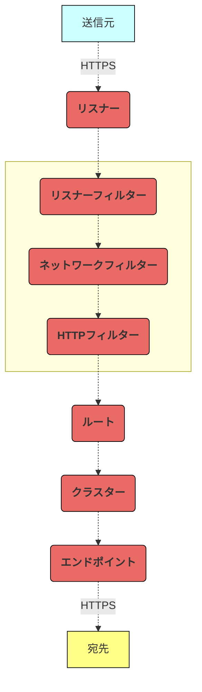

# この記事から得られる知識

この記事を読むと、以下を **"完全に理解"** できます✌️

- リクエストの方向に応じたIstioのトラフィック管理の仕組み
- IstioのカスタムリソースとEnvoyの設定の対応関係

<br>

[:contents]

<br>

# 01. はじめに

どうも、**俺 a.k.a いすてぃ男**です。


<br>

Istio ⛵️のサービスメッシュのトラフィック管理をトラブルシューティングする時、IstioはもちろんEnvoyについても知識が必要です。

これは、IstioがEnvoyの設定を抽象化し、開発者に代わってEnvoyを管理してくれているためです。


ですが、IstioとEnvoyの設定の対応関係について、まとまった情報が全然ないのよーーー💩

今回は、KubernetesリソースやIstioリソースの設定に応じて、IstioがEnvoyのトラフィック管理の設定をどのように抽象化するのかを解説します。

なお、Istioのサービスメッシュ方式には、サイドカープロキシメッシュ (`istio-proxy`コンテナを使用したサービスメッシュ) とアンビエントメッシュ (Nodeエージェントを使用したサービスメッシュ) があります。

今回は、サイドカープロキシメッシュでのEnvoyの抽象化について言及します。

それでは、もりもり布教していきます😗

<div class="text-box">
記事中のこのボックスは、補足情報を記載しています。
<br>
<br>
飛ばしていただいても大丈夫ですが、読んでもらえるとより理解が深まるはずです👍
</div>

<br>

# 02. 様々なリソースがEnvoyの設定を抽象化する

Istioは、KubernetesリソースやIstioカスタムリソースの設定に応じて、Envoyのトラフィック管理の設定を管理します。

まずは、どのようなリソースがトラフィック管理に関係しているのかを、リクエストの方向に分けて解説していきます。

`istio-proxy`コンテナやEnvoyについては、次章以降で解説します。

<br>

## サービスメッシュ外からのリクエスト

サービスメッシュ外から内にリクエストを送信する場合に、リソースが以下の順で紐付き、Envoyの設定を抽象化します。


<br>

各リソースは、以下の仕組みで、リクエストを送信元から宛先まで届けます。

図中の番号に沿って、通信の仕組みを解説します。

1. クライアントは、リクエストをサービスメッシュ外からL7ロードバランサーにリクエストを送信します。
2. L7ロードバランサーは、Istio IngressGateway Podにリクエストを送信します。
3. Istio IngressGateway Podは、宛先Podとの間で相互TLS認証を実施します。
4. Istio IngressGateway Podは、Kubernetesリソース (Service、Endpoints) やIstioカスタムリソース (VirtualService、DestinationRule) に応じて、リクエストを宛先PodにL7ロードバランシングします。


<br>

## マイクロサービス間のリクエスト

サービスメッシュ内のPodから別のPodにリクエストを送信する場合に、リソースが以下の順で紐付き、Envoyの設定を抽象化します。


<br>

各リソースは、以下の仕組みで、リクエストを送信元から宛先まで届けます。

図中の番号に沿って、通信の仕組みを解説します。

1. 送信元Podは、宛先Podとの間で相互TLS認証を実施します。
2. 送信元Podは、Kubernetesリソース (Service、Endpoints) やIstioカスタムリソース (VirtualService、DestinationRule) の設定に応じて、リクエストを宛先PodにL7ロードバランシングします。


<br>

## サービスメッシュ外へのリクエスト

サービスメッシュ内のPodから外のシステム (例：データベース、ドメインレイヤー委譲先の外部API) にリクエストを送信する場合に、リソースが以下の順で紐付き、Envoyの設定を抽象化します。

複数のVirtualServiceとDestinationが登場するため、これらには便宜上 `X` と `Y` をつけています。


<br>

各リソースは、以下の仕組みで、リクエストを送信元から宛先まで届けます。

図中の番号に沿って、通信の仕組みを解説します。

1. 送信元Podは、リクエストの宛先がServiceEntryでエントリ済みか否かの設定に応じて、リクエストの宛先を切り替えます。
   - 宛先がエントリ済みであれば、送信元Podはリクエストの宛先にIstio EgressGateway Podを選択します。
   - 宛先が未エントリであれば、送信元Podはリクエストの宛先に外のシステムを選択します。
2. 送信元Podは、Istio EgressGateway Podとの間で相互TLS認証を実施します。
3. (1) で宛先がエントリ済であったとします。送信元Podは、リクエストの向き先をIstio EgressGateway Podに変更します。
4. 送信元Podは、Kubernetesリソース (Service、Endpoints) やIstioカスタムリソース (VirtualService、DestinationRule) の設定に応じて、Istio EgressGateway PodにL7ロードバランシングします。
5. Istio EgressGateway Podは、リクエストをエントリ済システムにL7ロードバランシングします。


<br>

# 03. istio-proxyコンテナを作成する

前章では、KubernetesリソースやIstioカスタムリソースによって抽象化されたEnvoyまで言及しませんでした。

本章では、解説をもう少し具体化します。

Istioは、Envoyプロセスを持つ`istio-proxy`コンテナを作成します。

この`istio-proxy`コンテナを使用してどのようにトラフィックを管理しているのかを、リクエストの方向に分けて解説します。

Envoyの設定については、次章以降で解説します。

<br>

## Istioコントロールプレーン

Envoyの設定を抽象化する責務を持つのは、Istioコントロールプレーン (`discovery`コンテナ) です。

Istioコントロールプレーンは異なる責務を担う複数のレイヤー (**リソース設定取得レイヤー**、**Envoy設定翻訳レイヤー**、**Envoy設定配布レイヤー**) から構成されています。

1. リソース設定取得レイヤーにて、 Istioコントロールプレーンはkube-apiserverにリクエストを送信します。ここで、KubernetesリソースやIstioカスタムリソースの設定を取得します。
2. Envoy設定翻訳レイヤーにて、取得したリソースの設定をEnvoy設定に変換します。
3. Envoy設定配布レイヤーにて、Envoyの設定をPod内の`istio-proxy`コンテナに配布します。双方向ストリーミングRPCのため、PodがEnvoyの設定配布レイヤーにリクエストを送信し、これらを取得することもあります。


<br>

<div class="text-box">
Envoy設定配布レイヤーには、XDS-APIがあります。
<br>
<br>
XDS-APIは、
<br>
<br>
XDS-APIはEnvoyの各設定を配布するためのエンドポイントをを持ちます。
<br>
<br>
XDS-APIについては、以下の記事で解説していますため、もし気になる方はよろしくどうぞ🙇🏻‍
<br>
<br>
[https://hiroki-hasegawa.hatenablog.jp/entry/2022/12/25/060000:embed]
</div>

<br>

## サービスメッシュ外からのリクエスト

サービスメッシュ外から内にリクエストを送信する場合の`istio-proxy`コンテナです。

各リソースは、以下の仕組みで、リクエストを送信元から宛先まで届けます。

図中の番号に沿って、通信の仕組みを解説します。

1. Istioコントロールプレーンは、翻訳されたEnvoyの設定をPod内の`istio-proxy`コンテナに提供します。
2. クライアントは、リクエストをサービスメッシュ外からL7ロードバランサーにリクエストを送信します。
3. L7ロードバランサーは、Istio IngressGateway Podにリクエストを送信します。
4. Istio IngressGateway Pod内のiptablesは、リクエストを`istio-proxy`コンテナにリダイレクトします。
5. Istio IngressGateway Pod内の`istio-proxy`コンテナは、宛先Podを決定し、またこのPodに対して相互TLS認証を実施します。
6. Istio IngressGateway Pod内の`istio-proxy`コンテナは、リクエストを宛先PodにL7ロードバランシングします。
7. 宛先Pod内のiptablesは、リクエストを`istio-proxy`コンテナにリダイレクトします。
8. 宛先Pod内の`istio-proxy`コンテナは、リクエストを宛先マイクロサービスに送信します。


<br>

## マイクロサービス間のリクエスト

サービスメッシュ内のPodから別のPodにリクエストを送信する場合の`istio-proxy`コンテナです。

各リソースは、以下の仕組みで、リクエストを送信元から宛先まで届けます。

図中の番号に沿って、通信の仕組みを解説します。

1. Istioコントロールプレーンは、翻訳されたEnvoyの設定をPod内の`istio-proxy`コンテナに提供します。
2. 送信元Pod内のiptablesは、リクエストを`istio-proxy`コンテナにリダイレクトします。
3. 送信元Pod内の`istio-proxy`コンテナは、宛先Podを決定し、またこのPodに対して相互TLS認証を実施します。
4. 送信元Pod内の`istio-proxy`コンテナは、リクエストを宛先PodにL7ロードバランシングします。
5. 宛先Pod内のiptablesは、リクエストを`istio-proxy`コンテナにリダイレクトします。
6. 宛先Pod内の`istio-proxy`コンテナは、リクエストを宛先マイクロサービスに送信します。


<br>

## サービスメッシュ外へのリクエスト

サービスメッシュ内のPodから外のシステム (例：データベース、ドメインレイヤー委譲先の外部API) にリクエストを送信する場合の`istio-proxy`コンテナです。

各リソースは、以下の仕組みで、リクエストを送信元から宛先まで届けます。

図中の番号に沿って、通信の仕組みを解説します。

1. Istioコントロールプレーンは、翻訳されたEnvoyの設定をPod内の`istio-proxy`コンテナに提供します。
2. 送信元Pod内のiptablesは、リクエストを`istio-proxy`コンテナにリダイレクトします。
3. 送信元Pod内の`istio-proxy`コンテナは、宛先Podを決定し、またこのPodに対して相互TLS認証を実施します。この時、ServiceEntryで宛先がエントリ済みか否かに応じて、リクエストの宛先を切り替えます。
   - 宛先がエントリ済みであれば、`istio-proxy`コンテナはリクエストの宛先にIstio EgressGateway Podを選択します。
   - 宛先が未エントリであれば、`istio-proxy`コンテナはリクエストの宛先に外のシステムを選択します。
4. ここでは、宛先がエントリ済であったとします。送信元Pod内の`istio-proxy`コンテナは、リクエストをIstio EgressGateway PodにL7ロードバランシングします。
5. 宛先Pod内のiptablesは、リクエストを`istio-proxy`コンテナにリダイレクトします。
6. 宛先Pod内の`istio-proxy`コンテナは、リクエストをエントリ済システムにL7ロードバランシングします。


<br>

<div class="text-box">
実は、Istio EgressGatewayを使用しなくとも、サービスメッシュ外の登録済システムにリクエストを送信できます。
<br>
<br>
しかし、Istio EgressGatewayを使わないと、<code>istio-proxy</code>コンテナを経由せずにマイクロサービスから外部システムに直接リクエストを送信できるようになってしまい、システムの安全性が低くなります。
<blockquote>
<ul><li>[https://istio.io/latest/docs/tasks/traffic-management/egress/egress-control/#security-note:title]</li></ul>
</blockquote>
</div>

<br>

# 04. EnvoyがHTTPSを処理する仕組み

前章では、`istio-proxy`コンテナ内のEnvoyの設定まで、言及しませんでした。

本章では、もっと具体化します。

EnvoyがHTTPSを処理する仕組みを解説します。

<br>

## 受信したリクエストをプロキシするまで

HTTPSを処理する場合、Envoyの設定が以下の順で紐付き、リクエストを送信元から宛先まで届けます。



<br>

各処理がどのような責務を持っているのかをもう少し詳しく見てみましょう。

図中の番号に沿って、フィルターの仕組みを解説します。

1. 送信元マイクロサービスからのリクエストの宛先ポートで、リスナーを絞り込みます。
2. 通信の種類 (例：HTTP、HTTPS、TCP、UDP、Unixドメインソケット、など) に応じてフィルターを選び、各フィルターがパケットのヘッダーを処理します。ここでは、HTTPSを処理するとします。
3. リクエストの宛先ポートで、ルートを絞り込みます。
4. リクエストの宛先ホストやパスで、クラスターを絞り込みます。
5. 設定した負荷分散方式 (例：ラウンドロビン、など) に応じて、クラスター配下のエンドポイントを選びます。
6. パケットのL7ヘッダーを暗号化した上で、エンドポイントにL7ロードバランシングします。


<br>

## HTTPSの処理に必要なEnvoyのフィルター

IstioはEnvoyのフィルターの設定をEnvoyFilterで抽象化します。

HTTPSのリクエストを処理する場合、リスナーフィルター、ネットワークフィルター、HTTPフィルター、に属するフィルターを使用します。

全ては解説しきれないため、HTTPSを処理するために必要な代表的なフィルターをいくつか抜粋しました。

ただ、Istioはこれらのフィルターをデフォルトで読み込むようにしてくれているため、開発者がフィルターを意識する必要はありません。

<table>
  <thead>
    <tr>
      <th style="text-align: center;"><nobr>フィルターの種類</nobr></th>
      <th style="text-align: center;"><nobr>HTTPSの処理に必要なフィルター</nobr><br>(一部抜粋)</th>
      <th style="text-align: center;">説明</th>
    </tr>
  </thead>
  <tbody>
    <tr>
      <td rowspan="3" style="text-align: center;">リスナー<br>フィルター</td>
      <td>Original Destination</td>
      <td>Envoyがiptablesがリクエストをリダイレクトする前の宛先を<code>SO_ORIGINAL_DST</code>という定数から取得できるようにします。</td>
    </tr>
    <tr>
      <td>HTTP Inspector</td>
      <td>EnvoyがHTTPを検知できるようにします。</td>
    </tr>
    <tr>
      <td>TLS Inspector</td>
      <td>EnvoyがTLSを検知できるようにします。<br>リクエストにTLSを使用している場合、Envoyはリスナーフィルターの後にTLS Transport socketを実行します。<br>TLS Transport socketは、TLSハンドシェイクを実行し、パケットのL7ヘッダーを復号化します。
    </tr>
    <tr>
      <td style="text-align: center;">ネットワーク<br>フィルター</td>
      <td>HTTP connection manager</td>
      <td>Envoyが、L7ヘッダーを読み取り、また後続のHTTPフィルターを制御できるようにします。
    </tr>
    <tr>
      <td rowspan="2" style="text-align: center;">HTTP<br>フィルター</td>
      <td>Router</td>
      <td>Envoyがポート番号でルート、ホストやパスでクラスターを絞り込めるようにします。</td>
    </tr>
    <tr>
      <td>gRPC-Web</td>
      <td>EnvoyがHTTP/1.1で受信したリクエストをgRPCサーバーをプロキシできるようにします。</td>
    </tr>
  </tbody>
</table>

<br>

<div class="text-box">
iptablesがリクエストをリダイレクトすると、リクエストの宛先がリダイレクト前のものから<code>istio-proxy</code>コンテナに変わってしまいます。
<br>
<br>
しかし、iptablesはカーネルの<code>SO_ORIGINAL_DST</code>という定数に、リダイレクト前の宛先を格納した上で、リダイレクトしてくれます。
<br>
<br>
そのため、Envoyは<code>SO_ORIGINAL_DST</code>からリダイレクト前の宛先を取得し、正しい宛先にリクエストをプロキシできるというわけです👍🏻
</div>

<br>

図中の番号に沿って、通信の仕組みを解説します。

1. リスナーフィルターを実行します。上記の表のリスナーフィルターなどを読み込みます。
2. (1) でTLS Inspectorを読み込んでいた場合に、宛先とTLSハンドシェイクを実行し、パケットのL7ヘッダーを復号化します。
3. ネットワークフィルターを実行します。上記の表のネットワークフィルターなどを読み込みます。
4. HTTPフィルターを実行します。なお、HTTPフィルターはHTTP/HTTPSを処理する場合にのみ使用します。それ以外の通信の種類 (例：TCP、UDP、Unixドメインソケット、など) の場合は、HTTPフィルターを使用しません。


<br>

# 05. リソースの設定をのEnvoyの設定に翻訳する

いよいよです🔥

Istioが各リソースをいずれのEnvoyの設定に翻訳しているのかを解説します。

<br>

## 各リソースとEnvoyの設定の関係一覧

Istioコントロールプレーンは、KubernetesリソースやIstioカスタムリソースの設定をEnvoyの設定に翻訳し、処理の流れに当てはめます。

以下の通り、各リソースがいずれのEnvoyの設定を抽象化するのかを整理しました。

リソースによっては、Envoyの複数の設定を抽象化します。

なお、EnvoyFilterは、開発者が設定をデフォルト値から変更するユースケースが少ないため、今回は省略しています。

<table>
<thead>
    <tr>
      <th></th>
      <th colspan="2" style="text-align: center;">Kubernetes ☸️<br>リソース</th>
      <th colspan="5" style="text-align: center;">Istio ⛵️<br>カスタムリソース</th>
    </tr>
</thead>
<tbody>
    <tr>
      <td style="text-align: center;"><nobr>Envoyの設定</nobr></td>
      <td style="text-align: center;">Service</td>
      <td style="text-align: center;">Endpoints</td>
      <td style="text-align: center;">Gateway</td>
      <td style="text-align: center;">Virtual<br>Service</td>
      <td style="text-align: center;">Destination<br>Rule</td>
      <td style="text-align: center;">Service<br>Entry</td>
      <td style="text-align: center;">Peer<br>Authentication</td>
    </tr>
    <tr>
      <td style="text-align: center;"><nobr>リスナー</nobr></td>
      <td style="text-align: center;">✅</td>
      <td style="text-align: center;"></td>
      <td style="text-align: center;">✅</td>
      <td style="text-align: center;">✅</td>
      <td style="text-align: center;"></td>
      <td style="text-align: center;"></td>
      <td style="text-align: center;">✅</td>
    </tr>
    <tr>
      <td style="text-align: center;"><nobr>ルート</nobr></td>
      <td style="text-align: center;">✅</td>
      <td style="text-align: center;"></td>
      <td style="text-align: center;"></td>
      <td style="text-align: center;">✅</td>
      <td style="text-align: center;"></td>
      <td style="text-align: center;"></td>
      <td style="text-align: center;"></td>
    </tr>
    <tr>
      <td style="text-align: center;"><nobr>クラスター</nobr></td>
      <td style="text-align: center;">✅</td>
      <td style="text-align: center;"></td>
      <td style="text-align: center;"></td>
      <td style="text-align: center;"></td>
      <td style="text-align: center;">✅</td>
      <td style="text-align: center;">✅</td>
      <td style="text-align: center;">✅</td>
    </tr>
    <tr>
      <td style="text-align: center;"><nobr>エンドポイント</nobr></td>
      <td style="text-align: center;"></td>
      <td style="text-align: center;">✅</td>
      <td style="text-align: center;"></td>
      <td style="text-align: center;"></td>
      <td style="text-align: center;">✅</td>
      <td style="text-align: center;">✅</td>
      <td style="text-align: center;"></td>
    </tr>
</tbody>
</table>

<br>

## サービスメッシュ外からのリクエスト

### Envoyの設定を抽象化するリソース一覧

サービスメッシュ外からのリクエストを処理する場合に関係するリソースを抜粋しました。

ServiceEntryは、使用しないリソースのため、`×`としています。

<table>
<thead>
    <tr>
      <th></th>
      <th colspan="2" style="text-align: center;">Kubernetes ☸️<br>リソース</th>
      <th colspan="5" style="text-align: center;">Istio ⛵️<br>カスタムリソース</th>
    </tr>
</thead>
<tbody>
    <tr>
      <td style="text-align: center;"><nobr>Envoyの設定</nobr></td>
      <td style="text-align: center;">Service</td>
      <td style="text-align: center;">Endpoints</td>
      <td style="text-align: center;">Gateway</td>
      <td style="text-align: center;">Virtual<br>Service</td>
      <td style="text-align: center;">Destination<br>Rule</td>
      <td style="text-align: center;">Service<br>Entry</td>
      <td style="text-align: center;">Peer<br>Authentication</td>
    </tr>
    <tr>
      <td style="text-align: center;"><nobr>リスナー</nobr></td>
      <td style="text-align: center;">✅</td>
      <td style="text-align: center;"></td>
      <td style="text-align: center;">✅</td>
      <td style="text-align: center;">✅</td>
      <td style="text-align: center;"></td>
      <td style="text-align: center;">×</td>
      <td style="text-align: center;">✅</td>
    </tr>
    <tr>
      <td style="text-align: center;"><nobr>ルート</nobr></td>
      <td style="text-align: center;">✅</td>
      <td style="text-align: center;"></td>
      <td style="text-align: center;"></td>
      <td style="text-align: center;">✅</td>
      <td style="text-align: center;"></td>
      <td style="text-align: center;">×</td>
      <td style="text-align: center;"></td>
    </tr>
    <tr>
      <td style="text-align: center;"><nobr>クラスター</nobr></td>
      <td style="text-align: center;">✅</td>
      <td style="text-align: center;"></td>
      <td style="text-align: center;"></td>
      <td style="text-align: center;"></td>
      <td style="text-align: center;">✅</td>
      <td style="text-align: center;">×</td>
      <td style="text-align: center;">✅</td>
    </tr>
    <tr>
      <td style="text-align: center;"><nobr>エンドポイント</nobr></td>
      <td style="text-align: center;"></td>
      <td style="text-align: center;">✅</td>
      <td style="text-align: center;"></td>
      <td style="text-align: center;"></td>
      <td style="text-align: center;">✅</td>
      <td style="text-align: center;">×</td>
      <td style="text-align: center;"></td>
    </tr>
</tbody>
</table>

<br>

### Envoyの設定に当てはめる

送信元または宛先のEnvoyに分けると、各リソースは以下のようにEnvoyの設定を抽象化します。

Istioは、送信元のEnvoyでリクエストの宛先を決める設定の抽象化、または宛先のEnvoyでリクエストを受信するそれで、同じリソースを使用します。

<table>
  <thead>
    <tr>
      <th colspan="2" style="text-align: center;"></th>
      <th colspan="2" style="text-align: center;">Kubernetes ☸️<br>リソース </th>
      <th colspan="4" style="text-align: center;">Istio ⛵️<br>カスタムリソース </th>
    </tr>
  </thead>
  <tbody>
    <tr>
      <td colspan="2" style="text-align: center;">Envoyの設定</td>
      <td style="text-align: center;">Service</td>
      <td style="text-align: center;">Endpoints</td>
      <td style="text-align: center;">Gateway</td>
      <td style="text-align: center;">Virtual<br>Service</td>
      <td style="text-align: center;">Destination<br>Rule</td>
      <td style="text-align: center;">Peer<br>Authentication</td>
    </tr>
    <tr>
      <td rowspan="4" style="text-align: center; background-color: #CCFFFF">送信元</td>
      <td style="text-align: center; background-color: #CCFFFF">リスナー</td>
      <td style="text-align: center; background-color: #CCFFFF">✅</td>
      <td style="text-align: center; background-color: #CCFFFF"></td>
      <td style="text-align: center; background-color: #CCFFFF">✅</td>
      <td style="text-align: center; background-color: #CCFFFF">✅</td>
      <td style="text-align: center; background-color: #CCFFFF"></td>
      <td style="text-align: center; background-color: #CCFFFF">✅</td>
    </tr>
    <tr>
      <td style="text-align: center; background-color: #CCFFFF">ルート</td>
      <td style="text-align: center; background-color: #CCFFFF">✅</td>
      <td style="text-align: center; background-color: #CCFFFF"></td>
      <td style="text-align: center; background-color: #CCFFFF"></td>
      <td style="text-align: center; background-color: #CCFFFF">✅</td>
      <td style="text-align: center; background-color: #CCFFFF"></td>
      <td style="text-align: center; background-color: #CCFFFF"></td>
    </tr>
    <tr>
      <td style="text-align: center; background-color: #CCFFFF">クラスター</td>
      <td style="text-align: center; background-color: #CCFFFF">✅</td>
      <td style="text-align: center; background-color: #CCFFFF"></td>
      <td style="text-align: center; background-color: #CCFFFF"></td>
      <td style="text-align: center; background-color: #CCFFFF"></td>
      <td style="text-align: center; background-color: #CCFFFF">✅</td>
      <td style="text-align: center; background-color: #CCFFFF">✅</td>
    </tr>
    <tr>
      <td style="text-align: center; background-color: #CCFFFF">エンドポイント</td>
      <td style="text-align: center; background-color: #CCFFFF"></td>
      <td style="text-align: center; background-color: #CCFFFF">✅</td>
      <td style="text-align: center; background-color: #CCFFFF"></td>
      <td style="text-align: center; background-color: #CCFFFF"></td>
      <td style="text-align: center; background-color: #CCFFFF">✅</td>
      <td style="text-align: center; background-color: #CCFFFF"></td>
    </tr>
    <tr>
      <td rowspan="4" style="text-align: center; background-color: #FFFF88">宛先</td>
      <td style="text-align: center; background-color: #FFFF88">リスナー</td>
      <td style="text-align: center; background-color: #FFFF88">✅</td>
      <td style="text-align: center; background-color: #FFFF88"></td>
      <td style="text-align: center; background-color: #FFFF88"></td>
      <td style="text-align: center; background-color: #FFFF88">✅</td>
      <td style="text-align: center; background-color: #FFFF88"></td>
      <td style="text-align: center; background-color: #FFFF88">✅</td>
    </tr>
    <tr>
      <td style="text-align: center; background-color: #FFFF88">ルート</td>
      <td style="text-align: center; background-color: #FFFF88">✅</td>
      <td style="text-align: center; background-color: #FFFF88"></td>
      <td style="text-align: center; background-color: #FFFF88"></td>
      <td style="text-align: center; background-color: #FFFF88">✅</td>
      <td style="text-align: center; background-color: #FFFF88"></td>
      <td style="text-align: center; background-color: #FFFF88"></td>
    </tr>
    <tr>
      <td style="text-align: center; background-color: #FFFF88">クラスター</td>
      <td style="text-align: center; background-color: #FFFF88">✅</td>
      <td style="text-align: center; background-color: #FFFF88"></td>
      <td style="text-align: center; background-color: #FFFF88"></td>
      <td style="text-align: center; background-color: #FFFF88"></td>
      <td style="text-align: center; background-color: #FFFF88">✅</td>
      <td style="text-align: center; background-color: #FFFF88">✅</td>
    </tr>
    <tr>
      <td style="text-align: center; background-color: #FFFF88">エンドポイント</td>
      <td style="text-align: center; background-color: #FFFF88"></td>
      <td style="text-align: center; background-color: #FFFF88">✅</td>
      <td style="text-align: center; background-color: #FFFF88"></td>
      <td style="text-align: center; background-color: #FFFF88"></td>
      <td style="text-align: center; background-color: #FFFF88">✅</td>
      <td style="text-align: center; background-color: #FFFF88"></td>
    </tr>
  </tbody>
</table>

<br>

この表を、リクエストの仕組みの中に当てはめると、以下になります。

> Istioは、送信元のEnvoyでリクエストの宛先を決める設定の抽象化、または宛先のEnvoyでリクエストを受信するそれで、同じリソースを使用します。

前述に解説したことのイメージが掴めるかと思います。


<br>

リソースがEnvoyの設定間で重複していてわかりにくいため、整理します。


<br>

## マイクロサービス間のリクエスト

### Envoyの設定を抽象化するリソース一覧

サービスメッシュ内のPodから別のPodへのリクエストを処理する場合に関係するリソースを抜粋しました。

GatewayとServiceEntryは、使用しないリソースのため、`×`としています。

<table>
<thead>
    <tr>
      <th></th>
      <th colspan="2" style="text-align: center;">Kubernetes ☸️<br>リソース</th>
      <th colspan="5" style="text-align: center;">Istio ⛵️<br>カスタムリソース</th>
    </tr>
</thead>
<tbody>
    <tr>
      <td style="text-align: center;"><nobr>Envoyの設定</nobr></td>
      <td style="text-align: center;">Service</td>
      <td style="text-align: center;">Endpoints</td>
      <td style="text-align: center;">Gateway</td>
      <td style="text-align: center;">Virtual<br>Service</td>
      <td style="text-align: center;">Destination<br>Rule</td>
      <td style="text-align: center;">Service<br>Entry</td>
      <td style="text-align: center;">Peer<br>Authentication</td>
    </tr>
    <tr>
      <td style="text-align: center;"><nobr>リスナー</nobr></td>
      <td style="text-align: center;">✅</td>
      <td style="text-align: center;"></td>
      <td style="text-align: center;">×</td>
      <td style="text-align: center;">✅</td>
      <td style="text-align: center;"></td>
      <td style="text-align: center;">×</td>
      <td style="text-align: center;">✅</td>
    </tr>
    <tr>
      <td style="text-align: center;"><nobr>ルート</nobr></td>
      <td style="text-align: center;">✅</td>
      <td style="text-align: center;"></td>
      <td style="text-align: center;">×</td>
      <td style="text-align: center;">✅</td>
      <td style="text-align: center;"></td>
      <td style="text-align: center;">×</td>
      <td style="text-align: center;"></td>
    </tr>
    <tr>
      <td style="text-align: center;"><nobr>クラスター</nobr></td>
      <td style="text-align: center;">✅</td>
      <td style="text-align: center;"></td>
      <td style="text-align: center;">×</td>
      <td style="text-align: center;"></td>
      <td style="text-align: center;">✅</td>
      <td style="text-align: center;">×</td>
      <td style="text-align: center;">✅</td>
    </tr>
    <tr>
      <td style="text-align: center;"><nobr>エンドポイント</nobr></td>
      <td style="text-align: center;"></td>
      <td style="text-align: center;">✅</td>
      <td style="text-align: center;">×</td>
      <td style="text-align: center;"></td>
      <td style="text-align: center;">✅</td>
      <td style="text-align: center;">×</td>
      <td style="text-align: center;"></td>
    </tr>
</tbody>
</table>

<br>

### Envoyの設定に当てはめる

送信元または宛先のEnvoyに分けると、各リソースは以下のようにEnvoyの設定を抽象化します。

Istioは、送信元のEnvoyでリクエストの宛先を決める設定の抽象化、または宛先のEnvoyでリクエストを受信するそれで、同じリソースを使用します。

<table>
  <thead>
    <tr>
      <th colspan="2" style="text-align: center;"></th>
      <th colspan="2" style="text-align: center;">Kubernetes ☸️<br>リソース </th>
      <th colspan="3" style="text-align: center;">Istio ⛵️<br>カスタムリソース </th>
    </tr>
  </thead>
  <tbody>
    <tr>
      <td colspan="2" style="text-align: center;">Envoyの設定</td>
      <td style="text-align: center;">Service</td>
      <td style="text-align: center;">Endpoints</td>
      <td style="text-align: center;">Virtual<br>Service</td>
      <td style="text-align: center;">Destination<br>Rule</td>
      <td style="text-align: center;">Peer<br>Authentication</td>
    </tr>
    <tr>
      <td rowspan="4" style="text-align: center; background-color: #CCFFFF">送信元</td>
      <td style="text-align: center; background-color: #CCFFFF">リスナー</td>
      <td style="text-align: center; background-color: #CCFFFF">✅</td>
      <td style="text-align: center; background-color: #CCFFFF"></td>
      <td style="text-align: center; background-color: #CCFFFF">✅</td>
      <td style="text-align: center; background-color: #CCFFFF"></td>
      <td style="text-align: center; background-color: #CCFFFF">✅</td>
    </tr>
    <tr>
      <td style="text-align: center; background-color: #CCFFFF">ルート</td>
      <td style="text-align: center; background-color: #CCFFFF">✅</td>
      <td style="text-align: center; background-color: #CCFFFF"></td>
      <td style="text-align: center; background-color: #CCFFFF">✅</td>
      <td style="text-align: center; background-color: #CCFFFF"></td>
      <td style="text-align: center; background-color: #CCFFFF"></td>
    </tr>
    <tr>
      <td style="text-align: center; background-color: #CCFFFF">クラスター</td>
      <td style="text-align: center; background-color: #CCFFFF">✅</td>
      <td style="text-align: center; background-color: #CCFFFF"></td>
      <td style="text-align: center; background-color: #CCFFFF"></td>
      <td style="text-align: center; background-color: #CCFFFF">✅</td>
      <td style="text-align: center; background-color: #CCFFFF">✅</td>
    </tr>
    <tr>
      <td style="text-align: center; background-color: #CCFFFF">エンドポイント</td>
      <td style="text-align: center; background-color: #CCFFFF"></td>
      <td style="text-align: center; background-color: #CCFFFF">✅</td>
      <td style="text-align: center; background-color: #CCFFFF"></td>
      <td style="text-align: center; background-color: #CCFFFF">✅</td>
      <td style="text-align: center; background-color: #CCFFFF"></td>
    </tr>
    <tr>
      <td rowspan="4" style="text-align: center; background-color: #FFFF88">宛先</td>
      <td style="text-align: center; background-color: #FFFF88">リスナー</td>
      <td style="text-align: center; background-color: #FFFF88">✅</td>
      <td style="text-align: center; background-color: #FFFF88"></td>
      <td style="text-align: center; background-color: #FFFF88">✅</td>
      <td style="text-align: center; background-color: #FFFF88"></td>
      <td style="text-align: center; background-color: #FFFF88">✅</td>
    </tr>
    <tr>
      <td style="text-align: center; background-color: #FFFF88">ルート</td>
      <td style="text-align: center; background-color: #FFFF88">✅</td>
      <td style="text-align: center; background-color: #FFFF88"></td>
      <td style="text-align: center; background-color: #FFFF88">✅</td>
      <td style="text-align: center; background-color: #FFFF88"></td>
      <td style="text-align: center; background-color: #FFFF88"></td>
    </tr>
    <tr>
      <td style="text-align: center; background-color: #FFFF88">クラスター</td>
      <td style="text-align: center; background-color: #FFFF88">✅</td>
      <td style="text-align: center; background-color: #FFFF88"></td>
      <td style="text-align: center; background-color: #FFFF88"></td>
      <td style="text-align: center; background-color: #FFFF88">✅</td>
      <td style="text-align: center; background-color: #FFFF88">✅</td>
    </tr>
    <tr>
      <td style="text-align: center; background-color: #FFFF88">エンドポイント</td>
      <td style="text-align: center; background-color: #FFFF88"></td>
      <td style="text-align: center; background-color: #FFFF88">✅</td>
      <td style="text-align: center; background-color: #FFFF88"></td>
      <td style="text-align: center; background-color: #FFFF88">✅</td>
      <td style="text-align: center; background-color: #FFFF88"></td>
    </tr>
  </tbody>
</table>

<br>

この表を、リクエストの仕組みの中に当てはめると、以下になります。

> Istioは、送信元のEnvoyでリクエストの宛先を決める設定の抽象化、または宛先のEnvoyでリクエストを受信するそれで、同じリソースを使用します。

前述に解説したことのイメージが掴めるかと思います。


<br>

リソースがEnvoyの設定間で重複していてわかりにくいため、整理します。


<br>

## サービスメッシュ外へのリクエスト

### Envoyの設定を抽象化するリソース一覧

サービスメッシュ内のPodから外のシステム (例：データベース、ドメインレイヤー委譲先の外部API) へのリクエストを処理する場合に関係するリソースを抜粋しました。

Gatewayは、Istio EgressGatewayとして使用します。

<table>
<thead>
    <tr>
      <th></th>
      <th colspan="2" style="text-align: center;">Kubernetes ☸️<br>リソース</th>
      <th colspan="5" style="text-align: center;">Istio ⛵️<br>カスタムリソース</th>
    </tr>
</thead>
<tbody>
    <tr>
      <td style="text-align: center;"><nobr>Envoyの設定</nobr></td>
      <td style="text-align: center;">Service</td>
      <td style="text-align: center;">Endpoints</td>
      <td style="text-align: center;">Gateway</td>
      <td style="text-align: center;">Virtual<br>Service</td>
      <td style="text-align: center;">Destination<br>Rule</td>
      <td style="text-align: center;">Service<br>Entry</td>
      <td style="text-align: center;">Peer<br>Authentication</td>
    </tr>
    <tr>
      <td style="text-align: center;"><nobr>リスナー</nobr></td>
      <td style="text-align: center;">✅</td>
      <td style="text-align: center;"></td>
      <td style="text-align: center;">✅</td>
      <td style="text-align: center;">✅</td>
      <td style="text-align: center;"></td>
      <td style="text-align: center;"></td>
      <td style="text-align: center;">✅</td>
    </tr>
    <tr>
      <td style="text-align: center;"><nobr>ルート</nobr></td>
      <td style="text-align: center;">✅</td>
      <td style="text-align: center;"></td>
      <td style="text-align: center;"></td>
      <td style="text-align: center;">✅</td>
      <td style="text-align: center;"></td>
      <td style="text-align: center;"></td>
      <td style="text-align: center;"></td>
    </tr>
    <tr>
      <td style="text-align: center;"><nobr>クラスター</nobr></td>
      <td style="text-align: center;">✅</td>
      <td style="text-align: center;"></td>
      <td style="text-align: center;"></td>
      <td style="text-align: center;"></td>
      <td style="text-align: center;">✅</td>
      <td style="text-align: center;">✅</td>
      <td style="text-align: center;">✅</td>
    </tr>
    <tr>
      <td style="text-align: center;"><nobr>エンドポイント</nobr></td>
      <td style="text-align: center;"></td>
      <td style="text-align: center;">✅</td>
      <td style="text-align: center;"></td>
      <td style="text-align: center;"></td>
      <td style="text-align: center;">✅</td>
      <td style="text-align: center;">✅</td>
      <td style="text-align: center;"></td>
    </tr>
</tbody>
</table>

### Envoyの設定に当てはめる

送信元または宛先のEnvoyに分けると、各リソースは以下のようにEnvoyの設定を抽象化します。

<table>
  <thead>
    <tr>
      <th colspan="2"></th>
      <th colspan="2" style="text-align: center;">Kubernetes ☸️<br>リソース </th>
      <th colspan="7" style="text-align: center;">Istio ⛵️<br>カスタムリソース </th>
    </tr>
  </thead>
  <tbody>
    <tr>
      <td colspan="2" style="text-align: center;">Envoyの設定</td>
      <td style="text-align: center;">Service</td>
      <td style="text-align: center;">Endpoints</td>
      <td style="text-align: center;">Gateway</td>
      <td style="text-align: center;">Virtual<br>Service<br>X</td>
      <td style="text-align: center;">〃<br>Y</td>
      <td style="text-align: center;">Destination<br>Rule<br>X</td>
      <td style="text-align: center;">〃<br>Y</td>
      <td style="text-align: center;">Service<br>Entry</td>
      <td style="text-align: center;">Peer<br>Authentication</td>
    </tr>
    <tr>
      <td rowspan="4" style="text-align: center; background-color: #CCFFFF"><nobr>送信元</nobr></td>
      <td style="text-align: center; background-color: #CCFFFF"><nobr>リスナー</nobr></td>
      <td style="text-align: center; background-color: #CCFFFF">✅</td>
      <td style="text-align: center; background-color: #CCFFFF"></td>
      <td style="text-align: center; background-color: #CCFFFF"></td>
      <td style="text-align: center; background-color: #CCFFFF">✅</td>
      <td style="text-align: center; background-color: #CCFFFF"></td>
      <td style="text-align: center; background-color: #CCFFFF"></td>
      <td style="text-align: center; background-color: #CCFFFF"></td>
      <td style="text-align: center; background-color: #CCFFFF"></td>
      <td style="text-align: center; background-color: #CCFFFF">✅</td>
    </tr>
    <tr>
      <td style="text-align: center; background-color: #CCFFFF"><nobr>ルート</nobr></td>
      <td style="text-align: center; background-color: #CCFFFF">✅</td>
      <td style="text-align: center; background-color: #CCFFFF"></td>
      <td style="text-align: center; background-color: #CCFFFF"></td>
      <td style="text-align: center; background-color: #CCFFFF">✅</td>
      <td style="text-align: center; background-color: #CCFFFF"></td>
      <td style="text-align: center; background-color: #CCFFFF"></td>
      <td style="text-align: center; background-color: #CCFFFF"></td>
      <td style="text-align: center; background-color: #CCFFFF"></td>
      <td style="text-align: center; background-color: #CCFFFF"></td>
    </tr>
    <tr>
      <td style="text-align: center; background-color: #CCFFFF"><nobr>クラスター</nobr></td>
      <td style="text-align: center; background-color: #CCFFFF">✅</td>
      <td style="text-align: center; background-color: #CCFFFF"></td>
      <td style="text-align: center; background-color: #CCFFFF"></td>
      <td style="text-align: center; background-color: #CCFFFF"></td>
      <td style="text-align: center; background-color: #CCFFFF"></td>
      <td style="text-align: center; background-color: #CCFFFF">✅</td>
      <td style="text-align: center; background-color: #CCFFFF"></td>
      <td style="text-align: center; background-color: #CCFFFF"></td>
      <td style="text-align: center; background-color: #CCFFFF">✅</td>
    </tr>
    <tr>
      <td style="text-align: center; background-color: #CCFFFF"><nobr>エンドポイント</nobr></td>
      <td style="text-align: center; background-color: #CCFFFF"></td>
      <td style="text-align: center; background-color: #CCFFFF">✅</td>
      <td style="text-align: center; background-color: #CCFFFF"></td>
      <td style="text-align: center; background-color: #CCFFFF"></td>
      <td style="text-align: center; background-color: #CCFFFF"></td>
      <td style="text-align: center; background-color: #CCFFFF">✅</td>
      <td style="text-align: center; background-color: #CCFFFF"></td>
      <td style="text-align: center; background-color: #CCFFFF"></td>
      <td style="text-align: center; background-color: #CCFFFF"></td>
    </tr>
    <tr>
      <td rowspan="4" style="text-align: center; background-color: #FFFF88"><nobr>宛先</nobr></td>
      <td style="text-align: center; background-color: #FFFF88"><nobr>リスナー</nobr></td>
      <td style="text-align: center; background-color: #FFFF88"></td>
      <td style="text-align: center; background-color: #FFFF88"></td>
      <td style="text-align: center; background-color: #FFFF88">✅</td>
      <td style="text-align: center; background-color: #FFFF88"></td>
      <td style="text-align: center; background-color: #FFFF88">✅</td>
      <td style="text-align: center; background-color: #FFFF88"></td>
      <td style="text-align: center; background-color: #FFFF88"></td>
      <td style="text-align: center; background-color: #FFFF88"></td>
      <td style="text-align: center; background-color: #FFFF88">✅</td>
    </tr>
    <tr>
      <td style="text-align: center; background-color: #FFFF88"><nobr>ルート</nobr></td>
      <td style="text-align: center; background-color: #FFFF88"></td>
      <td style="text-align: center; background-color: #FFFF88"></td>
      <td style="text-align: center; background-color: #FFFF88"></td>
      <td style="text-align: center; background-color: #FFFF88"></td>
      <td style="text-align: center; background-color: #FFFF88">✅</td>
      <td style="text-align: center; background-color: #FFFF88"></td>
      <td style="text-align: center; background-color: #FFFF88"></td>
      <td style="text-align: center; background-color: #FFFF88"></td>
      <td style="text-align: center; background-color: #FFFF88"></td>
    </tr>
    <tr>
      <td style="text-align: center; background-color: #FFFF88"><nobr>クラスター</nobr></td>
      <td style="text-align: center; background-color: #FFFF88"></td>
      <td style="text-align: center; background-color: #FFFF88"></td>
      <td style="text-align: center; background-color: #FFFF88"></td>
      <td style="text-align: center; background-color: #FFFF88"></td>
      <td style="text-align: center; background-color: #FFFF88"></td>
      <td style="text-align: center; background-color: #FFFF88"></td>
      <td style="text-align: center; background-color: #FFFF88">✅</td>
      <td style="text-align: center; background-color: #FFFF88">✅</td>
      <td style="text-align: center; background-color: #FFFF88">✅</td>
    </tr>
    <tr>
      <td style="text-align: center; background-color: #FFFF88"><nobr>エンドポイント</nobr></td>
      <td style="text-align: center; background-color: #FFFF88"></td>
      <td style="text-align: center; background-color: #FFFF88"></td>
      <td style="text-align: center; background-color: #FFFF88"></td>
      <td style="text-align: center; background-color: #FFFF88"></td>
      <td style="text-align: center; background-color: #FFFF88"></td>
      <td style="text-align: center; background-color: #FFFF88"></td>
      <td style="text-align: center; background-color: #FFFF88">✅</td>
      <td style="text-align: center; background-color: #FFFF88">✅</td>
      <td style="text-align: center; background-color: #FFFF88"></td>
    </tr>
  </tbody>
</table>

<br>

この表を、リクエストの仕組みの中に当てはめると、以下になります。


<br>

リソースがEnvoyの設定間で重複していてわかりにくいため、整理します。


<br>

<div class="text-box">
実は、Istio EgressGatewayを使用しなくとも、ServiceEntryだけでサービスメッシュ外の登録済みシステムにリクエストを送信できます。
<br>
<br>
しかし、Istio EgressGatewayを使わないと、<code>istio-proxy</code>コンテナを経由せずにマイクロサービスから外部システムに直接リクエストを送信できるようになってしまい、システムの安全性が低くなります。
<blockquote>
<ul><li>[https://istio.io/latest/docs/tasks/traffic-management/egress/egress-control/#security-note:title]</li></ul>
</blockquote>
</div>

<br>

# 06. IstioによるEnvoyの抽象化に抗う

この辺になってくると、ほとんどの人にとってはどうでもよくて、自己満です!!

前章では、Envoyの設定に関わる各リソースの設定まで、言及しませんでした。

本章では、さらに具体化します。

各リソースの設定の翻訳によって、Envoyの設定がどのようになっているのかを解説します。

<br>

## Envoyの現在の設定を出力する

### リスナーを出力する

Envoyの`/config_dump?resource={dynamic_listeners}`エンドポイントにリクエストすると、リスナーを出力できます。

```sh
$ kubectl exec \
    -it foo-pod \
    -n foo-namespace \
    -c istio-proxy \
    -- bash -c "curl http://localhost:15000/config_dump?resource={dynamic_listeners}" | yq -P
```

### ルートを出力する

Envoyの`/config_dump?resource={dynamic_route_configs}`エンドポイントにリクエストすると、ルートを出力できます。

```sh
$ kubectl exec \
    -it foo-pod \
    -n foo-namespace \
    -c istio-proxy \
    -- bash -c "curl http://localhost:15000/config_dump?resource={dynamic_route_configs}" | yq -P
```

### クラスターを出力する

Envoyの`/config_dump?resource={dynamic_active_clusters}`エンドポイントにリクエストすると、クラスターを出力できます。

```sh
$ kubectl exec \
    -it foo-pod \
    -n foo-namespace \
    -c istio-proxy \
    -- bash -c "curl http://localhost:15000/config_dump?resource={dynamic_active_clusters}" | yq -P
```

### エンドポイントを出力する

Envoyの`/config_dump?include_eds`エンドポイントにリクエストすると、エンドポイントを出力できます。

```sh
$ kubectl exec \
    -it foo-pod \
    -n foo-namespace \
    -c istio-proxy \
    -- bash -c "curl http://localhost:15000/config_dump?include_eds" | yq -P
```

<br>

## サービスメッシュ外からのリクエスト

ここでは、`istio-proxy`コンテナはHTTPSを処理するとします。

図中の番号に沿って、通信の仕組みを解説します。


### 送信元Pod側の`istio-proxy`コンテナ

1. 送信元マイクロサービスからのリクエストの宛先ポート (例：`50000`) で、リスナーを絞り込みます。Envoyは、リスナーを宛先ポートで管理しています (例：`0.0.0.0_50000`) 。
2. HTTPSを処理するための各種フィルターを選びます。
3. HTTPフィルターにより、リクエストの宛先ポート (例：`50000`) で、ルートを絞り込みます。Envoyは、ルートを宛先ポートで管理しています (例：`50000`) 。
4. HTTPフィルターにより、リクエストの宛先ホスト (例：`foo-service.foo-namespace.svc.cluster.local`) やパス (例：`/`) で、クラスターを絞り込みます。Envoyは、クラスターを宛先ポートやホストで管理しています (例：`outbound|50010|foo-service.foo-namespace.svc.cluster.local`) 。
5. 設定した負荷分散方式 (例：ラウンドロビン、など) に応じて、Service配下のPodを選びます。Envoyは、エンドポイントをPodのIPアドレスや宛先ポートで管理しています (例：`<PodのIPアドレス>:50000`) 。
6. パケットのL7ヘッダーを暗号化した上で、リクエストを宛先PodにL7ロードバランシングします。

### 宛先Pod側の`istio-proxy`コンテナ

<ul class="decimal">
  <li value="7">L7ロードバランシングされたリクエストの宛先ポート (例：<code>50000</code>) で、リスナーを絞り込みます。Envoyは、リスナーを宛先ポートで管理しています (例：<code>0.0.0.0_50000</code>)</li>
  <li>HTTPSを処理するための各種フィルターを選びます。</li>
  <li>HTTPフィルターにより、リクエストの宛先ポート (例：<code>50000</code>) で、ルートを絞り込みます。Envoyは、ルートを宛先ポートで管理しています (例：<code>inbound|50000||</code>) 。</li>
  <li>HTTPフィルターにより、リクエストの宛先ホスト (例：<code>example.com</code>) やパス (例：<code>/</code>) で、クラスターを絞り込みます。Envoyは、クラスターを宛先ポートで管理しています (例：<code>inbound|50000||</code>) </li>
  <li>エンドポイントを選びます。Envoyは、エンドポイントをローカルホストや宛先ポートで管理しています (例：<code>127.0.0.6:50000</code>) 。
  <li>ローカルホストにリクエストを送信します。結果的に、宛先マイクロサービスにリクエストが届きます。</li>
</ul>

<div class="text-box">
ローカルホストは<code>127.0.0.6</code>になっています。
<br>
<br>
これは、Envoyのプロキシがループすることを防ぐためです。
<blockquote>
<ul><li>[https://docs.google.com/document/d/1j-5_XpeMTnT9mV_8dbSOeU7rfH-5YNtN_JJFZ2mmQ_w/edit#heading=h.54v0hk8dt9sb:title]</li></ul>
</blockquote>
</div>

<br>

## マイクロサービス間のリクエスト

ここでは、`istio-proxy`コンテナはHTTPSを処理するとします。

図中の番号に沿って、通信の仕組みを解説します。


### 送信元Pod側の`istio-proxy`コンテナ

1. 送信元マイクロサービスからのリクエストの宛先ポート (例：`50010`) で、リスナーを絞り込みます。Envoyは、リスナーを宛先ポートで管理しています (例：`0.0.0.0_50010`) 。
2. HTTPSを処理するための各種フィルターを選びます。
3. HTTPフィルターにより、リクエストの宛先ポート (例：`50010`) で、ルートを絞り込みます。Envoyは、ルートを宛先ポートで管理しています (例：`50010`) 。
4. HTTPフィルターにより、リクエストの宛先ホスト (例：`foo-service.foo-namespace.svc.cluster.local`) やパス (例：`/`) で、クラスターを絞り込みます。Envoyは、クラスターを宛先ポートやホストで管理しています (例：`outbound|50010|foo-service.foo-namespace.svc.cluster.local`) 。
5. 設定した負荷分散方式 (例：ラウンドロビン、など) に応じて、Service配下のPodを選びます。Envoyは、エンドポイントをPodのIPアドレスや宛先ポートで管理しています (例：`<PodのIPアドレス>:50010`) 。
6. パケットのL7ヘッダーを暗号化した上で、リクエストを宛先PodにL7ロードバランシングします。

### 宛先Pod側の`istio-proxy`コンテナ

<ul class="decimal">
  <li value="7">L7ロードバランシングされたリクエストの宛先ポート (例：<code>50010</code>) で、リスナーを絞り込みます。Envoyは、リスナーを宛先ポートで管理しています (例：<code>0.0.0.0_50010</code>)</li>
  <li>HTTPSを処理するための各種フィルターを選びます。</li>
  <li>HTTPフィルターにより、リクエストの宛先ポート (例：<code>50010</code>) で、ルートを絞り込みます。Envoyは、ルートを宛先ポートで管理しています (例：<code>inbound|50010||</code>) 。</li>
  <li>HTTPフィルターにより、リクエストの宛先ホスト (例：<code>example.com</code>) やパス (例：<code>/</code>) で、クラスターを絞り込みます。Envoyは、クラスターを宛先ポートで管理しています (例：<code>inbound|50010||</code>) </li>
  <li>エンドポイントを選びます。Envoyは、エンドポイントをローカルホストや宛先ポートで管理しています (例：<code>127.0.0.6:50010</code>) 。
  <li>ローカルホストにリクエストを送信します。結果的に、宛先マイクロサービスにリクエストが届きます。</li>
</ul>

<br>

## サービスメッシュ外へのリクエスト

ここでは、`istio-proxy`コンテナはHTTPSを処理するとします。

図中の番号に沿って、通信の仕組みを解説します。


### 送信元Pod側の`istio-proxy`コンテナ

1. 送信元マイクロサービスからのリクエストの宛先ポート (例：`443`) で、リスナーを絞り込みます。Envoyは、リスナーを宛先ポートで管理しています (例：`0.0.0.0_443`) 。
2. HTTPSを処理するための各種フィルターを選びます。
3. HTTPフィルターにより、リクエストの宛先ポート (例：`443`) で、ルートを絞り込みます。Envoyは、ルートを宛先ポートで管理しています (例：`443`) 。
4. HTTPフィルターにより、リクエストの宛先ホスト (例：`istio-egressgateway-service.foo-namespace.svc.cluster.local`) やパス (例：`/`) で、クラスターを絞り込みます。Envoyは、クラスターをIstio EgressGateway 宛先ポートやホストで管理しています (例：`outbound|443|istio-egressgateway-service.foo-namespace.svc.cluster.local`) 。
5. 設定した負荷分散方式 (例：ラウンドロビン、など) に応じて、Istio EgressGateway Service配下のPodを選びます。Envoyは、エンドポイントをPodのIPアドレスや宛先ポートで管理しています (例：`<PodのIPアドレス>:443`) 。
6. パケットのL7ヘッダーを暗号化した上で、宛先Istio EgressGateway PodにL7ロードバランシングします。

### 宛先Pod (Istio EgressGateway Pod) 側の`istio-proxy`コンテナ

<ul class="decimal">
  <li value="7">L7ロードバランシングされたリクエストの宛先ポート (例：<code>443</code>) で、リスナーを絞り込みます。Envoyは、リスナーを宛先ポートで管理しています (例：<code>0.0.0.0_443</code>)</li>
  <li>HTTPSを処理するための各種フィルターを選びます。</li>
  <li>HTTPフィルターにより、リクエストの宛先ポート (例：<code>443</code>) で、ルートを絞り込みます。Envoyは、ルートを宛先ポートで管理しています (例：<code>inbound|50010||</code>) 。</li>
  <li>HTTPフィルターにより、リクエストの宛先ホスト (例：<code>external.com</code>) やパス (例：<code>/</code>) で、クラスターを絞り込みます。Envoyは、クラスターを宛先ポートやホストで管理しています (例：<code>outbound|443|external.com</code>) 。</li>
  <li>エンドポイントを選びます。Envoyは、エンドポイントをエントリ済システムのIPアドレスや宛先ポートで管理しています (例：<code><エントリ済システムのIPアドレス>:50010</code>) 。エントリ済システムのIPアドレスは、開発者が設定する必要はなく、EnvoyがDNSから動的に取得します。
  <li>エントリ済システムにリクエストを送信します。</li>
</ul>

<br>

# 06. おわりに

Istioが、各リソースを使用してEnvoyをどのように抽象化してトラフィック管理を実装しているのか、を解説していきました。

今回もIstioで優勝しちゃいました😭

ただ、IstioがEnvoyをいい感じに抽象化してくれるため、開発者はEnvoyの設定を深く理解する必要はないです。

にしても、やっぱ Istio ムズいっす!!

<br>

# 参考

- Istioのトラフィック管理におけるリクエスト方向の種類
  - https://www.envoyproxy.io/docs/envoy/latest/intro/deployment_types/deployment_types
- Istioコントロールプレーンのアーキテクチャとレイヤー責務
  - https://docs.google.com/document/d/1S5ygkxR1alNI8cWGG4O4iV8zp8dA6Oc23zQCvFxr83U/edit#heading=h.a1bsj2j5pan1
  - https://github.com/istio/istio/blob/master/architecture/networking/pilot.md
- IstioとEnvoyの設定の関係
  - https://youtu.be/XAKY24b7XjQ?si=pnfA7Fnr72KY-kd-
  - https://www.slideshare.net/AspenMesh/debugging-your-debugging-tools-what-to-do-when-your-service-mesh-goes-down#19
- Envoyのエンドポイントから取得できるJSON (情報ちょっと古いかもしれないけど)
  - https://github.com/zhaohuabing/bookinfo-bookinfo-config-dump/blob/master/reviews-config-dump
- Envoyプロセスのリクエスト処理の流れ
  - www.amazon.co.jp/dp/B09XN9RDY1
  - https://www.zhaohuabing.com/post/2018-09-25-istio-traffic-management-impl-intro/
- HTTPSの処理に関係するネットワークフィルターやHTTPフィルター
  - https://www.envoyproxy.io/docs/envoy/latest/intro/arch_overview/http/http_connection_management
  - https://www.envoyproxy.io/docs/envoy/latest/configuration/http/http_filters/router_filter
- Istio IngressGatewayの仕組み
  - https://software.danielwatrous.com/istio-ingress-vs-kubernetes-ingress/
- Istio EgressGatewayの仕組み
  - https://reitsma.io/blog/using-istio-to-mitm-our-users-traffic
  - https://discuss.istio.io/t/ingress-egress-serviceentry-data-flow-issues-for-istio-api-gateway/14202
  - https://discuss.istio.io/t/fail-to-apply-virtualservice-and-gateway-to-egress-gateway-on-port-80/3161
- Istioの相互TLSについて
  - https://jimmysong.io/en/blog/understanding-the-tls-encryption-in-istio/
  - https://jimmysong.io/en/blog/istio-certificates-management/
- IstioのSSL証明書の配布について
  - https://www.zhaohuabing.com/post/2020-05-25-istio-certificate/

<br>
