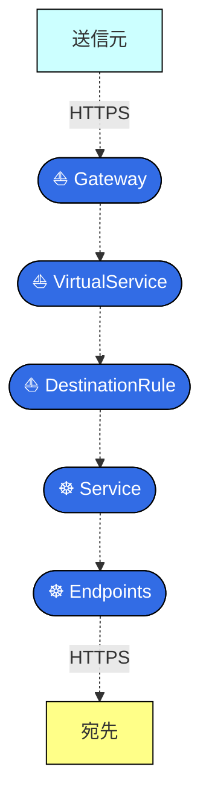
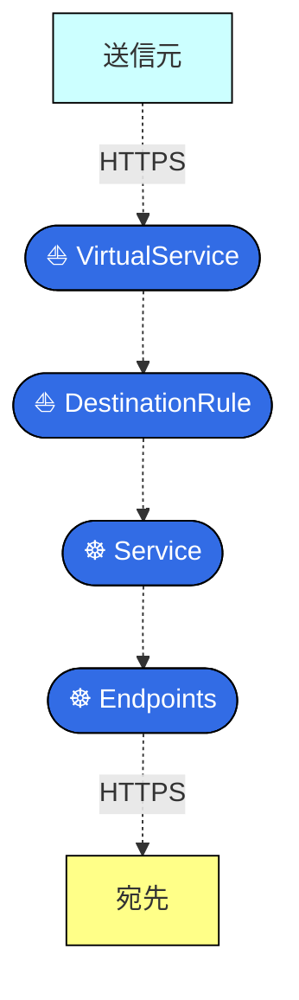
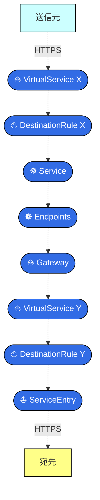

# この記事から得られる知識

この記事を読むと、以下を **"完全に理解"** できます✌️

- Istioの通信方向に応じたトラフィック管理の仕組み
- IstioのカスタムリソースとEnvoyの設定の対応関係

<br>

[:contents]

<br>

# 01. はじめに

どうも、**俺 a.k.a いすてぃ男**です。


<br>

Istio⛵️のサービスメッシュのトラフィック管理をトラブルシューティングする時、IstioはもちろんEnvoyについても知識が必要です。

これは、IstioがEnvoyの設定を抽象化し、開発者に代わってEnvoyを管理してくれているためです。


ですが、IstioとEnvoyの設定の対応関係について、まとまった情報が全然ないのよーーー💩

今回は、KubernetesリソースやIstioリソースの設定に応じて、IstioがEnvoyのトラフィック管理の設定をどのように抽象化するのかを解説します。

なお、Istioのサービスメッシュ方式には、サイドカープロキシメッシュ (`istio-proxy`コンテナを使用したサービスメッシュ) とアンビエントメッシュ (Nodeエージェントを使用したサービスメッシュ) があります。

今回は、サイドカープロキシメッシュでのEnvoyの抽象化について言及します。

それでは、もりもり布教していきます😗

<div class="text-box">
記事中のこのボックスは、補足情報を記載しています。
<br>
<br>
飛ばしていただいても大丈夫ですが、読んでもらえるとより理解が深まるはずです👍
</div>

<br>

# 02. 様々なリソースがEnvoyの設定を抽象化する

Istioは、KubernetesリソースやIstioカスタムリソースの設定に応じて、Envoyのトラフィック管理の設定を管理します。

まずは、どのようなリソースがトラフィック管理に関係しているのかを、通信の方向に分けて解説していきます。

`istio-proxy`コンテナやEnvoyについては、次章以降で解説します。

<br>

## サービスメッシュ外からの通信

サービスメッシュ外から内にリクエストを送信する場合に、抽象化するリソースです。

リソースは、以下の順で紐付き、送信元から宛先までリクエストを届けます。



各リソースは、以下の仕組みで、リクエストを送信元から宛先まで届けます。

図中の番号に沿って、仕組みを解説します。

1. クライアントは、リクエストをサービスメッシュ外からL7ロードバランサーにリクエストを送信します。
2. L7ロードバランサーは、Istio IngressGateway Podにリクエストを送信します。
3. Istio IngressGateway Podは、宛先Podとの間で相互TLS認証を実施します。
4. Istio IngressGateway Podは、Kubernetesリソース (Service、Endpoints) やIstioカスタムリソース (VirtualService、DestinationRule) に応じて、リクエストを宛先PodにL7ロードバランシングします。


<br>

## マイクロサービス間の通信

サービスメッシュ内のPodから別のPodにリクエストを送信する場合に、抽象化するリソースです。

リソースは、以下の順で紐付き、送信元から宛先までリクエストを届けます。



各リソースは、以下の仕組みで、リクエストを送信元から宛先まで届けます。

図中の番号に沿って、仕組みを解説します。

1. 送信元Podは、宛先Podとの間で相互TLS認証を実施します。
2. 送信元Podは、Kubernetesリソース (Service、Endpoints) やIstioカスタムリソース (VirtualService、DestinationRule) の設定に応じて、リクエストを宛先PodにL7ロードバランシングします。


<br>

## サービスメッシュ外への通信

サービスメッシュ内のPodから外のシステム (例：データベース、ドメインレイヤー委譲先の外部API) にリクエストを送信する場合に、Envoyを抽象化するリソースです。

リソースは、以下の順で紐付き、送信元から宛先までリクエストを届けます。

複数のVirtualServiceとDestinationが登場するため、これらには便宜上 `X` と `Y` をつけています。



各リソースは、以下の仕組みで、リクエストを送信元から宛先まで届けます。

図中の番号に沿って、仕組みを解説します。

1. 送信元Podは、リクエストの宛先がServiceEntryでエントリ済みか否かの設定に応じて、リクエストの宛先を切り替えます。
   a. 宛先がエントリ済みであれば、送信元Podはリクエストの宛先にIstio EgressGateway Podを選択します。
   b. 宛先が未エントリであれば、送信元Podはリクエストの宛先に外のシステムを選択します。
2. 送信元Podは、Istio EgressGateway Podとの間で相互TLS認証を実施します。
3. (1) で宛先がエントリ済であったとします。送信元Podは、リクエストの向き先をIstio EgressGateway Podに変更します。
4. 送信元Podは、Kubernetesリソース (Service、Endpoints) やIstioカスタムリソース (VirtualService、DestinationRule) の設定に応じて、Istio EgressGateway PodにL7ロードバランシングします。
5. Istio EgressGateway Podは、リクエストをエントリ済システムにL7ロードバランシングします。


<br>

# 03. istio-proxyコンテナを作成する

前章では、KubernetesリソースやIstioカスタムリソースによって抽象化されたEnvoyまで言及しませんでした。

本章では、解説をもう少し具体化します。

Istioは、Envoyプロセスを持つ`istio-proxy`コンテナを作成します。

この`istio-proxy`コンテナを使用してどのようにトラフィックを管理しているのかを、通信の方向に分けて解説します。

Envoyの設定については、次章以降で解説します。

<br>

## Istioコントロールプレーン

Envoyを抽象化する責務を持つのは、Istioコントロールプレーン (`discovery`コンテナ) です。

Istioコントロールプレーンは異なる責務を担う複数のレイヤー (**リソース設定取得レイヤー**、**Envoy設定翻訳レイヤー**、**Envoy設定配布レイヤー**) から構成されています。

1. リソース設定取得レイヤーにて、 Istioコントロールプレーンはkube-apiserverにリクエストを送信します。ここで、KubernetesリソースやIstioカスタムリソースの設定を取得します。
2. Envoy設定翻訳レイヤーにて、取得したリソースの設定をEnvoy設定に変換します。
3. Envoy設定配布レイヤーにて、Envoyの設定をPod内の`istio-proxy`コンテナに配布します。双方向ストリーミングRPCのため、PodがEnvoyの設定配布レイヤーにリクエストを送信し、これらを取得することもあります。


<br>

## サービスメッシュ外からの通信

サービスメッシュ外から内にリクエストを送信する場合の`istio-proxy`コンテナです。

各リソースは、以下の仕組みで、リクエストを送信元から宛先まで届けます。

図中の番号に沿って、仕組みを解説します。

1. Istioコントロールプレーンは、翻訳されたEnvoyの設定をPod内の`istio-proxy`コンテナに提供します。
2. クライアントは、リクエストをサービスメッシュ外からL7ロードバランサーにリクエストを送信します。
3. L7ロードバランサーは、Istio IngressGateway Podにリクエストを送信します。
4. Istio IngressGateway Pod内のiptablesは、リクエストを`istio-proxy`コンテナにリダイレクトします。
5. Istio IngressGateway Pod内の`istio-proxy`コンテナは、宛先Podを決定し、またこのPodに対して相互TLS認証を実施します。
6. Istio IngressGateway Pod内の`istio-proxy`コンテナは、リクエストを宛先PodにL7ロードバランシングします。
7. 宛先Pod内のiptablesは、リクエストを`istio-proxy`コンテナにリダイレクトします。
8. 宛先Pod内の`istio-proxy`コンテナは、リクエストを宛先マイクロサービスに送信します。


<br>

## マイクロサービス間の通信

サービスメッシュ内のPodから別のPodにリクエストを送信する場合の`istio-proxy`コンテナです。

各リソースは、以下の仕組みで、リクエストを送信元から宛先まで届けます。

図中の番号に沿って、仕組みを解説します。

1. Istioコントロールプレーンは、翻訳されたEnvoyの設定をPod内の`istio-proxy`コンテナに提供します。
2. 送信元Pod内のiptablesは、リクエストを`istio-proxy`コンテナにリダイレクトします。
3. 送信元Pod内の`istio-proxy`コンテナは、宛先Podを決定し、またこのPodに対して相互TLS認証を実施します。
4. 送信元Pod内の`istio-proxy`コンテナは、リクエストを宛先PodにL7ロードバランシングします。
5. 宛先Pod内のiptablesは、リクエストを`istio-proxy`コンテナにリダイレクトします。
6. 宛先Pod内の`istio-proxy`コンテナは、リクエストを宛先マイクロサービスに送信します。


<br>

## サービスメッシュ外への通信

サービスメッシュ内のPodから外のシステム (例：データベース、ドメインレイヤー委譲先の外部API) にリクエストを送信する場合の`istio-proxy`コンテナです。

各リソースは、以下の仕組みで、リクエストを送信元から宛先まで届けます。

図中の番号に沿って、仕組みを解説します。

1. Istioコントロールプレーンは、翻訳されたEnvoyの設定をPod内の`istio-proxy`コンテナに提供します。
2. 送信元Pod内のiptablesは、リクエストを`istio-proxy`コンテナにリダイレクトします。
3. 送信元Pod内の`istio-proxy`コンテナは、宛先Podを決定し、またこのPodに対して相互TLS認証を実施します。この時、ServiceEntryで宛先がエントリ済みか否かに応じて、リクエストの宛先を切り替えます。
   a. 宛先がエントリ済みであれば、`istio-proxy`コンテナはリクエストの宛先にIstio EgressGateway Podを選択します。
   b. 宛先が未エントリであれば、`istio-proxy`コンテナはリクエストの宛先に外のシステムを選択します。
4. ここでは、宛先がエントリ済であったとします。送信元Pod内の`istio-proxy`コンテナは、リクエストをIstio EgressGateway PodにL7ロードバランシングします。
5. 宛先Pod内のiptablesは、リクエストを`istio-proxy`コンテナにリダイレクトします。
6. 宛先Pod内の`istio-proxy`コンテナは、リクエストをエントリ済システムにL7ロードバランシングします。


<br>

<div class="text-box">
実は、Istio EgressGatewayを使用しなくとも、サービスメッシュ外の登録済システムと通信できます。
<br>
<br>
しかし、Istio EgressGatewayを使わないと、<code>istio-proxy</code>コンテナを経由せずにマイクロサービスから外部システムに直接リクエストを送信できるようになってしまい、システムの安全性が低くなります。
<blockquote>
<ul><li>[https://istio.io/latest/docs/tasks/traffic-management/egress/egress-control/#security-note:title]</li></ul>
</blockquote>
</div>

<br>

# 04. リソースの設定をのEnvoyの設定に翻訳する

前章では、`istio-proxy`コンテナ内のEnvoyの設定まで、言及しませんでした。

本章では、もっと具体化します。

いよいよ、Istioが各リソースをいずれのEnvoyの設定に翻訳しているのかを解説します。

<br>

## Envoyの仕組み

### 全体像

Envoyでは、設定が以下の順で紐付き、リクエストを送信元から宛先まで届けます。


各処理がどのような責務を持っているのかをもう少し詳しく見てみましょう。

図中の番号に沿って、仕組みを解説します。

1. リクエストの宛先ポートで、リスナーを絞り込みます。
2. 通信の種類 (例：HTTP、HTTPS、TCP、UDP、など) に応じてフィルターを選び、各フィルターがパケットのヘッダーを処理します。
3. リクエストの宛先ポートで、ルートを絞り込みます。
4. リクエストの宛先ホスト/パスで、クラスターを絞り込みます。
5. 設定した負荷分散方式 (例：ラウンドロビン、など) に応じて、クラスター配下のエンドポイントを選びます。
6. パケットのL7ヘッダーを暗号化した上で、エンドポイントにL7ロードバランシングします。


<br>

### Envoyのフィルターについて

IstioはEnvoyのフィルターの設定をEnvoyFilterで抽象化します。

ただ、フィルターのデフォルト値で十分であり、開発者が設定を変更しなければならないようなユースケースが少ないです。

Envoyのフィルターでは、HTTPSのリクエストの場合に以下の順でリクエストを処理します。

リスナーフィルター、ネットワークフィルター、HTTPフィルターに属するいくつかのフィルターが必要であり、これらはデフォルトで有効になっています (ここでは個別のフィルター名は省略します)。

図中の番号に沿って、仕組みを解説します。

1. リスナーフィルターを実行します。
   a. Envoyはiptablesがリクエストをリダイレクトする前の宛先を`SO_ORIGINAL_DST`という定数から取得します。
   b. TLSで暗号化された通信 (例：HTTPS) であるかを確認します。
2. TLSで暗号化された通信であった場合、TLSハンドシェイクを実行し、パケットのL7ヘッダーを復号化します。フィルター後のL7ロードバランシング時に、L7ヘッダーを再び暗号化します。
3. ネットワークフィルターを実行します。
   a. L3/L4ヘッダーを読み取り/書き込みます。
4. HTTPフィルターを実行します。
   a. ポート番号を使用して、後続のルート値を絞りこみます。
   b. ホストやパスを使用して、後続のクラスター値を絞りこみます。


<br>

<div class="text-box">
iptablesがリクエストをリダイレクトすると、送信元マイクロサービスの宛先が本来のものから<code>istio-proxy</code>コンテナに変わってしまいます。
<br>
<br>
しかし、iptablesは<code>SO_ORIGINAL_DST</code>という定数に本来の宛先を格納した上で、リダイレクトしてくれます。
<br>
<br>
そのため、Envoyは<code>SO_ORIGINAL_DST</code>から本来の宛先を取得し、本来の宛先に戻した上で、宛先にリクエストをプロキシできるというわけです👍🏻
</div>

<br>

## 各リソースとEnvoyの設定の関係一覧

Istioコントロールプレーンは、KubernetesリソースやIstioカスタムリソースの設定をEnvoyの設定に翻訳し、処理の流れに適用します。

以下の通り、各リソースがいずれのEnvoyの設定を抽象化するのかを整理しました。

- ルートに関しては、HTTPを処理する場合にのみ使用し、TCPの場合はフィルターからクラスターに至ります。
- フィルターを抽象化するリソースはEnvoyフィルターですが、フィルターのデフォルト値でも問題なく使えるので、EnvoyFilterは省略します。

<table>
<thead>
    <tr>
      <th></th>
      <th colspan="2" style="text-align: center;">Kubernetes☸️<br>リソース</th>
      <th colspan="5" style="text-align: center;">Istio⛵️<br>カスタムリソース</th>
    </tr>
</thead>
<tbody>
    <tr>
      <td style="text-align: center;"><nobr>Envoyの設定</nobr></td>
      <td style="text-align: center;">Service</td>
      <td style="text-align: center;">Endpoints</td>
      <td style="text-align: center;">Gateway</td>
      <td style="text-align: center;">Virtual<br>Service</td>
      <td style="text-align: center;">Destination<br>Rule</td>
      <td style="text-align: center;">Service<br>Entry</td>
      <td style="text-align: center;">Peer<br>Authentication</td>
    </tr>
    <tr>
      <td style="text-align: center;"><nobr>リスナー</nobr></td>
      <td style="text-align: center;">✅</td>
      <td style="text-align: center;"></td>
      <td style="text-align: center;">✅</td>
      <td style="text-align: center;">✅</td>
      <td style="text-align: center;"></td>
      <td style="text-align: center;"></td>
      <td style="text-align: center;">✅</td>
    </tr>
    <tr>
      <td style="text-align: center;"><nobr>ルート</nobr><br><nobr>(HTTP/HTTPSのみ)</nobr></td>
      <td style="text-align: center;">✅</td>
      <td style="text-align: center;"></td>
      <td style="text-align: center;"></td>
      <td style="text-align: center;">✅</td>
      <td style="text-align: center;"></td>
      <td style="text-align: center;"></td>
      <td style="text-align: center;"></td>
    </tr>
    <tr>
      <td style="text-align: center;"><nobr>クラスター</nobr></td>
      <td style="text-align: center;">✅</td>
      <td style="text-align: center;"></td>
      <td style="text-align: center;"></td>
      <td style="text-align: center;"></td>
      <td style="text-align: center;">✅</td>
      <td style="text-align: center;">✅</td>
      <td style="text-align: center;">✅</td>
    </tr>
    <tr>
      <td style="text-align: center;"><nobr>エンドポイント</nobr></td>
      <td style="text-align: center;"></td>
      <td style="text-align: center;">✅</td>
      <td style="text-align: center;"></td>
      <td style="text-align: center;"></td>
      <td style="text-align: center;">✅</td>
      <td style="text-align: center;">✅</td>
      <td style="text-align: center;"></td>
    </tr>
</tbody>
</table>

<br>

## サービスメッシュ外からの通信

### Envoyを抽象化するリソース一覧

サービスメッシュ内のPodから外のシステム (例：データベース、ドメインレイヤー委譲先の外部API) にリクエストを送信する場合、以下のリソースが抽象化に関わります。

<table>
<thead>
    <tr>
      <th></th>
      <th colspan="2" style="text-align: center;">Kubernetes☸️<br>リソース</th>
      <th colspan="5" style="text-align: center;">Istio⛵️<br>カスタムリソース</th>
    </tr>
</thead>
<tbody>
    <tr>
      <td style="text-align: center;"><nobr>Envoyの設定</nobr></td>
      <td style="text-align: center;">Service</td>
      <td style="text-align: center;">Endpoints</td>
      <td style="text-align: center;">Gateway<br><nobr>(IngressGatewayとして)</nobr></td>
      <td style="text-align: center;">Virtual<br>Service</td>
      <td style="text-align: center;">Destination<br>Rule</td>
      <td style="text-align: center;">Service<br>Entry</td>
      <td style="text-align: center;">Peer<br>Authentication</td>
    </tr>
    <tr>
      <td style="text-align: center;"><nobr>リスナー</nobr></td>
      <td style="text-align: center;">✅</td>
      <td style="text-align: center;"></td>
      <td style="text-align: center;">✅</td>
      <td style="text-align: center;">✅</td>
      <td style="text-align: center;"></td>
      <td style="text-align: center;">×</td>
      <td style="text-align: center;">✅</td>
    </tr>
    <tr>
      <td style="text-align: center;"><nobr>ルート</nobr><br><nobr>(HTTP/HTTPSのみ)</nobr></td>
      <td style="text-align: center;">✅</td>
      <td style="text-align: center;"></td>
      <td style="text-align: center;"></td>
      <td style="text-align: center;">✅</td>
      <td style="text-align: center;"></td>
      <td style="text-align: center;">×</td>
      <td style="text-align: center;"></td>
    </tr>
    <tr>
      <td style="text-align: center;"><nobr>クラスター</nobr></td>
      <td style="text-align: center;">✅</td>
      <td style="text-align: center;"></td>
      <td style="text-align: center;"></td>
      <td style="text-align: center;"></td>
      <td style="text-align: center;">✅</td>
      <td style="text-align: center;">×</td>
      <td style="text-align: center;">✅</td>
    </tr>
    <tr>
      <td style="text-align: center;"><nobr>エンドポイント</nobr></td>
      <td style="text-align: center;"></td>
      <td style="text-align: center;">✅</td>
      <td style="text-align: center;"></td>
      <td style="text-align: center;"></td>
      <td style="text-align: center;">✅</td>
      <td style="text-align: center;">×</td>
      <td style="text-align: center;"></td>
    </tr>
</tbody>
</table>

<br>

### 通信への適用

前述の表を参考に、各リソースとEnvoyの設定の関係を実際の処理の流れに適用します。


Istioは、Kubernetesリソース (Service、Endpoints) やIstioカスタムリソース (Gateway、VirtualService、DestinationRule、PeerAuthentication) を翻訳します。

以下の通り、翻訳結果をIstio IngressGateway Podやこれの宛先Podの`istio-proxy`コンテナに適用します。

- Gatewayの翻訳結果をIstio IngressGateway Podのみで使用します。
- Gateway以外のリソースの翻訳結果を、Istio IngressGateway Podと宛先Podの両方で共有します。Pod間で抽象化するリソースは同じ順です。

リソースがEnvoyの設定間で重複していてわかりにくいので、少し簡略化します。

重複を排除すると、各リソースは以下の抽象化に関わります。


<br>

## マイクロサービス間の通信

### Envoyを抽象化するリソース一覧

サービスメッシュ内のPodから別のPodにリクエストを送信する場合、以下のリソースが抽象化に関わります。

<table>
<thead>
    <tr>
      <th></th>
      <th colspan="2" style="text-align: center;">Kubernetes☸️<br>リソース</th>
      <th colspan="5" style="text-align: center;">Istio⛵️<br>カスタムリソース</th>
    </tr>
</thead>
<tbody>
    <tr>
      <td style="text-align: center;"><nobr>Envoyの設定</nobr></td>
      <td style="text-align: center;">Service</td>
      <td style="text-align: center;">Endpoints</td>
      <td style="text-align: center;">Gateway</td>
      <td style="text-align: center;">Virtual<br>Service</td>
      <td style="text-align: center;">Destination<br>Rule</td>
      <td style="text-align: center;">Service<br>Entry</td>
      <td style="text-align: center;">Peer<br>Authentication</td>
    </tr>
    <tr>
      <td style="text-align: center;"><nobr>リスナー</nobr></td>
      <td style="text-align: center;">✅</td>
      <td style="text-align: center;"></td>
      <td style="text-align: center;">×</td>
      <td style="text-align: center;">✅</td>
      <td style="text-align: center;"></td>
      <td style="text-align: center;">×</td>
      <td style="text-align: center;">✅</td>
    </tr>
    <tr>
      <td style="text-align: center;"><nobr>ルート</nobr><br><nobr>(HTTP/HTTPSのみ)</nobr></td>
      <td style="text-align: center;">✅</td>
      <td style="text-align: center;"></td>
      <td style="text-align: center;">×</td>
      <td style="text-align: center;">✅</td>
      <td style="text-align: center;"></td>
      <td style="text-align: center;">×</td>
      <td style="text-align: center;"></td>
    </tr>
    <tr>
      <td style="text-align: center;"><nobr>クラスター</nobr></td>
      <td style="text-align: center;">✅</td>
      <td style="text-align: center;"></td>
      <td style="text-align: center;">×</td>
      <td style="text-align: center;"></td>
      <td style="text-align: center;">✅</td>
      <td style="text-align: center;">×</td>
      <td style="text-align: center;">✅</td>
    </tr>
    <tr>
      <td style="text-align: center;"><nobr>エンドポイント</nobr></td>
      <td style="text-align: center;"></td>
      <td style="text-align: center;">✅</td>
      <td style="text-align: center;">×</td>
      <td style="text-align: center;"></td>
      <td style="text-align: center;">✅</td>
      <td style="text-align: center;">×</td>
      <td style="text-align: center;"></td>
    </tr>
</tbody>
</table>

<br>

### 通信への適用

前述の表を参考に、各リソースとEnvoyの設定の関係を実際の処理の流れに適用します。


Istioは、Kubernetesリソース (Service、Endpoints) やIstioカスタムリソース (VirtualService、DestinationRule、PeerAuthentication) を翻訳します。

以下の通り、翻訳結果を送信元Podや宛先Podの`istio-proxy`コンテナに適用します。

- 全てのリソースの翻訳結果を、送信元Podと宛先Podの両方で共有します。Pod間で抽象化するリソースは同じ順です。

リソースがEnvoyの設定間で重複していてわかりにくいので、少し簡略化します。

重複を排除すると、各リソースは以下の抽象化に関わります。


<br>

## サービスメッシュ外への通信

### Envoyを抽象化するリソース一覧

サービスメッシュ内のPodから外のシステム (例：データベース、ドメインレイヤー委譲先の外部API) にリクエストを送信する場合、以下のリソースが抽象化に関わります。

<table>
<thead>
    <tr>
      <th></th>
      <th colspan="2" style="text-align: center;">Kubernetes☸️<br>リソース</th>
      <th colspan="5" style="text-align: center;">Istio⛵️<br>カスタムリソース</th>
    </tr>
</thead>
<tbody>
    <tr>
      <td style="text-align: center;"><nobr>Envoyの設定</nobr></td>
      <td style="text-align: center;">Service</td>
      <td style="text-align: center;">Endpoints</td>
      <td style="text-align: center;">Gateway<br><nobr>(EgressGatewayとして)</nobr></td>
      <td style="text-align: center;">Virtual<br>Service</td>
      <td style="text-align: center;">Destination<br>Rule</td>
      <td style="text-align: center;">Service<br>Entry</td>
      <td style="text-align: center;">Peer<br>Authentication</td>
    </tr>
    <tr>
      <td style="text-align: center;"><nobr>リスナー</nobr></td>
      <td style="text-align: center;">✅</td>
      <td style="text-align: center;"></td>
      <td style="text-align: center;">✅</td>
      <td style="text-align: center;">✅</td>
      <td style="text-align: center;"></td>
      <td style="text-align: center;"></td>
      <td style="text-align: center;">✅</td>
    </tr>
    <tr>
      <td style="text-align: center;"><nobr>ルート</nobr><br><nobr>(HTTP/HTTPSのみ)</nobr></td>
      <td style="text-align: center;">✅</td>
      <td style="text-align: center;"></td>
      <td style="text-align: center;"></td>
      <td style="text-align: center;">✅</td>
      <td style="text-align: center;"></td>
      <td style="text-align: center;"></td>
      <td style="text-align: center;"></td>
    </tr>
    <tr>
      <td style="text-align: center;"><nobr>クラスター</nobr></td>
      <td style="text-align: center;">✅</td>
      <td style="text-align: center;"></td>
      <td style="text-align: center;"></td>
      <td style="text-align: center;"></td>
      <td style="text-align: center;">✅</td>
      <td style="text-align: center;">✅</td>
      <td style="text-align: center;">✅</td>
    </tr>
    <tr>
      <td style="text-align: center;"><nobr>エンドポイント</nobr></td>
      <td style="text-align: center;"></td>
      <td style="text-align: center;">✅</td>
      <td style="text-align: center;"></td>
      <td style="text-align: center;"></td>
      <td style="text-align: center;">✅</td>
      <td style="text-align: center;">✅</td>
      <td style="text-align: center;"></td>
    </tr>
</tbody>
</table>

### 通信への適用

前述の表を参考に、各リソースとEnvoyの設定の関係を実際の処理の流れに適用します。


Istioは、Istioカスタムリソース (Gateway、VirtualService、DestinationRule、ServiceEntry) を翻訳します。

以下の通り、翻訳結果を送信元PodやIstio EgressGateway Podの`istio-proxy`コンテナに適用します。

- Gateway、エントリ済システムの宛先リソース (VirtualService `Y`、DestinationRule ` Y`、ServiceEntry) の翻訳結果をIstio EgressGateway Podのみで使用します。
- Gateway以外のリソースの翻訳結果を、Istio IngressGateway Podと宛先Podの両方で共有します。Pod間で抽象化するリソースは同じ順です。

リソースがEnvoyの設定間で重複していてわかりにくいので、少し簡略化します。

重複を排除すると、各リソースは以下の抽象化に関わります。


<br>

<div class="text-box">
実は、Istio EgressGatewayを使用しなくとも、ServiceEntryだけでサービスメッシュ外の登録済みシステムと通信できます。
<br>
<br>
しかし、Istio EgressGatewayを使わないと、<code>istio-proxy</code>コンテナを経由せずにマイクロサービスから外部システムに直接リクエストを送信できるようになってしまい、システムの安全性が低くなります。
<blockquote>
<ul><li>[https://istio.io/latest/docs/tasks/traffic-management/egress/egress-control/#security-note:title]</li></ul>
</blockquote>
</div>

<br>

# 05. IstioによるEnvoyの抽象化に抗う

この辺になってくると、ほとんどの人にとってはどうでもよくて、自己満です!!

前章では、Envoyの設定に関わる各リソースの設定まで、言及しませんでした。

本章では、さらに具体化します。

各リソースの設定の翻訳によって、Envoyの設定がどのようになっているのかを解説します。

なお、以下のコマンドを実行すると、`istio-proxy`コンテナのEnvoyの設定を確認できます👍

```sh
# リスナー値
$ kubectl exec \
    -it foo-pod \
    -n foo-namespace \
    -c istio-proxy \
    -- bash -c "curl http://localhost:15000/config_dump?resource={dynamic_listeners}" | yq -P
```

```sh
# ルート値
$ kubectl exec \
    -it foo-pod \
    -n foo-namespace \
    -c istio-proxy \
    -- bash -c "curl http://localhost:15000/config_dump?resource={dynamic_route_configs}" | yq -P
```

```sh
# クラスター値
$ kubectl exec \
    -it foo-pod \
    -n foo-namespace \
    -c istio-proxy \
    -- bash -c "curl http://localhost:15000/config_dump?resource={dynamic_active_clusters}" | yq -P
```

```sh
# エンドポイント値
$ kubectl exec \
    -it foo-pod \
    -n foo-namespace \
    -c istio-proxy \
    -- bash -c "curl http://localhost:15000/config_dump?include_eds" | yq -P
```

<br>

## サービスメッシュ外からの通信


書こうとすると説明が長すぎてしまうので省略します。

抽象化された後の処理の流れと見比べると、雰囲気をつかめます👍

<br>

## マイクロサービス間の通信


書こうとすると説明が長すぎてしまうので省略します。

抽象化された後の処理の流れと見比べると、雰囲気をつかめます👍

<br>

## サービスメッシュ外への通信


書こうとすると説明が長すぎてしまうので省略します。

抽象化された後の処理の流れと見比べると、雰囲気をつかめます👍

<br>

# 06. おわりに

Istioが、各リソースを使用してEnvoyをどのように抽象化してトラフィック管理を実装しているのか、を解説していきました。

今回もIstioで優勝しちゃいました😭

ただ、IstioがEnvoyをいい感じに抽象化してくれるので、開発者はEnvoyの設定を深く理解する必要はないです。

にしても、やっぱ Istio ムズいっす!!

<br>

# 参考

- Istioのトラフィック管理における通信方向の種類
  - https://www.envoyproxy.io/docs/envoy/latest/intro/deployment_types/deployment_types
- Istioコントロールプレーンのアーキテクチャとレイヤー責務
  - https://docs.google.com/document/d/1S5ygkxR1alNI8cWGG4O4iV8zp8dA6Oc23zQCvFxr83U/edit#heading=h.a1bsj2j5pan1
  - https://github.com/istio/istio/blob/master/architecture/networking/pilot.md
- IstioとEnvoyの設定の関係
  - https://youtu.be/XAKY24b7XjQ?si=pnfA7Fnr72KY-kd-
  - https://www.slideshare.net/AspenMesh/debugging-your-debugging-tools-what-to-do-when-your-service-mesh-goes-down#19
- Envoyのエンドポイントから取得できるJSON (情報ちょっと古いかもしれないけど)
  - https://github.com/zhaohuabing/bookinfo-bookinfo-config-dump/blob/master/reviews-config-dump
- Envoyプロセスのリクエスト処理の流れ
  - www.amazon.co.jp/dp/B09XN9RDY1
  - https://www.zhaohuabing.com/post/2018-09-25-istio-traffic-management-impl-intro/
- HTTPの処理に関係するネットワークフィルターやHTTPフィルター
  - https://www.envoyproxy.io/docs/envoy/latest/intro/arch_overview/http/http_connection_management
  - https://www.envoyproxy.io/docs/envoy/latest/configuration/http/http_filters/router_filter
- Istio IngressGatewayの仕組み
  - https://software.danielwatrous.com/istio-ingress-vs-kubernetes-ingress/
- Istio EgressGatewayの仕組み
  - https://reitsma.io/blog/using-istio-to-mitm-our-users-traffic
  - https://discuss.istio.io/t/ingress-egress-serviceentry-data-flow-issues-for-istio-api-gateway/14202
  - https://discuss.istio.io/t/fail-to-apply-virtualservice-and-gateway-to-egress-gateway-on-port-80/3161
- Istioの相互TLSについて
  - https://jimmysong.io/en/blog/understanding-the-tls-encryption-in-istio/
  - https://jimmysong.io/en/blog/istio-certificates-management/
- IstioのSSL証明書の配布について
  - https://www.zhaohuabing.com/post/2020-05-25-istio-certificate/

<br>
