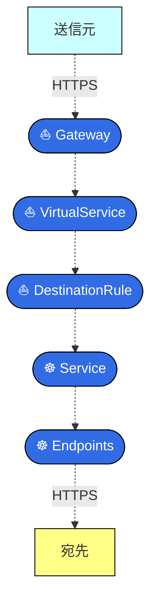
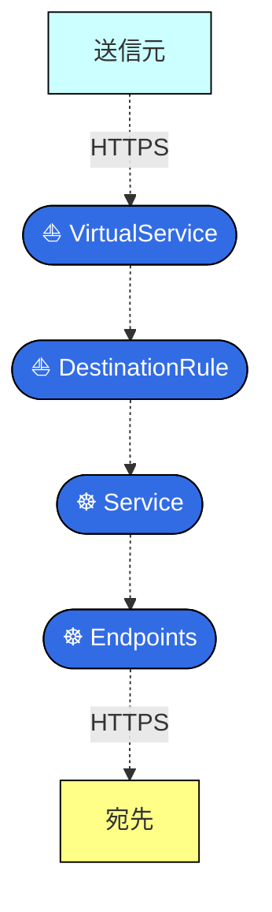
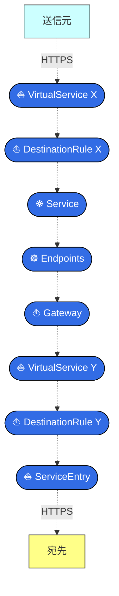
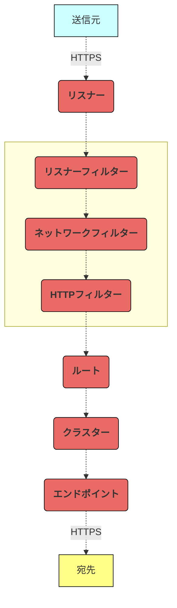
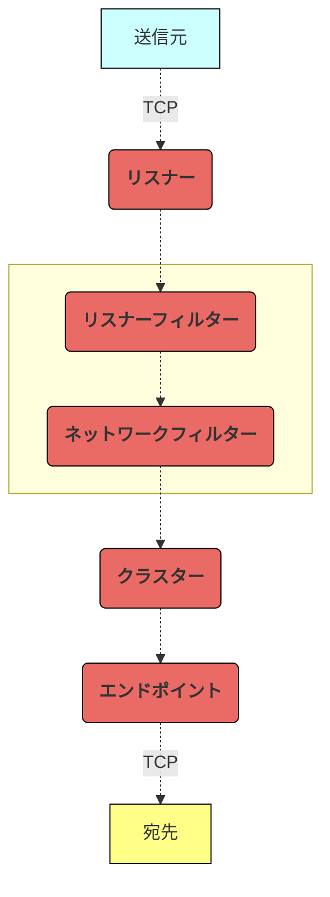

<br>

# この記事から得られる知識

この記事を読むと、以下を **"完全に理解"** できます✌️

- Istioのサイドカーメッシュを題材にしたEnvoyの設定の抽象化について
- 様々なサービスメッシュツール (特に、Istio、Consul、Cilium、など) でも流用できるEnvoyの知識について

<br>

[:contents]

<br>

# 01. はじめに

<br>

どうも、**俺 (REMIX) feat. Istioニキ a.k.a. いすてぃ男**です。


<br>

Istioは、Envoyを使用したサービスメッシュを実装します。

IstioがKubernetesリソースやIstioカスタムリソースに基づいてEnvoyの設定を抽象化してくれるため、開発者はEnvoyをより簡単に設定できます。


<br>

Envoyの設定の抽象化は、Envoyを使用したサービスメッシュ (例：Istioサイドカーメッシュ/アンビエントメッシュ、Consul、Istioから得られた学びを土台に登場したCiliumサイドカーフリーメッシュ、など) に共通しています。

つまり、次々に登場するEnvoyによるサービスメッシュツールに振り回されないようにするためには、ツールがどのようにEnvoyを抽象化するのかを理解しておく必要があります。

そこで今回は、IstioサイドカーメッシュがEnvoyのHTTPSリクエストの処理をどのように抽象化するのかを解説します。

また、抽象化されたEnvoyがHTTPSリクエストを処理する仕組みも一緒に解説します。

これらの知識は、様々なサービスメッシュツールで流用できるはずです。

それでは、もりもり布教していきます😗

<div class="text-box">
記事中のこのボックスは、補足情報を記載しています。
<br>
<br>
飛ばしていただいても大丈夫ですが、読んでもらえるとより理解が深まるはずです👍
</div>

<br>

# 02. 様々なリソースによるEnvoy設定の抽象化

まずは、どのようなリソースがHTTPSリクエストの処理に関係しているのかを、HTTPSリクエストの方向に分けて解説していきます。

`istio-proxy`コンテナやEnvoyについては、次章以降で解説します。

<br>

## サービスメッシュ外からのHTTPS

サービスメッシュ外から内にHTTPSリクエストを送信する場合、リソースが以下の順で紐付き、Envoyの設定を抽象化します。


<div hidden>



</div>

<br>

各リソースは、以下の仕組みで、HTTPSリクエストを送信元から宛先まで届けます。

図中の番号に沿って、通信の仕組みを解説します。

1. クライアントは、サービスメッシュ外からL7ロードバランサーにHTTPSリクエストを送信します。
2. L7ロードバランサーは、Istio IngressGateway PodにHTTPSリクエストを送信します。
3. Istio IngressGateway Podは、宛先Podとの間で相互TLS認証を実施します。
4. Istio IngressGateway Podは、Kubernetesリソース (Service、Endpoints) やIstioカスタムリソース (VirtualService、DestinationRule) に応じて、HTTPSリクエストを宛先PodにL7ロードバランシングします。


> - [https://software.danielwatrous.com/istio-ingress-vs-kubernetes-ingress/:title]

<br>

## マイクロサービス間のHTTPS

サービスメッシュ内のPodから別のPodにHTTPSリクエストを送信する場合、リソースが以下の順で紐付き、Envoyの設定を抽象化します。


<div hidden>



</div>

<br>

各リソースは、以下の仕組みで、HTTPSリクエストを送信元から宛先まで届けます。

図中の番号に沿って、通信の仕組みを解説します。

1. 送信元Podは、宛先Podとの間で相互TLS認証を実施します。
2. 送信元Podは、Kubernetesリソース (Service、Endpoints) やIstioカスタムリソース (VirtualService、DestinationRule) の設定に応じて、HTTPSリクエストを宛先PodにL7ロードバランシングします。


> - [https://www.zhaohuabing.com/post/2018-09-25-istio-traffic-management-impl-intro/:title]

<br>

## サービスメッシュ外へのHTTPS

サービスメッシュ内のPodから外のシステム (例：データベース、ドメインレイヤー委譲先の外部API) にHTTPSリクエストを送信する場合、リソースが以下の順で紐付き、Envoyの設定を抽象化します。

複数のVirtualServiceとDestinationが登場するため、これらには便宜上 `X` と `Y` をつけています。


<div hidden>



</div>

<br>

各リソースは、以下の仕組みで、HTTPSリクエストを送信元から宛先まで届けます。

図中の番号に沿って、通信の仕組みを解説します。

1. 送信元Podは、HTTPSリクエストの宛先がServiceEntryでエントリ済みか否かの設定に応じて、HTTPSリクエストの宛先を切り替えます。
   - 宛先がエントリ済みであれば、送信元PodはHTTPSリクエストの宛先にIstio EgressGateway Podを選択します。
   - 宛先が未エントリであれば、送信元PodはHTTPSリクエストの宛先に外のシステムを選択します。
2. 送信元Podは、Istio EgressGateway Podとの間で相互TLS認証を実施します。
3. (1) で宛先がエントリ済であったとします。送信元Podは、HTTPSリクエストの向き先をIstio EgressGateway Podに変更します。
4. 送信元Podは、Kubernetesリソース (Service、Endpoints) やIstioカスタムリソース (VirtualService、DestinationRule) の設定に応じて、Istio EgressGateway PodにL7ロードバランシングします。
5. Istio EgressGateway Podは、HTTPSリクエストをエントリ済システムにL7ロードバランシングします。


> - [https://reitsma.io/blog/using-istio-to-mitm-our-users-traffic:title]
> - [https://discuss.istio.io/t/ingress-egress-serviceentry-data-flow-issues-for-istio-api-gateway/14202:title]

<br>

<div class="text-box">
<div class="text-box-title">▶︎ Istio EgressGatewayの必要性について</div>
<br>
実は、Istio EgressGatewayを使用しなくとも、ServiceEntryだけでサービスメッシュ外の登録済みシステムにHTTPSリクエストを送信できます。
<br>
<br>
しかし、Istio EgressGatewayを使わないと、マイクロサービスから<code>istio-proxy</code>コンテナを経由せずに外部システムに直接HTTPSリクエストを送信できるようになってしまい、システムの安全性が低くなります。
<br>
<br>
他に、サービスメッシュ外への特定の通信を識別できるようになるメリットもあります。
<blockquote>
<ul><li>[https://istio.io/latest/docs/tasks/traffic-management/egress/egress-control/#security-note:title]</li></ul>
<ul><li>[https://istio.io/v1.10/blog/2019/egress-performance/#egress-traffic-cases:title]</li></ul>
</blockquote>
</div>

<br>

# 03. istio-proxyコンテナによるHTTPS処理

前章では、KubernetesリソースやIstioカスタムリソースによって抽象化されたEnvoyまで言及しませんでした。

本章では、解説をもう少し具体化します。

Istioは、Envoyプロセスを持つ`istio-proxy`コンテナを作成します。

この`istio-proxy`コンテナを使用してどのようにHTTPSリクエストを処理しているのかを、HTTPSリクエストの方向に分けて解説します。

Envoyの設定については、次章以降で解説します。

<br>

## Istioコントロールプレーンの仕組み

Envoyの設定を抽象化する責務を担うのは、Istioコントロールプレーン (`discovery`コンテナ) です。

Istioコントロールプレーンは異なる責務を担う複数のレイヤーから構成されています。

<table>
  <thead>
    <tr>
      <th style="text-align: center;">レイヤー名</th>
      <th style="text-align: center;">責務</th>
    </tr>
  </thead>
  <tbody>
    <tr>
      <td style="text-align: center;"><nobr>Config ingestion</nobr><br>レイヤー
      </td>
      <td>kube-apiserverからKubernetesリソースやIstioカスタムリソースの設定を取得します。<br>Istioの初期から名前は変わっていません。
      </td>
    </tr>
    <tr>
      <td style="text-align: center;"><nobr>Config translation</nobr><br>レイヤー
      </td>
      <td>
       リソースの設定をEnvoy設定に変換します。<br>Istioの初期ではConfig Data Modelレイヤーという名前で、執筆時点 (2024/01/16) で名前が変わっています。
      </td>
    </tr>
    <tr>
      <td style="text-align: center;"><nobr>Config serving</nobr><br>レイヤー
      </td>
      <td>Envoyの設定や証明書をPod内のistio-proxyコンテナに配布します。<br>Istioの初期では、Proxy Servingレイヤーという名前で、執筆時点 (2024/01/16) で名前が変わっています。
      </td>
    </tr>
  </tbody>
</table>

<br>

図中の番号に沿って、Istioコントロールプレーンの仕組みを解説します。

1. Config ingestionレイヤーにて、 Istioコントロールプレーンはkube-apiserverにHTTPSリクエストを送信します。ここで、KubernetesリソースやIstioカスタムリソースの設定を取得します。
2. Config translationレイヤーにて、取得したリソースの設定をEnvoyの設定に変換します。
3. Config servingレイヤーにて、Envoyの設定や証明書をPod内の`istio-proxy`コンテナに配布します。双方向ストリーミングRPCのため、`istio-proxy`コンテナがConfig servingレイヤーにリクエストを送信し、これらを取得することもあります。


> - [https://github.com/istio/istio/blob/1.20.2/architecture/networking/pilot.md#proxy-configuration:title]
> - [https://www.zhaohuabing.com/post/2020-05-25-istio-certificate/:title]

<br>

<div class="text-box">
<div class="text-box-title">▶︎ Config servingレイヤーにあるXDS-APIについて</div>
<br>
Config servingレイヤーには、XDS-APIがあります。
<br>
<br>
このXDS-APIは、Envoyの設定に関するエンドポイント (LDS-API、RDS-API、CDS-API、EDS-API、ADS-API、など) や、証明書配布のエンドポイント (例：SDS-API) を持ちます。
<br>
<br>

<br>
<br>
以下の記事で解説していますため、もし気になる方はよろしくどうぞ🙇🏻‍
<br>
<br>
[https://hiroki-hasegawa.hatenablog.jp/entry/2022/12/25/060000:embed]
</div>

<br>

<div class="text-box">
<div class="text-box-title">▶︎ Istioカスタムリソースのコントローラーについて</div>
<br>
Istioコントロールプレーンは、前述の責務以外にカスタムコントローラーとしての責務も担います。
<br>
<br>
以前は、IstioOperatorがカスタムコントローラーの責務を担っていましたが、執筆時点 (2024/01/16) ではIstioOperatorが非推奨となりました。
<br>
<br>
IstioOperatorの代わりに、Istioコントロールプレーンがこれを担うようになりました👍🏻
<br>
<blockquote>
<ul>
<li>[https://github.com/istio/istio/blob/1.20.2/architecture/networking/pilot.md#controllers:title]</li>
</ul>
</blockquote>
</div>

<br>

## サービスメッシュ外からのHTTPS

サービスメッシュ外から内にHTTPSリクエストを送信する場合の`istio-proxy`コンテナです。

各リソースは、以下の仕組みで、HTTPSリクエストを送信元から宛先まで届けます。

図中の番号に沿って、通信の仕組みを解説します。

1. Istioコントロールプレーンは、翻訳されたEnvoyの設定をPod内の`istio-proxy`コンテナに提供します。
2. クライアントは、サービスメッシュ外からL7ロードバランサーにHTTPSリクエストを送信します。
3. L7ロードバランサーは、Istio IngressGateway PodにHTTPSリクエストを送信します。
4. Istio IngressGateway Pod内のiptablesは、HTTPSリクエストを`istio-proxy`コンテナに送信します (リダイレクトは不要)。
5. Istio IngressGateway Pod内の`istio-proxy`コンテナは、宛先Podを決定し、またこのPodに対して相互TLS認証を実施します。
6. Istio IngressGateway Pod内の`istio-proxy`コンテナは、HTTPSリクエストを宛先PodにL7ロードバランシングします。
7. 宛先Pod内のiptablesは、HTTPSリクエストを`istio-proxy`コンテナにリダイレクトします。
8. 宛先Pod内の`istio-proxy`コンテナは、HTTPSリクエストを宛先マイクロサービスに送信します。


> - [https://software.danielwatrous.com/istio-ingress-vs-kubernetes-ingress/:title]

<br>

<div class="text-box">
<div class="text-box-title">▶︎ Pod内のiptablesについて</div>
<br>
Pod内のiptablesは、リクエストが必ず<code>istio-proxy</code>コンテナを経由するように、<code>istio-proxy</code>コンテナにリクエストをリダイレクトします。
<br>
<br>
iptablesのルールを書き換えるのは<code>istio-init</code>コンテナです。
<br>
<br>
Istioは、<code>istio-proxy</code>コンテナと同じタイミングで、<code>istio-init</code>コンテナをPodにインジェクションします (Istio IngressGatewayとIstio EgressGatewayのPodは除きます)。
<br>
<br>
<figure><figcaption>画像引用元：<a href="https://www.sobyte.net/post/2022-07/istio-sidecar-proxy/#sidecar-traffic-interception-basic-process">SoByte</a></figcaption></figure>
<br>
<br>
<code>istio-init</code>コンテナは、<code>istio-iptables</code>コマンドを実行し、iptablesのルールを書き換えます。
<br>
<br>
また、<code>istio-init</code>コンテナはルールを書き換えた後に終了するため、Podの起動後にPod内に残りません👍🏻

```sh
$ istio-iptables \
    -p 15001 \
    -z 15006 \
    -u 1337 \
    -m REDIRECT \
    -i * \
    -x \
    -b * \
    -d 15090,15020
```

<blockquote>
<ul>
<li>[https://jimmysongio.medium.com/sidecar-injection-transparent-traffic-hijacking-and-routing-process-in-istio-explained-in-detail-d53e244e0348:title]</li>
<li>[https://istio.io/latest/docs/reference/commands/pilot-agent/#pilot-agent-istio-iptables:title]</li>
</ul>
</blockquote>
</div>

<br>

<div class="text-box">
<div class="text-box-title">▶︎ Istio IngressGateway Pod内のiptablesについて</div>
<br>
Istio IngressGateway Podでは、マイクロサービスがないため、<code>istio-proxy</code>コンテナにリクエストをリダイレクトする必要がありません。
<br>
<br>
そのため、Istioはiptablesのルールを書き換える<code>istio-init</code>コンテナをIstio IngressGateway Podにインジェクションしません。
<br>
<br>
つまり、Istio IngressGateway Pod内のiptablesのルールはデフォルトのままになっています👍🏻
</div>

<br>

## マイクロサービス間のHTTPS

サービスメッシュ内のPodから別のPodにHTTPSリクエストを送信する場合の`istio-proxy`コンテナです。

各リソースは、以下の仕組みで、HTTPSリクエストを送信元から宛先まで届けます。

図中の番号に沿って、通信の仕組みを解説します。

1. Istioコントロールプレーンは、翻訳されたEnvoyの設定をPod内の`istio-proxy`コンテナに提供します。
2. 送信元Pod内のiptablesは、HTTPSリクエストを`istio-proxy`コンテナにリダイレクトします。
3. 送信元Pod内の`istio-proxy`コンテナは、宛先Podを決定し、またこのPodに対して相互TLS認証を実施します。
4. 送信元Pod内の`istio-proxy`コンテナは、HTTPSリクエストを宛先PodにL7ロードバランシングします。
5. 宛先Pod内のiptablesは、HTTPSリクエストを`istio-proxy`コンテナにリダイレクトします。
6. 宛先Pod内の`istio-proxy`コンテナは、HTTPSリクエストを宛先マイクロサービスに送信します。


> - [https://www.zhaohuabing.com/post/2018-09-25-istio-traffic-management-impl-intro/:title]

<br>

## サービスメッシュ外へのHTTPS

サービスメッシュ内のPodから外のシステム (例：データベース、ドメインレイヤー委譲先の外部API) にHTTPSリクエストを送信する場合の`istio-proxy`コンテナです。

各リソースは、以下の仕組みで、HTTPSリクエストを送信元から宛先まで届けます。

図中の番号に沿って、通信の仕組みを解説します。

1. Istioコントロールプレーンは、翻訳されたEnvoyの設定をPod内の`istio-proxy`コンテナに提供します。
2. 送信元Pod内のiptablesは、HTTPSリクエストを`istio-proxy`コンテナにリダイレクトします。
3. 送信元Pod内の`istio-proxy`コンテナは、宛先Podを決定し、またこのPodに対して相互TLS認証を実施します。この時、ServiceEntryで宛先がエントリ済みか否かに応じて、HTTPSリクエストの宛先を切り替えます。
   - 宛先がエントリ済みであれば、`istio-proxy`コンテナはHTTPSリクエストの宛先にIstio EgressGateway Podを選択します。
   - 宛先が未エントリであれば、`istio-proxy`コンテナはHTTPSリクエストの宛先に外のシステムを選択します。
4. ここでは、宛先がエントリ済であったとします。送信元Pod内の`istio-proxy`コンテナは、HTTPSリクエストをIstio EgressGateway PodにL7ロードバランシングします。
5. Istio EgressGateway Pod内のiptablesは、HTTPSリクエストを`istio-proxy`コンテナに送信します (リダイレクトは不要)。
6. Istio EgressGateway Pod内の`istio-proxy`コンテナは、HTTPSリクエストをエントリ済システムにL7ロードバランシングします。


<div class="text-box">
<div class="text-box-title">▶︎ Istio EgressGateway Pod内のiptablesについて</div>
<br>
Istio EgressGateway Podでは、マイクロサービスがないため、<code>istio-proxy</code>コンテナにリクエストをリダイレクトする必要がありません。
<br>
<br>
そのため、Istioはiptablesのルールを書き換える<code>istio-init</code>コンテナをIstio EgressGateway Podにインジェクションしません。
<br>
<br>
つまり、Istio EgressGateway Pod内のiptablesのルールはデフォルトのままになっています👍🏻
</div>

> - [https://reitsma.io/blog/using-istio-to-mitm-our-users-traffic:title]
> - [https://discuss.istio.io/t/ingress-egress-serviceentry-data-flow-issues-for-istio-api-gateway/14202:title]

<br>

# 04. EnvoyによるHTTPS処理

前章では、`istio-proxy`コンテナ内のEnvoyの設定まで、言及しませんでした。

本章では、もっと具体化します。

EnvoyがHTTPSリクエストを処理する仕組みを解説します。

<br>

## Envoyの設定の種類

HTTPSリクエストを処理する場合、Envoyの設定が以下の順で紐付き、HTTPSリクエストを送信元から宛先まで届けます。


<div hidden>



</div>

<br>

各処理がどのような責務を担っているのかをもう少し詳しく見てみましょう。

図中の番号に沿って、EnvoyがHTTPSリクエストを処理する仕組みを解説します。

1. 送信元からのHTTPSリクエストの宛先ポートで、リスナーを絞り込みます。
2. 通信の種類 (例：HTTP、HTTPS、TCP、UDP、Unixドメインソケット、など) に応じてフィルターを選び、各フィルターがパケットのヘッダーを処理します。もしHTTPSであれば、送信元との間でTLS接続を確立し、パケットのL7のアプリケーションデータを復号化します。
3. フィルターを使用して、HTTPSリクエストの宛先ポートで、ルートを絞り込みます。
4. フィルターを使用して、HTTPSリクエストの宛先ホストやパスで、クラスターを絞り込みます。
5. 設定した負荷分散方式 (例：ラウンドロビン、など) に応じて、クラスター配下のエンドポイントを選びます。
6. 宛先との間でTLS接続を確立し、パケットのL7のアプリケーションデータを暗号化します。そして、エンドポイントにL7ロードバランシングします。


> - [https://www.envoyproxy.io/docs/envoy/latest/intro/life_of_a_request:title]

<br>

<div class="text-box">
<div class="text-box-title">▶ TCPリクエストを処理する場合について</div>
<br>
HTTPリクエストを処理する場合、フィルターに紐づくのはルートですが、TCPリクエストの場合はそうではありません。
<br>
<br>
TCPリクエストを処理する場合、フィルターにクラスターが紐づきます👍🏻
<br>
<br>


<div hidden>



</div>

<blockquote>
<ul><li>[https://www.slideshare.net/AspenMesh/debugging-your-debugging-tools-what-to-do-when-your-service-mesh-goes-down#15:title]</li></ul>
</blockquote>

</div>

<br>

## フィルター

### フィルターの一覧

Envoyのフィルターは、Envoyの機能を拡張するための設定です。

HTTPSリクエストを処理するためには、リスナーフィルター、ネットワークフィルター、HTTPフィルター、といったフィルターが必要になります。

全ては解説しきれないため、HTTPSリクエストを処理するための代表的なフィルターをいくつか抜粋しました。

ただ、 **<font color="#FF0000">Istioはこれらのフィルターをデフォルトで有効にしてくれている</font>** ため、開発者がEnvoyのフィルターを設定する場面は少ないです。

逆をいえば、Istioを介さずにEnvoyをそのまま使用する場合、開発者がEnvoyのフィルターを自前で設定する必要があります👍🏻

<table>
  <thead>
    <tr>
      <th style="text-align: center;"><nobr>フィルターの種類</nobr></th>
      <th style="text-align: center;"><nobr>HTTPSリクエストの処理に必要なフィルター</nobr><br>(一部抜粋)</th>
      <th style="text-align: center;">説明</th>
    </tr>
  </thead>
  <tbody>
    <tr>
      <td rowspan="3" style="text-align: center;">リスナー<br>フィルター</td>
      <td><a href="https://www.envoyproxy.io/docs/envoy/latest/intro/arch_overview/upstream/load_balancing/original_dst">Original Destination</a></td>
      <td><code>istio-proxy</code>コンテナへのリダイレクト前の宛先情報をEnvoyが取得できるようにします。<br>Pod内のiptablesがHTTPSリクエストを<code>istio-proxy</code>コンテナにリダイレクトすると、HTTPSリクエストの宛先が<code>istio-proxy</code>コンテナに変わってしまいます。<br>ただし、iptablesはリダイレクト前の宛先をカーネル上の<code>SO_ORIGINAL_DST</code>という定数に格納してくれています。<a href="https://venilnoronha.medium.com/introduction-to-original-destination-in-envoy-d8a8aa184bb6"><br>Envoyは、カーネル上の<code>SO_ORIGINAL_DST</code>から本来の宛先を取得し、プロキシします。</a></td>
    </tr>
    <tr>
      <td><a href="https://www.envoyproxy.io/docs/envoy/latest/configuration/listeners/listener_filters/http_inspector">HTTP Inspector</a></td>
      <td>EnvoyがHTTPを検知できるようにします。</td>
    </tr>
    <tr>
      <td><a href="https://www.envoyproxy.io/docs/envoy/latest/configuration/listeners/listener_filters/tls_inspector">TLS Inspector</a></td>
      <td>EnvoyがTLSを検知できるようにします。<br>TLSを検知した場合、Envoyは<a href="https://www.envoyproxy.io/docs/envoy/latest/start/quick-start/securing">TLSに関する処理</a>を実行します。<br>例えば、<a href="https://www.envoyproxy.io/docs/envoy/latest/api-v3/extensions/transport_sockets/tls/v3/tls.proto#extensions-transport-sockets-tls-v3-downstreamtlscontext">DownstreamTlsContext</a>は、リスナーフィルター直後に、送信元との間でTLS接続を確立し、パケットのL7のアプリケーションデータを復号化します。<br>また、<a href="https://www.envoyproxy.io/docs/envoy/latest/api-v3/extensions/transport_sockets/tls/v3/tls.proto#extensions-transport-sockets-tls-v3-upstreamtlscontext">UpstreamTlsContext</a>は、クラスターの処理時に、宛先との間でTLS接続を確立し、L7のアプリケーションデータを暗号化します。
    </tr>
    <tr>
      <td style="text-align: center;">ネットワーク<br>フィルター</td>
      <td><a href="https://www.envoyproxy.io/docs/envoy/latest/intro/arch_overview/http/http_connection_management">HTTP connection manager</a></td>
      <td>Envoyが、L7のアプリケーションデータを読み取り、また後続のHTTPフィルターを制御できるようにします。
    </tr>
    <tr>
      <td rowspan="2" style="text-align: center;">HTTP<br>フィルター</td>
      <td><a href="https://www.envoyproxy.io/docs/envoy/latest/configuration/http/http_filters/router_filter">Router</a></td>
      <td>Envoyがポート番号でルート、ホストやパスでクラスターを絞り込めるようにします。</td>
    </tr>
    <tr>
      <td><a href="https://www.envoyproxy.io/docs/envoy/latest/intro/arch_overview/other_protocols/grpc#arch-overview-grpc">gRPC-Web</a></td>
      <td>EnvoyがHTTP/1.1で受信したHTTPSリクエストをHTTP/2に変換し、gRPCサーバーにプロキシできるようにします。</td>
    </tr>
  </tbody>
</table>

> - [https://www.envoyproxy.io/docs/envoy/latest/api-v3/config/filter/filter:title]

<br>

<div class="text-box">
<div class="text-box-title">▶︎ Istioがデフォルトで有効にするEnvoyの設定について</div>
<br>
<code>istio-proxy</code>コンテナは、イメージのビルド時に、あらかじめ用意しておいたEnvoyの設定ファイルを組み込みます。
<br>
<br>
そのため、<code>istio-proxy</code>コンテナ内のEnvoyは、多くの設定をデフォルトで有効にできます。
<br>
<br>
Istioを利用する開発者が、EnvoyがHTTPSリクエストを処理するために必要なフィルターを有効にしなくてよいのも、Istioのおかげです。
<br>
<br>
Istioほんまにありがとな🙏🙏🙏
<br>
<br>
<blockquote>
<ul>
  <li>[https://github.com/istio/istio/blob/1.20.2/pilot/docker/Dockerfile.proxyv2#L27-L29:title]</li>
  <li>[https://github.com/istio/istio/blob/1.20.2/tools/packaging/common/envoy_bootstrap.json:title]</li>
</ul>
</blockquote>
</div>

<br>

### フィルターチェーンの仕組み

Envoyは、複数のフィルターからなるフィルターチェーンを実行し、HTTPSを処理します。

図中の番号に沿って、Envoyのフィルターチェーンの仕組みを解説します。

各フィルターの機能は、前述したフィルターの一覧を参考にしてください🙇🏻

1. リスナーフィルター (Original Destination、HTTP Inspector、TLS Inspector、など) を実行します。
2. (1) でTLS InspectorがTLSを検知した場合、DownstreamTlsContextで宛先とTLSハンドシェイクを実行し、パケットのL7のアプリケーションデータを復号化します。
3. ネットワークフィルター (HTTP connection manager、など) を実行します。
4. HTTPフィルター (Router、gRPC-Web、など) を実行します。


> - [https://www.envoyproxy.io/docs/envoy/latest/intro/life_of_a_request:title]

<br>

<div class="text-box">
<div class="text-box-title">▶ TCPリクエストを処理する場合について</div>
<br>
HTTPフィルターはHTTP/HTTPSリクエストを処理する場合にのみ使用します。
<br>
<br>
それ以外の通信の種類 (例：TCP、UDP、Unixドメインソケット、など) の場合は、HTTPフィルターを使用しません。
<br>
<br>
例えば、TCPリクエストの場合、ネットワークフィルターのTCP proxyフィルターを使用します👍🏻
<br>
<blockquote>
<ul><li>[https://www.envoyproxy.io/docs/envoy/latest/configuration/listeners/network_filters/tcp_proxy_filter:title]</li></ul>
</blockquote>
</div>

<br>

# 05. リソースの設定からEnvoy設定への翻訳

いよいよです🔥

Istioが各リソースをいずれのEnvoyの設定に翻訳しているのかを解説します。

表で対応関係の一覧を示した後、`istio-proxy`コンテナ内のEnvoyに当てはめました。

<br>

## 各リソースとEnvoyの設定の関係一覧

Istioコントロールプレーンは、KubernetesリソースやIstioカスタムリソースの設定をEnvoyの設定に翻訳し、処理の流れに当てはめます。

以下の通り、各リソースがいずれのEnvoyの設定を抽象化するのかを整理しました。

リソースによっては、Envoyの複数の設定を抽象化します。

なお、Istioの用意したEnvoyのフィルターのデフォルト値を変更するユースケースが少ないため、これを抽象化するEnvoyFilterについては言及しません。

<table>
<thead>
    <tr>
      <th></th>
      <th colspan="2" style="text-align: center;">Kubernetes ☸️<br>リソース</th>
      <th colspan="5" style="text-align: center;">Istio ⛵️<br>カスタムリソース</th>
    </tr>
</thead>
<tbody>
    <tr>
      <td style="text-align: center;"><nobr>Envoyの設定</nobr></td>
      <td style="text-align: center;">Service</td>
      <td style="text-align: center;">Endpoints</td>
      <td style="text-align: center;">Gateway</td>
      <td style="text-align: center;">Virtual<br>Service</td>
      <td style="text-align: center;">Destination<br>Rule</td>
      <td style="text-align: center;">Service<br>Entry</td>
      <td style="text-align: center;">Peer<br>Authentication</td>
    </tr>
    <tr>
      <td style="text-align: center;"><nobr>リスナー</nobr></td>
      <td style="text-align: center;">✅</td>
      <td style="text-align: center;"></td>
      <td style="text-align: center;">✅</td>
      <td style="text-align: center;">✅</td>
      <td style="text-align: center;"></td>
      <td style="text-align: center;"></td>
      <td style="text-align: center;">✅</td>
    </tr>
    <tr>
      <td style="text-align: center;"><nobr>ルート</nobr></td>
      <td style="text-align: center;">✅</td>
      <td style="text-align: center;"></td>
      <td style="text-align: center;"></td>
      <td style="text-align: center;">✅</td>
      <td style="text-align: center;"></td>
      <td style="text-align: center;"></td>
      <td style="text-align: center;"></td>
    </tr>
    <tr>
      <td style="text-align: center;"><nobr>クラスター</nobr></td>
      <td style="text-align: center;">✅</td>
      <td style="text-align: center;"></td>
      <td style="text-align: center;"></td>
      <td style="text-align: center;"></td>
      <td style="text-align: center;">✅</td>
      <td style="text-align: center;">✅</td>
      <td style="text-align: center;">✅</td>
    </tr>
    <tr>
      <td style="text-align: center;"><nobr>エンドポイント</nobr></td>
      <td style="text-align: center;"></td>
      <td style="text-align: center;">✅</td>
      <td style="text-align: center;"></td>
      <td style="text-align: center;"></td>
      <td style="text-align: center;">✅</td>
      <td style="text-align: center;">✅</td>
      <td style="text-align: center;"></td>
    </tr>
</tbody>
</table>

> - [https://www.slideshare.net/AspenMesh/debugging-your-debugging-tools-what-to-do-when-your-service-mesh-goes-down#19:title]
> - [https://youtu.be/XAKY24b7XjQ?t=1128:title]

<br>

## サービスメッシュ外からのHTTPS

### Envoyの設定を抽象化するリソース一覧

サービスメッシュ外からのHTTPSリクエストを処理する場合に関係するリソースを抜粋しました。

Gatewayは、Istio IngressGatewayの一部として使用します。

ServiceEntryは、使用しないリソースのため、`×`としています。

<table>
<thead>
    <tr>
      <th></th>
      <th colspan="2" style="text-align: center;">Kubernetes ☸️<br>リソース</th>
      <th colspan="5" style="text-align: center;">Istio ⛵️<br>カスタムリソース</th>
    </tr>
</thead>
<tbody>
    <tr>
      <td style="text-align: center;"><nobr>Envoyの設定</nobr></td>
      <td style="text-align: center;">Service</td>
      <td style="text-align: center;">Endpoints</td>
      <td style="text-align: center;">Gateway</td>
      <td style="text-align: center;">Virtual<br>Service</td>
      <td style="text-align: center;">Destination<br>Rule</td>
      <td style="text-align: center;">Service<br>Entry</td>
      <td style="text-align: center;">Peer<br>Authentication</td>
    </tr>
    <tr>
      <td style="text-align: center;"><nobr>リスナー</nobr></td>
      <td style="text-align: center;">✅</td>
      <td style="text-align: center;"></td>
      <td style="text-align: center;">✅</td>
      <td style="text-align: center;">✅</td>
      <td style="text-align: center;"></td>
      <td style="text-align: center;">×</td>
      <td style="text-align: center;">✅</td>
    </tr>
    <tr>
      <td style="text-align: center;"><nobr>ルート</nobr></td>
      <td style="text-align: center;">✅</td>
      <td style="text-align: center;"></td>
      <td style="text-align: center;"></td>
      <td style="text-align: center;">✅</td>
      <td style="text-align: center;"></td>
      <td style="text-align: center;">×</td>
      <td style="text-align: center;"></td>
    </tr>
    <tr>
      <td style="text-align: center;"><nobr>クラスター</nobr></td>
      <td style="text-align: center;">✅</td>
      <td style="text-align: center;"></td>
      <td style="text-align: center;"></td>
      <td style="text-align: center;"></td>
      <td style="text-align: center;">✅</td>
      <td style="text-align: center;">×</td>
      <td style="text-align: center;">✅</td>
    </tr>
    <tr>
      <td style="text-align: center;"><nobr>エンドポイント</nobr></td>
      <td style="text-align: center;"></td>
      <td style="text-align: center;">✅</td>
      <td style="text-align: center;"></td>
      <td style="text-align: center;"></td>
      <td style="text-align: center;">✅</td>
      <td style="text-align: center;">×</td>
      <td style="text-align: center;"></td>
    </tr>
</tbody>
</table>

<br>

### リソースとEnvoyの設定の対応関係

送信元または宛先Envoyに分けると、各リソースは以下のようにEnvoyの設定を抽象化します。

話を簡単にするために、送信元と宛先は同じNamespaceにあると仮定します。

送信元EnvoyでHTTPSリクエストの宛先を決める設定、または宛先EnvoyでHTTPSリクエストを受信する設定を、同じリソースが抽象化します。

<table>
  <thead>
    <tr>
      <th colspan="2" style="text-align: center;"></th>
      <th colspan="2" style="text-align: center;">Kubernetes ☸️<br>リソース </th>
      <th colspan="4" style="text-align: center;">Istio ⛵️<br>カスタムリソース </th>
    </tr>
  </thead>
  <tbody>
    <tr>
      <td colspan="2" style="text-align: center;">Envoyの設定</td>
      <td style="text-align: center;">Service</td>
      <td style="text-align: center;">Endpoints</td>
      <td style="text-align: center;">Gateway</td>
      <td style="text-align: center;">Virtual<br>Service</td>
      <td style="text-align: center;">Destination<br>Rule</td>
      <td style="text-align: center;">Peer<br>Authentication</td>
    </tr>
    <tr>
      <td rowspan="4" style="text-align: center; background-color: #CCFFFF">送信元</td>
      <td style="text-align: center; background-color: #CCFFFF">リスナー</td>
      <td style="text-align: center; background-color: #CCFFFF">✅</td>
      <td style="text-align: center; background-color: #CCFFFF"></td>
      <td style="text-align: center; background-color: #CCFFFF">✅</td>
      <td style="text-align: center; background-color: #CCFFFF">✅</td>
      <td style="text-align: center; background-color: #CCFFFF"></td>
      <td style="text-align: center; background-color: #CCFFFF">✅</td>
    </tr>
    <tr>
      <td style="text-align: center; background-color: #CCFFFF">ルート</td>
      <td style="text-align: center; background-color: #CCFFFF">✅</td>
      <td style="text-align: center; background-color: #CCFFFF"></td>
      <td style="text-align: center; background-color: #CCFFFF"></td>
      <td style="text-align: center; background-color: #CCFFFF">✅</td>
      <td style="text-align: center; background-color: #CCFFFF"></td>
      <td style="text-align: center; background-color: #CCFFFF"></td>
    </tr>
    <tr>
      <td style="text-align: center; background-color: #CCFFFF">クラスター</td>
      <td style="text-align: center; background-color: #CCFFFF">✅</td>
      <td style="text-align: center; background-color: #CCFFFF"></td>
      <td style="text-align: center; background-color: #CCFFFF"></td>
      <td style="text-align: center; background-color: #CCFFFF"></td>
      <td style="text-align: center; background-color: #CCFFFF">✅</td>
      <td style="text-align: center; background-color: #CCFFFF">✅</td>
    </tr>
    <tr>
      <td style="text-align: center; background-color: #CCFFFF">エンドポイント</td>
      <td style="text-align: center; background-color: #CCFFFF"></td>
      <td style="text-align: center; background-color: #CCFFFF">✅</td>
      <td style="text-align: center; background-color: #CCFFFF"></td>
      <td style="text-align: center; background-color: #CCFFFF"></td>
      <td style="text-align: center; background-color: #CCFFFF">✅</td>
      <td style="text-align: center; background-color: #CCFFFF"></td>
    </tr>
    <tr>
      <td rowspan="4" style="text-align: center; background-color: #FFFF88">宛先</td>
      <td style="text-align: center; background-color: #FFFF88">リスナー</td>
      <td style="text-align: center; background-color: #FFFF88">✅</td>
      <td style="text-align: center; background-color: #FFFF88"></td>
      <td style="text-align: center; background-color: #FFFF88"></td>
      <td style="text-align: center; background-color: #FFFF88">✅</td>
      <td style="text-align: center; background-color: #FFFF88"></td>
      <td style="text-align: center; background-color: #FFFF88">✅</td>
    </tr>
    <tr>
      <td style="text-align: center; background-color: #FFFF88">ルート</td>
      <td style="text-align: center; background-color: #FFFF88">✅</td>
      <td style="text-align: center; background-color: #FFFF88"></td>
      <td style="text-align: center; background-color: #FFFF88"></td>
      <td style="text-align: center; background-color: #FFFF88">✅</td>
      <td style="text-align: center; background-color: #FFFF88"></td>
      <td style="text-align: center; background-color: #FFFF88"></td>
    </tr>
    <tr>
      <td style="text-align: center; background-color: #FFFF88">クラスター</td>
      <td style="text-align: center; background-color: #FFFF88">✅</td>
      <td style="text-align: center; background-color: #FFFF88"></td>
      <td style="text-align: center; background-color: #FFFF88"></td>
      <td style="text-align: center; background-color: #FFFF88"></td>
      <td style="text-align: center; background-color: #FFFF88">✅</td>
      <td style="text-align: center; background-color: #FFFF88">✅</td>
    </tr>
    <tr>
      <td style="text-align: center; background-color: #FFFF88">エンドポイント</td>
      <td style="text-align: center; background-color: #FFFF88"></td>
      <td style="text-align: center; background-color: #FFFF88">✅</td>
      <td style="text-align: center; background-color: #FFFF88"></td>
      <td style="text-align: center; background-color: #FFFF88"></td>
      <td style="text-align: center; background-color: #FFFF88">✅</td>
      <td style="text-align: center; background-color: #FFFF88"></td>
    </tr>
  </tbody>
</table>

<br>

<div class="text-box">
<div class="text-box-title">▶︎ 送信元と宛先のNamespaceについて</div>
<br>
今回、送信元のIstio IngressGatewayと宛先は同じNamespaceにあると仮定しています。
<br>
<br>
しかし、もししっかり設計するのであれば、Istio IngressGatewayは専用のNamespace (例：<code>istio-ingress</code>) においた方が良いです。
<br>
<br>
マイクロサービスとは異なるNamespaceにIstio IngressGatewayを置くことで、Istio IngressGatewayをアップグレードしやすくなったり、他から障害の影響を受けにくくなります🙆🏻‍♂️
</div>

### `istio-proxy`コンテナ内のEnvoyに当てはめる

この表を、HTTPSリクエストの仕組みの中に当てはめると、以下になります。

<div class="text-quote">
送信元EnvoyでHTTPSリクエストの宛先を決める設定、または宛先EnvoyでHTTPSリクエストを受信する設定を、同じリソースが抽象化します。
</div>

<br>

引用した前述の解説のイメージが掴めるかと思います。

送信元または宛先Envoyでほとんど同じリソースが登場しますが、 Gatewayは送信元Envoyだけで登場します。


<br>

リソースの種類だけに着目すると、以下になります。

Gatewayが送信元Envoyだけで登場することがわかりやすくなりました。


<br>

## マイクロサービス間のHTTPS

### Envoyの設定を抽象化するリソース一覧

サービスメッシュ内のPodから別のPodへのHTTPSリクエストを処理する場合に関係するリソースを抜粋しました。

GatewayとServiceEntryは、使用しないリソースのため、`×`としています。

<table>
<thead>
    <tr>
      <th></th>
      <th colspan="2" style="text-align: center;">Kubernetes ☸️<br>リソース</th>
      <th colspan="5" style="text-align: center;">Istio ⛵️<br>カスタムリソース</th>
    </tr>
</thead>
<tbody>
    <tr>
      <td style="text-align: center;"><nobr>Envoyの設定</nobr></td>
      <td style="text-align: center;">Service</td>
      <td style="text-align: center;">Endpoints</td>
      <td style="text-align: center;">Gateway</td>
      <td style="text-align: center;">Virtual<br>Service</td>
      <td style="text-align: center;">Destination<br>Rule</td>
      <td style="text-align: center;">Service<br>Entry</td>
      <td style="text-align: center;">Peer<br>Authentication</td>
    </tr>
    <tr>
      <td style="text-align: center;"><nobr>リスナー</nobr></td>
      <td style="text-align: center;">✅</td>
      <td style="text-align: center;"></td>
      <td style="text-align: center;">×</td>
      <td style="text-align: center;">✅</td>
      <td style="text-align: center;"></td>
      <td style="text-align: center;">×</td>
      <td style="text-align: center;">✅</td>
    </tr>
    <tr>
      <td style="text-align: center;"><nobr>ルート</nobr></td>
      <td style="text-align: center;">✅</td>
      <td style="text-align: center;"></td>
      <td style="text-align: center;">×</td>
      <td style="text-align: center;">✅</td>
      <td style="text-align: center;"></td>
      <td style="text-align: center;">×</td>
      <td style="text-align: center;"></td>
    </tr>
    <tr>
      <td style="text-align: center;"><nobr>クラスター</nobr></td>
      <td style="text-align: center;">✅</td>
      <td style="text-align: center;"></td>
      <td style="text-align: center;">×</td>
      <td style="text-align: center;"></td>
      <td style="text-align: center;">✅</td>
      <td style="text-align: center;">×</td>
      <td style="text-align: center;">✅</td>
    </tr>
    <tr>
      <td style="text-align: center;"><nobr>エンドポイント</nobr></td>
      <td style="text-align: center;"></td>
      <td style="text-align: center;">✅</td>
      <td style="text-align: center;">×</td>
      <td style="text-align: center;"></td>
      <td style="text-align: center;">✅</td>
      <td style="text-align: center;">×</td>
      <td style="text-align: center;"></td>
    </tr>
</tbody>
</table>

<br>

### リソースとEnvoyの設定の対応関係

送信元または宛先Envoyに分けると、各リソースは以下のようにEnvoyの設定を抽象化します。

話を簡単にするために、送信元と宛先は同じNamespaceにあると仮定します。

送信元EnvoyでHTTPSリクエストの宛先を決める設定、または宛先EnvoyでHTTPSリクエストを受信する設定を、同じリソースが抽象化します。

<table>
  <thead>
    <tr>
      <th colspan="2" style="text-align: center;"></th>
      <th colspan="2" style="text-align: center;">Kubernetes ☸️<br>リソース </th>
      <th colspan="3" style="text-align: center;">Istio ⛵️<br>カスタムリソース </th>
    </tr>
  </thead>
  <tbody>
    <tr>
      <td colspan="2" style="text-align: center;">Envoyの設定</td>
      <td style="text-align: center;">Service</td>
      <td style="text-align: center;">Endpoints</td>
      <td style="text-align: center;">Virtual<br>Service</td>
      <td style="text-align: center;">Destination<br>Rule</td>
      <td style="text-align: center;">Peer<br>Authentication</td>
    </tr>
    <tr>
      <td rowspan="4" style="text-align: center; background-color: #CCFFFF">送信元</td>
      <td style="text-align: center; background-color: #CCFFFF">リスナー</td>
      <td style="text-align: center; background-color: #CCFFFF">✅</td>
      <td style="text-align: center; background-color: #CCFFFF"></td>
      <td style="text-align: center; background-color: #CCFFFF">✅</td>
      <td style="text-align: center; background-color: #CCFFFF"></td>
      <td style="text-align: center; background-color: #CCFFFF">✅</td>
    </tr>
    <tr>
      <td style="text-align: center; background-color: #CCFFFF">ルート</td>
      <td style="text-align: center; background-color: #CCFFFF">✅</td>
      <td style="text-align: center; background-color: #CCFFFF"></td>
      <td style="text-align: center; background-color: #CCFFFF">✅</td>
      <td style="text-align: center; background-color: #CCFFFF"></td>
      <td style="text-align: center; background-color: #CCFFFF"></td>
    </tr>
    <tr>
      <td style="text-align: center; background-color: #CCFFFF">クラスター</td>
      <td style="text-align: center; background-color: #CCFFFF">✅</td>
      <td style="text-align: center; background-color: #CCFFFF"></td>
      <td style="text-align: center; background-color: #CCFFFF"></td>
      <td style="text-align: center; background-color: #CCFFFF">✅</td>
      <td style="text-align: center; background-color: #CCFFFF">✅</td>
    </tr>
    <tr>
      <td style="text-align: center; background-color: #CCFFFF">エンドポイント</td>
      <td style="text-align: center; background-color: #CCFFFF"></td>
      <td style="text-align: center; background-color: #CCFFFF">✅</td>
      <td style="text-align: center; background-color: #CCFFFF"></td>
      <td style="text-align: center; background-color: #CCFFFF">✅</td>
      <td style="text-align: center; background-color: #CCFFFF"></td>
    </tr>
    <tr>
      <td rowspan="4" style="text-align: center; background-color: #FFFF88">宛先</td>
      <td style="text-align: center; background-color: #FFFF88">リスナー</td>
      <td style="text-align: center; background-color: #FFFF88">✅</td>
      <td style="text-align: center; background-color: #FFFF88"></td>
      <td style="text-align: center; background-color: #FFFF88">✅</td>
      <td style="text-align: center; background-color: #FFFF88"></td>
      <td style="text-align: center; background-color: #FFFF88">✅</td>
    </tr>
    <tr>
      <td style="text-align: center; background-color: #FFFF88">ルート</td>
      <td style="text-align: center; background-color: #FFFF88">✅</td>
      <td style="text-align: center; background-color: #FFFF88"></td>
      <td style="text-align: center; background-color: #FFFF88">✅</td>
      <td style="text-align: center; background-color: #FFFF88"></td>
      <td style="text-align: center; background-color: #FFFF88"></td>
    </tr>
    <tr>
      <td style="text-align: center; background-color: #FFFF88">クラスター</td>
      <td style="text-align: center; background-color: #FFFF88">✅</td>
      <td style="text-align: center; background-color: #FFFF88"></td>
      <td style="text-align: center; background-color: #FFFF88"></td>
      <td style="text-align: center; background-color: #FFFF88">✅</td>
      <td style="text-align: center; background-color: #FFFF88">✅</td>
    </tr>
    <tr>
      <td style="text-align: center; background-color: #FFFF88">エンドポイント</td>
      <td style="text-align: center; background-color: #FFFF88"></td>
      <td style="text-align: center; background-color: #FFFF88">✅</td>
      <td style="text-align: center; background-color: #FFFF88"></td>
      <td style="text-align: center; background-color: #FFFF88">✅</td>
      <td style="text-align: center; background-color: #FFFF88"></td>
    </tr>
  </tbody>
</table>

### `istio-proxy`コンテナ内のEnvoyに当てはめる

この表を、HTTPSリクエストの仕組みの中に当てはめると、以下になります。

<div class="text-quote">
送信元EnvoyでHTTPSリクエストの宛先を決める設定、または宛先EnvoyでHTTPSリクエストを受信する設定を、同じリソースが抽象化します。
</div>

<br>

引用した前述の解説のイメージが掴めるかと思います。

送信元または宛先Envoyで、同じリソースが登場します。


<br>

リソースの種類だけに着目すると、以下になります。

送信元または宛先Envoyで同じリソースが登場することがわかりやすくなりました。


<br>

## サービスメッシュ外へのHTTPS

### Envoyの設定を抽象化するリソース一覧

サービスメッシュ内のPodから外のシステム (例：データベース、ドメインレイヤー委譲先の外部API) へのHTTPSリクエストを処理する場合に関係するリソースを抜粋しました。

Gatewayは、Istio EgressGatewayの一部として使用します。

<table>
<thead>
    <tr>
      <th></th>
      <th colspan="2" style="text-align: center;">Kubernetes ☸️<br>リソース</th>
      <th colspan="5" style="text-align: center;">Istio ⛵️<br>カスタムリソース</th>
    </tr>
</thead>
<tbody>
    <tr>
      <td style="text-align: center;"><nobr>Envoyの設定</nobr></td>
      <td style="text-align: center;">Service</td>
      <td style="text-align: center;">Endpoints</td>
      <td style="text-align: center;">Gateway</td>
      <td style="text-align: center;">Virtual<br>Service</td>
      <td style="text-align: center;">Destination<br>Rule</td>
      <td style="text-align: center;">Service<br>Entry</td>
      <td style="text-align: center;">Peer<br>Authentication</td>
    </tr>
    <tr>
      <td style="text-align: center;"><nobr>リスナー</nobr></td>
      <td style="text-align: center;">✅</td>
      <td style="text-align: center;"></td>
      <td style="text-align: center;">✅</td>
      <td style="text-align: center;">✅</td>
      <td style="text-align: center;"></td>
      <td style="text-align: center;"></td>
      <td style="text-align: center;">✅</td>
    </tr>
    <tr>
      <td style="text-align: center;"><nobr>ルート</nobr></td>
      <td style="text-align: center;">✅</td>
      <td style="text-align: center;"></td>
      <td style="text-align: center;"></td>
      <td style="text-align: center;">✅</td>
      <td style="text-align: center;"></td>
      <td style="text-align: center;"></td>
      <td style="text-align: center;"></td>
    </tr>
    <tr>
      <td style="text-align: center;"><nobr>クラスター</nobr></td>
      <td style="text-align: center;">✅</td>
      <td style="text-align: center;"></td>
      <td style="text-align: center;"></td>
      <td style="text-align: center;"></td>
      <td style="text-align: center;">✅</td>
      <td style="text-align: center;">✅</td>
      <td style="text-align: center;">✅</td>
    </tr>
    <tr>
      <td style="text-align: center;"><nobr>エンドポイント</nobr></td>
      <td style="text-align: center;"></td>
      <td style="text-align: center;">✅</td>
      <td style="text-align: center;"></td>
      <td style="text-align: center;"></td>
      <td style="text-align: center;">✅</td>
      <td style="text-align: center;">✅</td>
      <td style="text-align: center;"></td>
    </tr>
</tbody>
</table>

### リソースとEnvoyの設定の対応関係

送信元または宛先Envoyに分けると、各リソースは以下のようにEnvoyの設定を抽象化します。

話を簡単にするために、送信元と宛先は同じNamespaceにあると仮定します。

他の場合とは異なり、送信元EnvoyでHTTPSリクエストの宛先を決める設定、または宛先EnvoyでHTTPSリクエストを受信する設定を、異なるリソースが抽象化します。

PeerAuthenticationだけは、話を簡単にするために送信元と宛先が同じNamespaceであると仮定しているので、同じリソースが抽象化します。

送信元Envoyの設定の抽象化で登場するリソースが宛先では登場せず、逆も然りです。

<table>
  <thead>
    <tr>
      <th colspan="2"></th>
      <th colspan="2" style="text-align: center;">Kubernetes ☸️<br>リソース </th>
      <th colspan="7" style="text-align: center;">Istio ⛵️<br>カスタムリソース </th>
    </tr>
  </thead>
  <tbody>
    <tr>
      <td colspan="2" style="text-align: center;">Envoyの設定</td>
      <td style="text-align: center;">Service</td>
      <td style="text-align: center;">Endpoints</td>
      <td style="text-align: center;">Gateway</td>
      <td style="text-align: center;">Virtual<br>Service<br>X</td>
      <td style="text-align: center;">〃<br>Y</td>
      <td style="text-align: center;">Destination<br>Rule<br>X</td>
      <td style="text-align: center;">〃<br>Y</td>
      <td style="text-align: center;">Service<br>Entry</td>
      <td style="text-align: center;">Peer<br>Authentication</td>
    </tr>
    <tr>
      <td rowspan="4" style="text-align: center; background-color: #CCFFFF"><nobr>送信元</nobr></td>
      <td style="text-align: center; background-color: #CCFFFF"><nobr>リスナー</nobr></td>
      <td style="text-align: center; background-color: #CCFFFF">✅</td>
      <td style="text-align: center; background-color: #CCFFFF"></td>
      <td style="text-align: center; background-color: #CCFFFF"></td>
      <td style="text-align: center; background-color: #CCFFFF">✅</td>
      <td style="text-align: center; background-color: #CCFFFF"></td>
      <td style="text-align: center; background-color: #CCFFFF"></td>
      <td style="text-align: center; background-color: #CCFFFF"></td>
      <td style="text-align: center; background-color: #CCFFFF"></td>
      <td style="text-align: center; background-color: #CCFFFF">✅</td>
    </tr>
    <tr>
      <td style="text-align: center; background-color: #CCFFFF"><nobr>ルート</nobr></td>
      <td style="text-align: center; background-color: #CCFFFF">✅</td>
      <td style="text-align: center; background-color: #CCFFFF"></td>
      <td style="text-align: center; background-color: #CCFFFF"></td>
      <td style="text-align: center; background-color: #CCFFFF">✅</td>
      <td style="text-align: center; background-color: #CCFFFF"></td>
      <td style="text-align: center; background-color: #CCFFFF"></td>
      <td style="text-align: center; background-color: #CCFFFF"></td>
      <td style="text-align: center; background-color: #CCFFFF"></td>
      <td style="text-align: center; background-color: #CCFFFF"></td>
    </tr>
    <tr>
      <td style="text-align: center; background-color: #CCFFFF"><nobr>クラスター</nobr></td>
      <td style="text-align: center; background-color: #CCFFFF">✅</td>
      <td style="text-align: center; background-color: #CCFFFF"></td>
      <td style="text-align: center; background-color: #CCFFFF"></td>
      <td style="text-align: center; background-color: #CCFFFF"></td>
      <td style="text-align: center; background-color: #CCFFFF"></td>
      <td style="text-align: center; background-color: #CCFFFF">✅</td>
      <td style="text-align: center; background-color: #CCFFFF"></td>
      <td style="text-align: center; background-color: #CCFFFF"></td>
      <td style="text-align: center; background-color: #CCFFFF">✅</td>
    </tr>
    <tr>
      <td style="text-align: center; background-color: #CCFFFF"><nobr>エンドポイント</nobr></td>
      <td style="text-align: center; background-color: #CCFFFF"></td>
      <td style="text-align: center; background-color: #CCFFFF">✅</td>
      <td style="text-align: center; background-color: #CCFFFF"></td>
      <td style="text-align: center; background-color: #CCFFFF"></td>
      <td style="text-align: center; background-color: #CCFFFF"></td>
      <td style="text-align: center; background-color: #CCFFFF">✅</td>
      <td style="text-align: center; background-color: #CCFFFF"></td>
      <td style="text-align: center; background-color: #CCFFFF"></td>
      <td style="text-align: center; background-color: #CCFFFF"></td>
    </tr>
    <tr>
      <td rowspan="4" style="text-align: center; background-color: #FFFF88"><nobr>宛先</nobr></td>
      <td style="text-align: center; background-color: #FFFF88"><nobr>リスナー</nobr></td>
      <td style="text-align: center; background-color: #FFFF88"></td>
      <td style="text-align: center; background-color: #FFFF88"></td>
      <td style="text-align: center; background-color: #FFFF88">✅</td>
      <td style="text-align: center; background-color: #FFFF88"></td>
      <td style="text-align: center; background-color: #FFFF88">✅</td>
      <td style="text-align: center; background-color: #FFFF88"></td>
      <td style="text-align: center; background-color: #FFFF88"></td>
      <td style="text-align: center; background-color: #FFFF88"></td>
      <td style="text-align: center; background-color: #FFFF88">✅</td>
    </tr>
    <tr>
      <td style="text-align: center; background-color: #FFFF88"><nobr>ルート</nobr></td>
      <td style="text-align: center; background-color: #FFFF88"></td>
      <td style="text-align: center; background-color: #FFFF88"></td>
      <td style="text-align: center; background-color: #FFFF88"></td>
      <td style="text-align: center; background-color: #FFFF88"></td>
      <td style="text-align: center; background-color: #FFFF88">✅</td>
      <td style="text-align: center; background-color: #FFFF88"></td>
      <td style="text-align: center; background-color: #FFFF88"></td>
      <td style="text-align: center; background-color: #FFFF88"></td>
      <td style="text-align: center; background-color: #FFFF88"></td>
    </tr>
    <tr>
      <td style="text-align: center; background-color: #FFFF88"><nobr>クラスター</nobr></td>
      <td style="text-align: center; background-color: #FFFF88"></td>
      <td style="text-align: center; background-color: #FFFF88"></td>
      <td style="text-align: center; background-color: #FFFF88"></td>
      <td style="text-align: center; background-color: #FFFF88"></td>
      <td style="text-align: center; background-color: #FFFF88"></td>
      <td style="text-align: center; background-color: #FFFF88"></td>
      <td style="text-align: center; background-color: #FFFF88">✅</td>
      <td style="text-align: center; background-color: #FFFF88">✅</td>
      <td style="text-align: center; background-color: #FFFF88">✅</td>
    </tr>
    <tr>
      <td style="text-align: center; background-color: #FFFF88"><nobr>エンドポイント</nobr></td>
      <td style="text-align: center; background-color: #FFFF88"></td>
      <td style="text-align: center; background-color: #FFFF88"></td>
      <td style="text-align: center; background-color: #FFFF88"></td>
      <td style="text-align: center; background-color: #FFFF88"></td>
      <td style="text-align: center; background-color: #FFFF88"></td>
      <td style="text-align: center; background-color: #FFFF88"></td>
      <td style="text-align: center; background-color: #FFFF88">✅</td>
      <td style="text-align: center; background-color: #FFFF88">✅</td>
      <td style="text-align: center; background-color: #FFFF88"></td>
    </tr>
  </tbody>
</table>

<br>

<div class="text-box">
<div class="text-box-title">▶︎ 送信元と宛先のNamespaceについて</div>
<br>
今回、送信元と宛先のIstio EgressGatewayは同じNamespaceにあると仮定しています。
<br>
<br>
しかし、もししっかり設計するのであれば、Istio EgressGatewayは専用のNamespace (例：<code>istio-egress</code>) においた方が良いです。
<br>
<br>
マイクロサービスとは異なるNamespaceにIstio EgressGatewayを置くことで、Istio EgressGatewayをアップグレードしやすくなったり、他から障害の影響を受けにくくなります🙆🏻‍♂️
</div>

### `istio-proxy`コンテナ内のEnvoyに当てはめる

この表を、HTTPSリクエストの仕組みの中に当てはめると、以下になります。

<div class="text-quote">
送信元EnvoyでHTTPSリクエストの宛先を決める設定、または宛先EnvoyでHTTPSリクエストを受信する設定を、異なるリソースが抽象化します。
<br>
<br>
PeerAuthenticationだけは、話を簡単にするために送信元と宛先が同じNamespaceであると仮定しているので、同じリソースが抽象化します。
</div>

<br>

引用した前述の解説のイメージが掴めるかと思います。

送信元または宛先Envoyで同じリソースが登場しません 。


<br>

リソースの種類だけに着目すると、以下になります。

送信元または宛先Envoyで同じリソースが登場しないことがわかりやすくなりました。


<br>

# 06. 翻訳されたEnvoy設定値を見てみる

前章では、Envoyの具体的な設定値まで、言及しませんでした。

本章では、さらに具体化します。

各リソースの設定の翻訳によって、Envoyの具体的にどのような設定値になっているのかを解説します。

<br>

## Envoyの現在の設定を出力する

Envoyは、現在の設定を確認するためのエンドポイント (`/config_dump`) を公開しています。

これにHTTPSリクエストを送信し、具体的な設定値を出力してみましょう👍🏻

### リスナーを出力する

`/config_dump`のクエリストリングに`resource={dynamic_listeners}`をつけると、Envoyのリスナーを出力できます。

```sh
$ kubectl exec \
    -it foo-pod \
    -n foo-namespace \
    -c istio-proxy \
    -- bash -c "curl http://localhost:15000/config_dump?resource={dynamic_listeners}" | yq -P
```

> - [https://www.envoyproxy.io/docs/envoy/latest/operations/admin#get--config_dump?resource=:title]
> - [https://www.envoyproxy.io/docs/envoy/latest/api-v3/admin/v3/config_dump_shared.proto#admin-v3-listenersconfigdump:title]

<br>

<div class="text-box">
<div class="text-box-title">▶ 宛先情報を見やすくする<code>yq</code>コマンドについて</div>
<br>
Envoyは、JSON形式で設定を出力します。
<br>
<br>
JSON形式だと見にくいため、<code>yq</code>コマンドでYAMLに変換すると見やすくなります👍
</div>

### ルートを出力する

`/config_dump`のクエリストリングに`resource={dynamic_route_configs}`をつけると、Envoyのルートを出力できます。

```sh
$ kubectl exec \
    -it foo-pod \
    -n foo-namespace \
    -c istio-proxy \
    -- bash -c "curl http://localhost:15000/config_dump?resource={dynamic_route_configs}" | yq -P
```

> - [https://www.envoyproxy.io/docs/envoy/latest/operations/admin#get--config_dump?resource:title]
> - [https://www.envoyproxy.io/docs/envoy/latest/api-v3/admin/v3/config_dump_shared.proto#envoy-v3-api-msg-admin-v3-routesconfigdump-dynamicrouteconfig:title]

### クラスターを出力する

`/config_dump`のクエリストリングに`resource={dynamic_active_clusters}`をつけると、Envoyのクラスターを出力できます。

```sh
$ kubectl exec \
    -it foo-pod \
    -n foo-namespace \
    -c istio-proxy \
    -- bash -c "curl http://localhost:15000/config_dump?resource={dynamic_active_clusters}" | yq -P
```

> - [https://www.envoyproxy.io/docs/envoy/latest/operations/admin#get--config_dump?resource=:title]
> - [https://www.envoyproxy.io/docs/envoy/latest/api-v3/admin/v3/config_dump_shared.proto#envoy-v3-api-msg-admin-v3-clustersconfigdump-dynamiccluster:title]

### エンドポイントを出力する

`/config_dump`のクエリストリングに`include_eds`をつけると、Envoyのエンドポイントを出力できます。

```sh
$ kubectl exec \
    -it foo-pod \
    -n foo-namespace \
    -c istio-proxy \
    -- bash -c "curl http://localhost:15000/config_dump?include_eds" | yq -P
```

> - [https://www.envoyproxy.io/docs/envoy/latest/operations/admin#get--config_dump?include_eds:title]
> - [https://www.envoyproxy.io/docs/envoy/latest/api-v3/admin/v3/config_dump_shared.proto#envoy-v3-api-msg-admin-v3-endpointsconfigdump-dynamicendpointconfig:title]
> - [https://www.envoyproxy.io/docs/envoy/latest/intro/arch_overview/upstream/load_balancing/load_balancers#weighted-least-request:title]

### 証明書を出力する

`/config_dump`のクエリストリングに`resource={dynamic_active_secrets}`をつけると、証明書を出力できます。

```sh
$ kubectl exec \
    -it foo-pod \
    -n foo-namespace \
    -c istio-proxy \
    -- bash -c "curl http://localhost:15000/config_dump?resource={dynamic_active_secrets}" | yq -P
```

> - [https://www.envoyproxy.io/docs/envoy/latest/api-v3/admin/v3/config_dump.proto#envoy-v3-api-msg-admin-v3-secretsconfigdump-dynamicsecret:title]

<br>

## サービスメッシュ外からのHTTPS

ここでは、`istio-proxy`コンテナはHTTPSリクエストを処理するとします。

図中の番号に沿って、通信の仕組みを解説します。


### 送信元Pod側の`istio-proxy`コンテナ

1. 送信元マイクロサービスからのHTTPSリクエストの宛先ポート (例：`50000`) で、リスナーを絞り込みます。Envoyは、リスナーを宛先ポートで管理しています (例：`0.0.0.0_50000`) 。
2. HTTPSリクエストを処理するための各種フィルターを選びます。また、宛先とTLSハンドシェイクを実行し、パケットのL7のアプリケーションデータを復号化します。
3. HTTPフィルターにより、HTTPSリクエストの宛先ポート (例：`50000`) で、ルートを絞り込みます。Envoyは、ルートを宛先ポートで管理しています (例：`50000`) 。
4. HTTPフィルターにより、HTTPSリクエストの宛先ホスト (例：`foo-service.foo-namespace.svc.cluster.local`) やパス (例：`/`) で、クラスターを絞り込みます。Envoyは、クラスターを宛先ポートやホストで管理しています (例：`outbound|50010|foo-service.foo-namespace.svc.cluster.local`) 。
5. 設定した負荷分散方式 (例：ラウンドロビン、など) に応じて、Service配下のPodを選びます。Envoyは、エンドポイントをPodのIPアドレスや宛先ポートで管理しています (例：`<PodのIPアドレス>:50000`) 。
6. 宛先との間でTLS接続を確立し、パケットのL7のアプリケーションデータを暗号化します。そして、HTTPSリクエストを宛先PodにL7ロードバランシングします。

### 宛先Pod側の`istio-proxy`コンテナ

<ul class="decimal">
  <li value="7">L7ロードバランシングされたHTTPSリクエストの宛先ポート (例：<code>50000</code>) で、リスナーを絞り込みます。Envoyは、リスナーを宛先ポートで管理しています (例：<code>0.0.0.0_50000</code>)</li>
  <li>HTTPSリクエストを処理するための各種フィルターを選びます。</li>
  <li>HTTPフィルターにより、HTTPSリクエストの宛先ポート (例：<code>50000</code>) で、ルートを絞り込みます。Envoyは、ルートを宛先ポートで管理しています (例：<code>inbound|50000||</code>) 。</li>
  <li>HTTPフィルターにより、HTTPSリクエストの宛先ホスト (例：<code>example.com</code>) やパス (例：<code>/</code>) で、クラスターを絞り込みます。Envoyは、クラスターを宛先ポートで管理しています (例：<code>inbound|50000||</code>) </li>
  <li>エンドポイントを選びます。Envoyは、エンドポイントをローカルホストや宛先ポートで管理しています (例：<code>127.0.0.6:50000</code>) 。
  <li>ローカルホストにHTTPSリクエストを送信します。結果的に、宛先マイクロサービスにHTTPSリクエストが届きます。</li>
</ul>

> - [https://software.danielwatrous.com/istio-ingress-vs-kubernetes-ingress/:title]

<br>

<div class="text-box">
<div class="text-box-title">▶︎ <code>istio-proxy</code>コンテナのプロキシ先のIPアドレスについて</div>
<br>
<code>istio-proxy</code>コンテナは、ローカルホストを<code>127.0.0.6</code>とし、HTTPSリクエストをマイクロサービスに送信します。
<br>
<br>
これは、<code>127.0.0.1</code>を指定してしまうと、<code>istio-proxy</code>コンテナからマイクロサービスへの通信がiptables上でループしてしまうためです。
<br>
<br>
<code>istio-proxy</code>コンテナからマイクロサービスへの通信では、正しくはiptables上で<code>ISTIO_OUTPUT</code>から<code>POSTROUTING</code>に通信を渡します。
<br>
<br>
一方で、もしローカルホストが<code>127.0.0.1</code>であると、<code>ISTIO_OUTPUT</code>から<code>ISTIO_IN_REDIRECT</code>に通信を渡すことになり、<code>istio-proxy</code>コンテナに再びリダイレクトしてしまいます。
<br>
<br>
hatappi1225さんの解説が鬼わかりやすかったです🙏🙏🙏
<br>
<figure><figcaption>画像引用元：<a href="https://engineering.mercari.com/blog/entry/20211021-istio1-10-inbound-fowarding/">mercari engineering</a></figcaption></figure>
<br>
<blockquote>
<ul>
<li>[https://docs.google.com/document/d/1j-5_XpeMTnT9mV_8dbSOeU7rfH-5YNtN_JJFZ2mmQ_w/edit#heading=h.54v0hk8dt9sb:title]</li>
<li>[https://engineering.mercari.com/blog/entry/20211021-istio1-10-inbound-fowarding/:title]</li>
</ul>
</blockquote>
</div>

<br>

## マイクロサービス間のHTTPS

ここでは、`istio-proxy`コンテナはHTTPSリクエストを処理するとします。

図中の番号に沿って、通信の仕組みを解説します。


### 送信元Pod側の`istio-proxy`コンテナ

1. 送信元マイクロサービスからのHTTPSリクエストの宛先ポート (例：`50010`) で、リスナーを絞り込みます。Envoyは、リスナーを宛先ポートで管理しています (例：`0.0.0.0_50010`) 。
2. HTTPSリクエストを処理するための各種フィルターを選びます。また、宛先とTLSハンドシェイクを実行し、パケットのL7のアプリケーションデータを復号化します。
3. HTTPフィルターにより、HTTPSリクエストの宛先ポート (例：`50010`) で、ルートを絞り込みます。Envoyは、ルートを宛先ポートで管理しています (例：`50010`) 。
4. HTTPフィルターにより、HTTPSリクエストの宛先ホスト (例：`foo-service.foo-namespace.svc.cluster.local`) やパス (例：`/`) で、クラスターを絞り込みます。Envoyは、クラスターを宛先ポートやホストで管理しています (例：`outbound|50010|foo-service.foo-namespace.svc.cluster.local`) 。
5. 設定した負荷分散方式 (例：ラウンドロビン、など) に応じて、Service配下のPodを選びます。Envoyは、エンドポイントをPodのIPアドレスや宛先ポートで管理しています (例：`<PodのIPアドレス>:50010`) 。
6. 宛先との間でTLS接続を確立し、パケットのL7のアプリケーションデータを暗号化します。そして、HTTPSリクエストを宛先PodにL7ロードバランシングします。

### 宛先Pod側の`istio-proxy`コンテナ

<ul class="decimal">
  <li value="7">L7ロードバランシングされたHTTPSリクエストの宛先ポート (例：<code>50010</code>) で、リスナーを絞り込みます。Envoyは、リスナーを宛先ポートで管理しています (例：<code>0.0.0.0_50010</code>)</li>
  <li>HTTPSリクエストを処理するための各種フィルターを選びます。</li>
  <li>HTTPフィルターにより、HTTPSリクエストの宛先ポート (例：<code>50010</code>) で、ルートを絞り込みます。Envoyは、ルートを宛先ポートで管理しています (例：<code>inbound|50010||</code>) 。</li>
  <li>HTTPフィルターにより、HTTPSリクエストの宛先ホスト (例：<code>example.com</code>) やパス (例：<code>/</code>) で、クラスターを絞り込みます。Envoyは、クラスターを宛先ポートで管理しています (例：<code>inbound|50010||</code>) </li>
  <li>エンドポイントを選びます。Envoyは、エンドポイントをローカルホストや宛先ポートで管理しています (例：<code>127.0.0.6:50010</code>) 。
  <li>ローカルホストにHTTPSリクエストを送信します。結果的に、宛先マイクロサービスにHTTPSリクエストが届きます。</li>
</ul>

> - [https://www.zhaohuabing.com/post/2018-09-25-istio-traffic-management-impl-intro/:title]

<br>

## サービスメッシュ外へのHTTPS

ここでは、`istio-proxy`コンテナはHTTPSリクエストを処理するとします。

図中の番号に沿って、通信の仕組みを解説します。


### 送信元Pod側の`istio-proxy`コンテナ

1. 送信元マイクロサービスからのHTTPSリクエストの宛先ポート (例：`443`) で、リスナーを絞り込みます。Envoyは、リスナーを宛先ポートで管理しています (例：`0.0.0.0_443`) 。
2. HTTPSリクエストを処理するための各種フィルターを選びます。また、宛先とTLSハンドシェイクを実行し、パケットのL7のアプリケーションデータを復号化します。
3. HTTPフィルターにより、HTTPSリクエストの宛先ポート (例：`443`) で、ルートを絞り込みます。Envoyは、ルートを宛先ポートで管理しています (例：`443`) 。
4. HTTPフィルターにより、HTTPSリクエストの宛先ホスト (例：`istio-egressgateway-service.foo-namespace.svc.cluster.local`) やパス (例：`/`) で、クラスターを絞り込みます。Envoyは、クラスターをIstio EgressGateway 宛先ポートやホストで管理しています (例：`outbound|443|istio-egressgateway-service.foo-namespace.svc.cluster.local`) 。
5. 設定した負荷分散方式 (例：ラウンドロビン、など) に応じて、Istio EgressGateway Service配下のPodを選びます。Envoyは、エンドポイントをPodのIPアドレスや宛先ポートで管理しています (例：`<PodのIPアドレス>:443`) 。
6. 宛先との間でTLS接続を確立し、パケットのL7のアプリケーションデータを暗号化します。そして、Istio EgressGateway PodにL7ロードバランシングします。

### 宛先Pod (Istio EgressGateway Pod) 側の`istio-proxy`コンテナ

<ul class="decimal">
  <li value="7">L7ロードバランシングされたHTTPSリクエストの宛先ポート (例：<code>443</code>) で、リスナーを絞り込みます。Envoyは、リスナーを宛先ポートで管理しています (例：<code>0.0.0.0_443</code>)</li>
  <li>HTTPSリクエストを処理するための各種フィルターを選びます。</li>
  <li>HTTPフィルターにより、HTTPSリクエストの宛先ポート (例：<code>443</code>) で、ルートを絞り込みます。Envoyは、ルートを宛先ポートで管理しています (例：<code>inbound|50010||</code>) 。</li>
  <li>HTTPフィルターにより、HTTPSリクエストの宛先ホスト (例：<code>external.com</code>) やパス (例：<code>/</code>) で、クラスターを絞り込みます。Envoyは、クラスターを宛先ポートやホストで管理しています (例：<code>outbound|443|external.com</code>) 。</li>
  <li>エンドポイントを選びます。Envoyは、エンドポイントをエントリ済システムのIPアドレスや宛先ポートで管理しています (例：<code><エントリ済システムのIPアドレス>:50010</code>) 。エントリ済システムのIPアドレスは、開発者が設定する必要はなく、EnvoyがDNSから動的に取得します。
  <li>エントリ済システムにHTTPSリクエストを送信します。</li>
</ul>

> - [https://reitsma.io/blog/using-istio-to-mitm-our-users-traffic:title]
> - [https://discuss.istio.io/t/ingress-egress-serviceentry-data-flow-issues-for-istio-api-gateway/14202:title]

<br>

# 07. おわりに

IstioサイドカーメッシュがEnvoyのHTTPSリクエストの処理をどのように抽象化するのか、またEnvoyがどのようにHTTPSリクエストを処理するのかを解説しました。

次々とサービスメッシュツールが登場したとしても、それがEnvoyを使用したサービスメッシュである限り、最終的にはEnvoyの設定値に行き着きます。

そのため、抽象化されたEnvoyがどのように通信を扱うのかを一度でも理解すれば、様々なサービスメッシュツールで知識を流用できると思います。

Istioはもちろん、他のEnvoyによるサービスメッシュツール (Consul、Cilium、など) を使っている方の参考にもなれば幸いです👍🏻

<br>

# 謝辞

今回、Kubernetesのネットワークを調査するにあたり、以下の方に知見をご教授いただきました。

- [`@ken5owata`](https://twitter.com/ken5owata) さん

この場で感謝申し上げます🙇🏻‍

<br>

# 記事関連のおすすめ書籍

[asin:B09XN9RDY1:detail]

[isbn:1492043788:detail]

<br>
